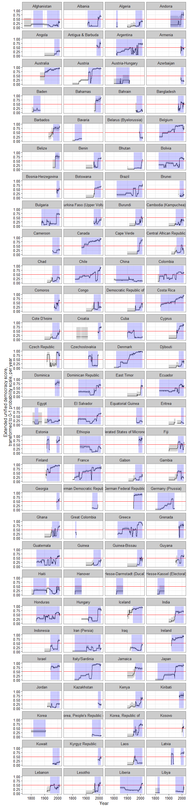
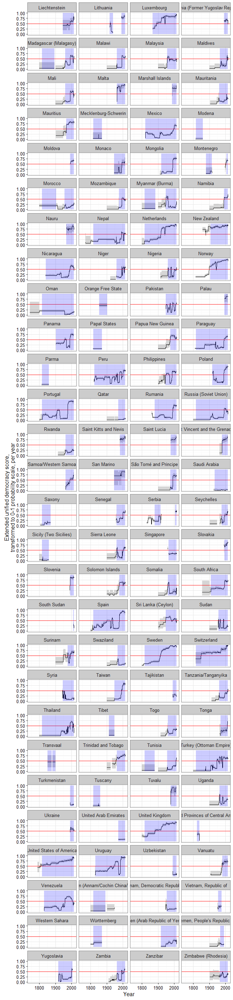

<!-- README.md is generated from README.Rmd. Please edit that file -->
[](https://travis-ci.org/xmarquez/QuickUDS)

This `R` package contains convenience functions to extend the [Unified Democracy Scores of Pemstein, Meserve, and Melton](http://www.unified-democracy-scores.org/). These are basically wrappers for a couple of functions in the package [mirt](https://cran.r-project.org/web/packages/mirt/mirt.pdf), which contains powerful facilities for factor analysis, and which you will probably want to use directly to do anything beyond replicating and extending the UD scores with the data provided by this package.

This package also includes an "[extended UDS](https://github.com/xmarquez/QuickUDS/blob/master/csvs-and-pdfs/extended_uds.csv?raw=true)" dataset with latent democracy scores going back to the 19th century and a replication dataset with 61 different democracy measurements from 29 different projects to measure democracy. Both datasets are fully documented. The extended scores (and their generation) are described in more detail in Marquez, Xavier, "A Quick Method for Extending the Unified Democracy Scores" (March 23, 2016). Available at SSRN: <http://ssrn.com/abstract=2753830>. A more informal description of the extended UD scores is also found in [this blogpost](http://abandonedfootnotes.blogspot.co.nz/2016/03/artisanal-democracy-data-quick-and-easy.html).

To install, use:

``` r
devtools::install_github(repo = "xmarquez/QuickUDS")
```

To view the documentation for the datasets, use:

``` r
?democracy
?extended_uds
```

For non-R users, there are csv versions of these datasets [here](https://github.com/xmarquez/QuickUDS/tree/master/csvs-and-pdfs). This folder also contains a pdf version of the documentation.

The `extended_uds` dataset can be generated with the following code:

``` r
library(dplyr)
#> 
#> Attaching package: 'dplyr'
#> The following objects are masked from 'package:stats':
#> 
#>     filter, lag
#> The following objects are masked from 'package:base':
#> 
#>     intersect, setdiff, setequal, union
library(QuickUDS)
#> Loading required package: mirt
#> Loading required package: stats4
#> Loading required package: lattice

indexes <- c("arat_pmm","blm","bmr_democracy","bnr","bollen_pmm","doorenspleet","eiu","freedomhouse",
             "freedomhouse_electoral","gwf","hadenius_pmm","kailitz_tri","lied","mainwaring",
             "magaloni_regime_tri","munck_pmm","pacl","PEPS1v","pitf", "polity2",
             "polyarchy_contestation","prc_notrans","svolik","ulfelder","utip_dichotomous_strict",
             "v2x_polyarchy","vanhanen_democratization","wahman_teorell_hadenius")

# Generate Extended UDS
data <- QuickUDS::democracy[ ,c("country_name","GWn","cown","year","region",
                                "continent","microstate","lat","lon","in_system",indexes)]
data <- reshape2::melt(data, measure.vars = indexes, na.rm = TRUE)
data <- data %>% group_by(country_name,year) %>% mutate(measures_per_cy = n()) %>% ungroup()
data <- reshape2::dcast(data, ... ~ variable)
data <- data %>% arrange(country_name,year)

data2 <- prepare_democracy(indexes)


extended_model <- democracy_model(data2,indexes, verbose=FALSE, technical = list(NCYCLES = 2500))
extended_scores <- democracy_scores(extended_model)
extended_uds <- bind_cols(data,extended_scores)

# Time to converge on my machine
extended_model@time
#>    TOTAL     DATA ESTIMATE    Estep    Mstep       SE     POST 
#>   128.20     1.44   116.03    66.74    49.22    10.63     0.04

# Number of iterations, log likelihood, etc.
extended_model
#> 
#> Call:
#> mirt::mirt(data = data[, columns], model = model, itemtype = itemtype, 
#>     SE = SE, verbose = FALSE, technical = ..2)
#> 
#> Full-information item factor analysis with 1 factor(s).
#> Converged within 1e-04 tolerance after 1402 EM iterations.
#> mirt version: 1.16 
#> M-step optimizer: BFGS 
#> EM acceleration: Ramsay
#> Number of rectangular quadrature: 61
#> 
#> Information matrix estimated with method: crossprod
#> Condition number of information matrix = 12075.16
#> Second-order test: model is a possible local maximum
#> 
#> Log-likelihood = -202077.9
#> AIC = 404513.8; AICc = 404516.5
#> BIC = 405962.2; SABIC = 405393.4

# Correlations of latent factor with source variables, variance accounted for, etc.
summary(extended_model)
#>                             F1    h2
#> arat_pmm                 0.895 0.801
#> blm                      0.979 0.958
#> bmr_democracy            0.980 0.961
#> bnr                      0.965 0.931
#> bollen_pmm               0.920 0.847
#> doorenspleet             0.965 0.932
#> eiu                      0.888 0.788
#> freedomhouse             0.928 0.860
#> freedomhouse_electoral   0.985 0.971
#> gwf                      0.962 0.926
#> hadenius_pmm             0.949 0.901
#> kailitz_tri              0.936 0.875
#> lied                     0.915 0.836
#> mainwaring               0.970 0.941
#> magaloni_regime_tri      0.956 0.915
#> munck_pmm                0.940 0.883
#> pacl                     0.956 0.914
#> PEPS1v                   0.992 0.984
#> pitf                     0.975 0.950
#> polity2                  0.988 0.977
#> polyarchy_contestation   0.944 0.890
#> prc_notrans              0.952 0.906
#> svolik                   0.958 0.918
#> ulfelder                 0.969 0.939
#> utip_dichotomous_strict  0.951 0.904
#> v2x_polyarchy            0.934 0.873
#> vanhanen_democratization 0.934 0.872
#> wahman_teorell_hadenius  0.991 0.982
#> 
#> SS loadings:  25.436 
#> Proportion Var:  0.908 
#> 
#> Factor correlations: 
#> 
#>    F1
#> F1  1
```

(For the latest code used, always see <https://github.com/xmarquez/QuickUDS/blob/master/data-raw/Generate%20extended%20UDS%20data.R>)

To generate a 0-1 index from these scores where 0.5 represents the average latent variable cutpoint for dichotomous democracy measures, the following code can be used:

``` r
cutpoints_extended <- cutpoints(extended_model)

cutpoints_extended
#> Source: local data frame [151 x 4]
#> Groups: variable [28]
#> 
#>         variable   estimate     pct025      pct975
#>            (chr)      (dbl)      (dbl)       (dbl)
#> 1       arat_pmm -1.0061529 -1.0198020 -0.99387698
#> 2       arat_pmm -0.6097275 -0.6070545 -0.61230170
#> 3       arat_pmm -0.0448286 -0.0105198 -0.07570276
#> 4       arat_pmm  0.3507178  0.4167698  0.29112163
#> 5       arat_pmm  0.8376795  0.9446163  0.74172001
#> 6       arat_pmm  1.7913859  1.9823639  1.62037295
#> 7            blm  0.4750460  0.7125630  0.31557377
#> 8            blm  1.0671980  1.5919707  0.71475410
#> 9  bmr_democracy  0.6275534  0.7037643  0.55940205
#> 10           bnr  0.8168451  0.9255175  0.71983084
#> ..           ...        ...        ...         ...

dichotomous_cutpoints <- cutpoints_extended %>% 
  group_by(variable) %>%
  filter(n() == 1) 

dichotomous_cutpoints
#> Source: local data frame [10 x 4]
#> Groups: variable [10]
#> 
#>                   variable  estimate    pct025    pct975
#>                      (chr)     (dbl)     (dbl)     (dbl)
#> 1            bmr_democracy 0.6275534 0.7037643 0.5594020
#> 2                      bnr 0.8168451 0.9255175 0.7198308
#> 3             doorenspleet 0.9459417 1.0863039 0.8238081
#> 4   freedomhouse_electoral 0.6012813 0.7346227 0.4913225
#> 5                      gwf 0.5478679 0.6220417 0.4820088
#> 6                     pacl 0.5943022 0.6875241 0.5126818
#> 7                   svolik 0.5911972 0.6607374 0.5283367
#> 8                 ulfelder 0.5662614 0.6656417 0.4802742
#> 9  utip_dichotomous_strict 0.3771308 0.4449266 0.3185793
#> 10 wahman_teorell_hadenius 0.8054721 0.9984096 0.6492057

avg_dichotomous <- mean(dichotomous_cutpoints$estimate)

avg_dichotomous
#> [1] 0.6473853

extended_uds <- extended_uds %>% mutate(adj.z1 = z1 - avg_dichotomous, 
                                        adj.pct025 = pct025 - avg_dichotomous, 
                                        adj.pct975 = pct975 - avg_dichotomous,
                                        index = pnorm(adj.z1),
                                        index.pct025 = pnorm(adj.pct025),
                                        index.pct975 = pnorm(adj.pct975))
```

For a more extended introduction to the available functions in the package, see the [package vignettes](https://github.com/xmarquez/QuickUDS/tree/master/vignettes).

The extended UD scores are available for `24136` country-years (`225` unique countries and non-sovereign territories):





(Grey shaded areas represent 95% confidence intervals; blue shaded areas are periods where the country is either deemed to be a member of the system of states in the [Gleditsch and Ward list of state system membership since 1816](http://privatewww.essex.ac.uk/~ksg/statelist.html), i.e., independent, or is a [microstate in Gleditsch's tentative list](http://privatewww.essex.ac.uk/~ksg/statelist.html)).

If you find this package useful in your work, please cite:

Pemstein, Daniel, Stephen Meserve, and James Melton. 2010. Democratic Compromise: A Latent Variable Analysis of Ten Measures of Regime Type. Political Analysis 18 (4): 426-449.

As well as:

Marquez, Xavier, "A Quick Method for Extending the Unified Democracy Scores" (March 23, 2016). Available at SSRN: <http://ssrn.com/abstract=2753830>
