# Characteristics of Different Democracy Measures
Xavier Marquez  
`r Sys.Date()`  


This vignette describes the temporal and spatial coverage of the democracy measures included in this package,  notes their correlations, and documents any changes made to the original data sources.

# Arat

This is the dataset described in Arat 1991; the actual values are taken from Pemstein, Meserve, and Melton 2013 (the replication data for Pemstein, Meserve, and Melton 2010).

## Coverage


```r
library(QuickUDS)
library(dplyr)
library(ggplot2)

panel <- democracy %>% select(country_name,year) %>% distinct()

temporal_coverage <- function(data) {
  data <- left_join(panel,data) 
  
  data <- data %>% 
    group_by(year, add=TRUE) %>% 
    count(year,in_system)

  ggplot(data =  data, aes(x=year,fill = in_system, y = n)) + 
    geom_bar(stat = "identity") +
    theme_bw() +
    theme(legend.position = "bottom") +
    labs(fill = "In G&W system of states", 
         y = "Number of states or territories included\nin each year of `democracy` panel") +
    ggtitle("Coverage \nwithin the `democracy` dataset")
}

library(rworldmap)
```

```
## Warning: package 'rworldmap' was built under R version 3.2.4
```

```
## Loading required package: sp
```

```
## ### Welcome to rworldmap ###
```

```
## For a short introduction type : 	 vignette('rworldmap')
```

```r
world <- getMap()
world <- fortify(world)
```

```
## Regions defined for each Polygons
```

```r
spatial_coverage <- function(data) {
  ggplot() +
    geom_path(data = world, aes(x=long,y=lat,group=group)) +
    theme_bw() +
    theme(legend.position = "bottom") +
    geom_count(data = data, aes(x=lon,y=lat,color = in_system)) +
    labs(color = "In G&W system of states", y = "", x = "", size = "Number of country-years") +
    ggtitle("Spatial coverage")
}

data <- democracy_long %>% filter(variable == "arat_pmm")

temporal_coverage(data)
```

```
## Joining by: c("country_name", "year")
```

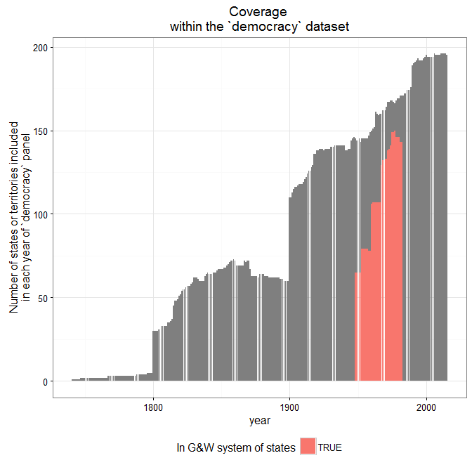

```r
spatial_coverage(data)
```

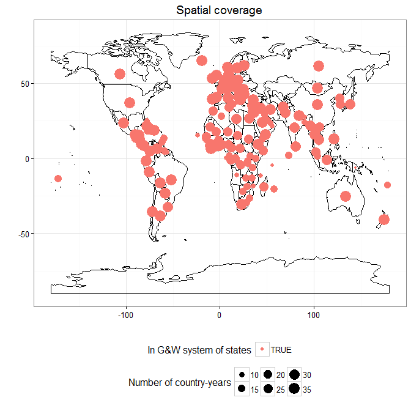

## Distribution


```r
ggplot(data = data) +
  geom_histogram(aes(x=value),bins=20) +
  theme_bw() +
  theme(legend.position = "bottom") +
  labs(y = "Country-years") +
  facet_wrap(~variable, ncol=2)
```

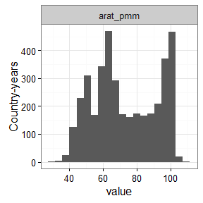

```r
ggplot(data = data) +
  geom_density(aes(x=value)) +
  theme_bw() +
  theme(legend.position = "bottom") +
  labs(y = "Density") +
  facet_wrap(~variable, ncol=2)
```

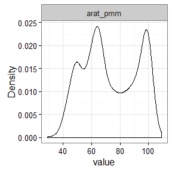

# BLM

This is the dataset described in Bowman, Lehoucq, and Mahoney 2005.

## Coverage


```r
data <- democracy_long %>% filter(variable == "blm")

temporal_coverage(data)
```

```
## Joining by: c("country_name", "year")
```

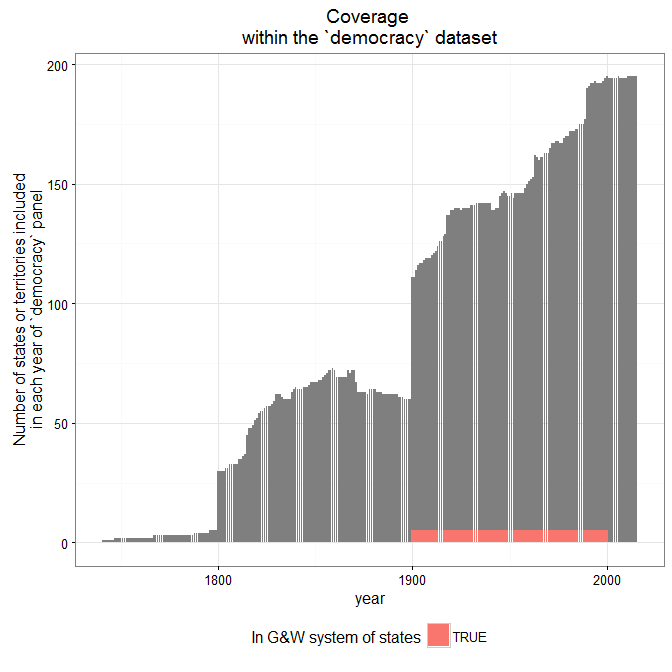

```r
spatial_coverage(data)
```

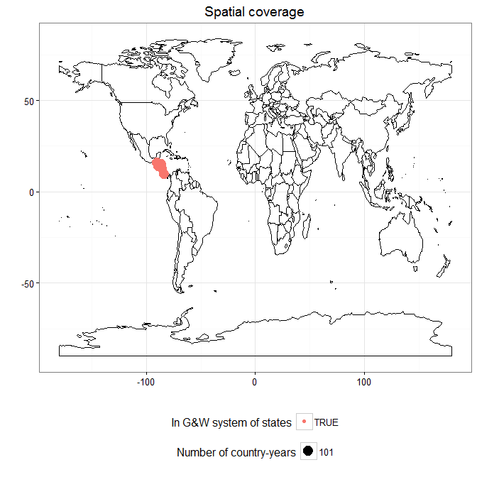

## Distribution


```r
ggplot(data = data) +
  geom_histogram(aes(x=value),bins=20) +
  theme_bw() +
  theme(legend.position = "bottom") +
  labs(y = "Country-years") +
  facet_wrap(~variable, ncol=2)
```

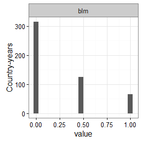

# BMR

This is the dataset described in Boix, Miller, and Rosato 2012.

## Coverage


```r
data <- democracy_long %>% filter(variable == "bmr_democracy")

temporal_coverage(data)
```

```
## Joining by: c("country_name", "year")
```


```r
spatial_coverage(data)
```

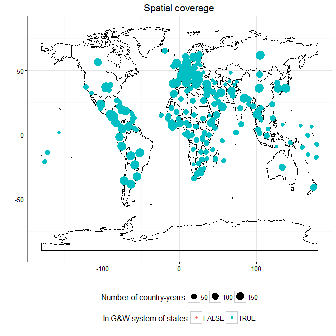

## Distribution


```r
data <- democracy_long %>% filter(variable %in% c("bmr_democracy","bmr_democracy_omitteddata"))

ggplot(data = data) +
  geom_histogram(aes(x=value),bins=20) +
  theme_bw() +
  theme(legend.position = "bottom") +
  labs(y = "Country-years") +
  facet_wrap(~variable, ncol=2)
```

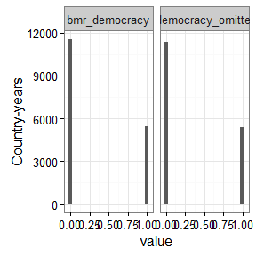

# BNR

This is the dataset described in Bernhardt, Nordstrom, and Reenock 2001. The original dataset only counts periods of democracy in the period 1913-2005, since it is designed for event history analysis. To put it in country-year format, this package assumes that country-years in independent states between 1913 and 2005 are to be counted as non-democratic if they are not explicitly said to be democratic by BNR. (Country-years are considered to be independent if the state is not a microstate and appears in Gleditasch and Ward's [1999] panel of indepdent states for the period).

## Coverage


```r
data <- democracy_long %>% filter(variable == "bnr")

temporal_coverage(data)
```

```
## Joining by: c("country_name", "year")
```

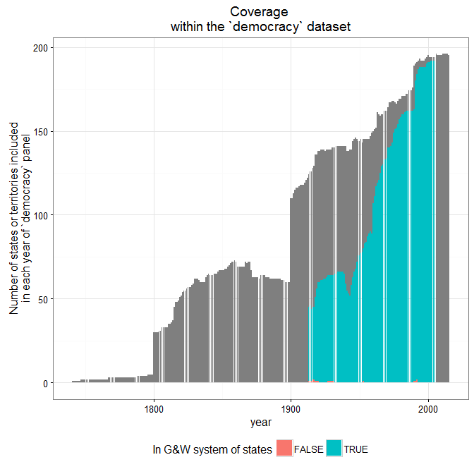

```r
spatial_coverage(data)
```

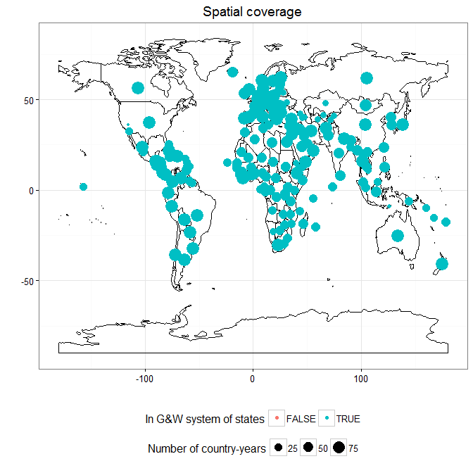

## Distribution


```r
ggplot(data = data) +
  geom_histogram(aes(x=value),bins=20) +
  theme_bw() +
  theme(legend.position = "bottom") +
  labs(y = "Country-years") +
  facet_wrap(~variable, ncol=2)
```


# Bollen

This is the dataset described in Bollen 2001. The actual values are taken from Pemstein, Meserve, and Melton's replication data for their article (Pemstein, Meserve, and Melton 2013).

## Coverage


```r
data <- democracy_long %>% filter(variable == "bollen_pmm")

temporal_coverage(data)
```

```
## Joining by: c("country_name", "year")
```

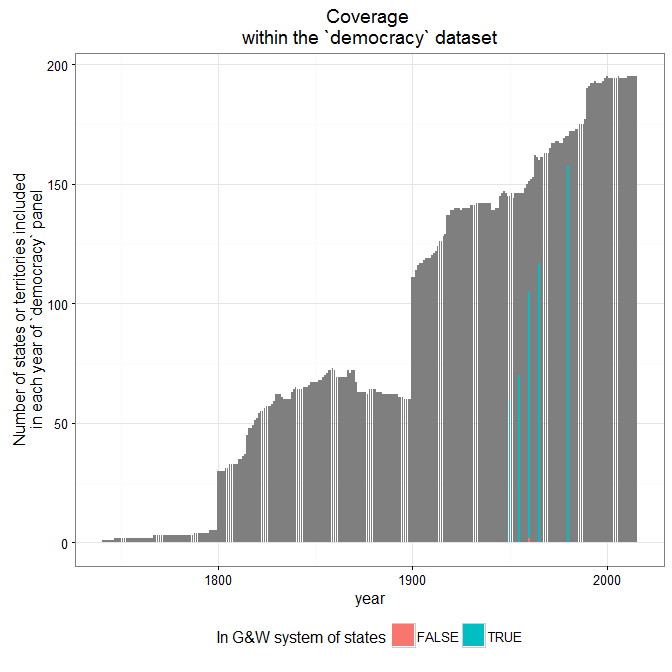

```r
spatial_coverage(data)
```

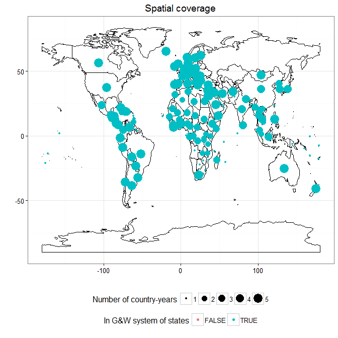

## Distribution


```r
ggplot(data = data) +
  geom_histogram(aes(x=value),bins=20) +
  theme_bw() +
  theme(legend.position = "bottom") +
  labs(y = "Country-years") +
  facet_wrap(~variable, ncol=2)
```

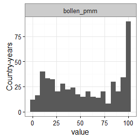

```r
ggplot(data = data) +
  geom_density(aes(x=value)) +
  theme_bw() +
  theme(legend.position = "bottom") +
  labs(y = "Density") +
  facet_wrap(~variable, ncol=2)
```

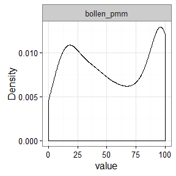

# Doorenspleet

This is the dataset described in Doorenspleet 2000.

## Coverage


```r
data <- democracy_long %>% filter(variable == "doorenspleet")

temporal_coverage(data)
```

```
## Joining by: c("country_name", "year")
```

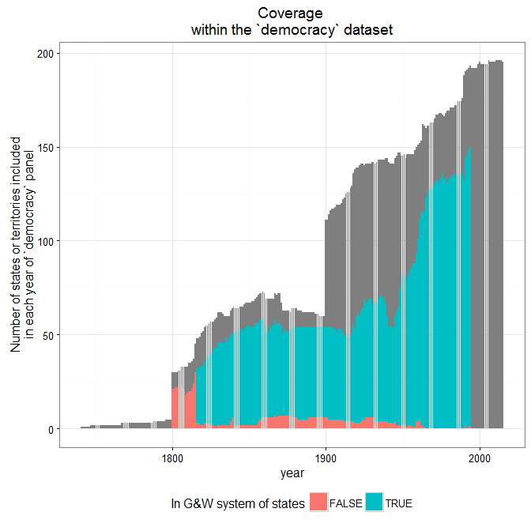

```r
spatial_coverage(data)
```


## Distribution


```r
ggplot(data = data) +
  geom_histogram(aes(x=value),bins=20) +
  theme_bw() +
  theme(legend.position = "bottom") +
  labs(y = "Country-years") +
  facet_wrap(~variable, ncol=2)
```

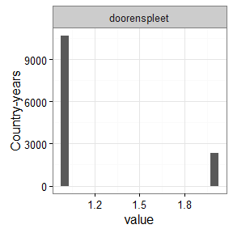

# EIU

This contains the Economist Intelligence Unit's index of democracy (EIU 2012). The actual data is taken from the World Bank's Governance Indicators (http://www.govindicators.org)

## Coverage


```r
data <- democracy_long %>% filter(variable == "eiu")

temporal_coverage(data)
```

```
## Joining by: c("country_name", "year")
```

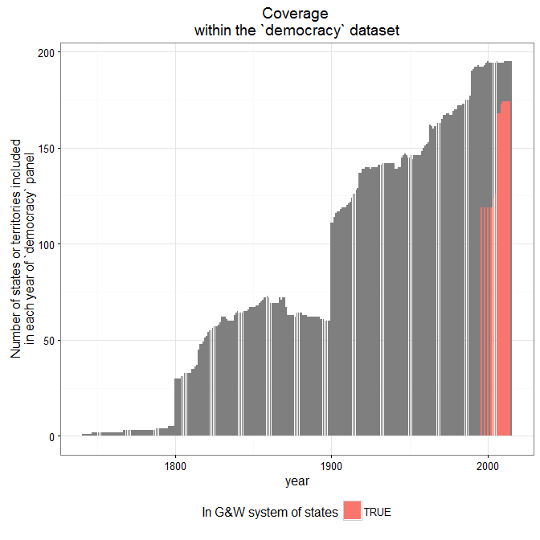

```r
spatial_coverage(data)
```

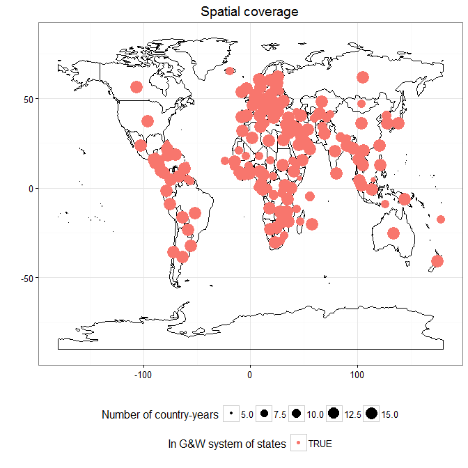

## Distribution


```r
ggplot(data = data) +
  geom_histogram(aes(x=value),bins=20) +
  theme_bw() +
  theme(legend.position = "bottom") +
  labs(y = "Country-years") +
  facet_wrap(~variable, ncol=2)
```

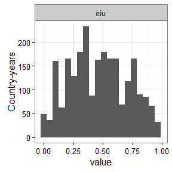

```r
ggplot(data = data) +
  geom_density(aes(x=value)) +
  theme_bw() +
  theme(legend.position = "bottom") +
  labs(y = "Density") +
  facet_wrap(~variable, ncol=2)
```

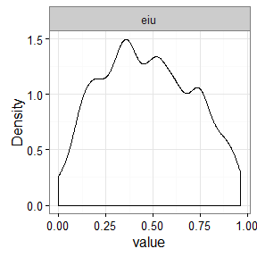

# Freedom House (Freedom in the World)

This is the Freedom in the World Index, to 2015 (Freedom House 2016). Some non-independent territories have been excluded from the original data.

## Coverage


```r
data <- democracy_long %>% filter(variable %in% c("freedomhouse"))

temporal_coverage(data)
```

```
## Joining by: c("country_name", "year")
```

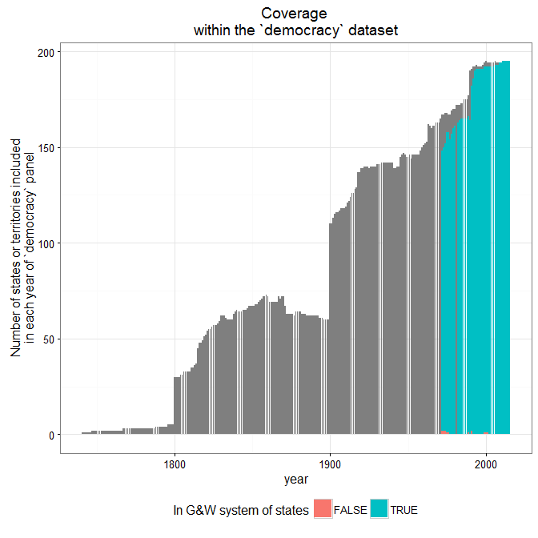

```r
spatial_coverage(data)
```

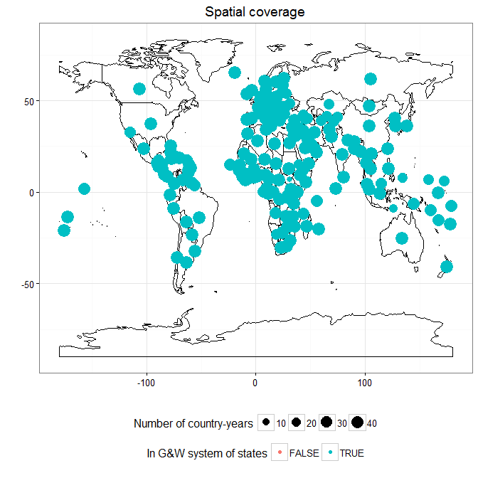

## Distribution


```r
ggplot(data = data) +
  geom_histogram(aes(x=value),bins=20) +
  theme_bw() +
  theme(legend.position = "bottom") +
  labs(y = "Country-years") +
  facet_wrap(~variable, ncol=2)
```

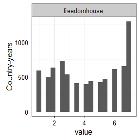

```r
ggplot(data = data) +
  geom_density(aes(x=value)) +
  theme_bw() +
  theme(legend.position = "bottom") +
  labs(y = "Density") +
  facet_wrap(~variable, ncol=2)
```

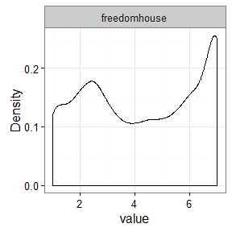

# Freedom House (Electoral Democracies)

This is Freedom House's list of electoral democracies, to 2015 (Freedom House 2016). Some non-independent territories have been excluded from the original data.

## Coverage


```r
data <- democracy_long %>% filter(variable == "freedomhouse_electoral")

temporal_coverage(data)
```

```
## Joining by: c("country_name", "year")
```

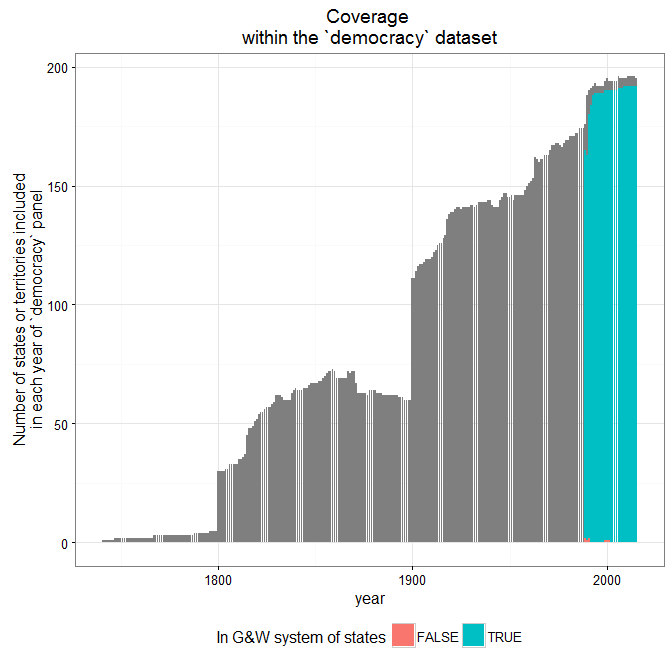

```r
spatial_coverage(data)
```


## Distribution


```r
ggplot(data = data) +
  geom_histogram(aes(x=value),bins=20) +
  theme_bw() +
  theme(legend.position = "bottom") +
  labs(y = "Country-years") +
  facet_wrap(~variable, ncol=2)
```

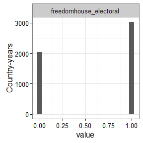

# GWF (Geddes, Wright, and Frantz)

This is a measure of democracy/non-democracy derived from the dataset described in Geddes, Wright, and Frantz 2014. The original data has been extended beyond 1945 by reconciling the information contained in the original dataset's `gwf_startdate`, `gwf_spell`, and `gwf_casename` variables, which encode the start year of each democratic and non-democratic regime (sometimes going back to the 18th century). 

## Coverage


```r
data <- democracy_long %>% filter(variable == "gwf")

temporal_coverage(data) +
  geom_vline(xintercept = 1945) +
  annotate("text", label = "Limit of original dataset", x = 1945,y = 100, angle=90)
```

```
## Joining by: c("country_name", "year")
```

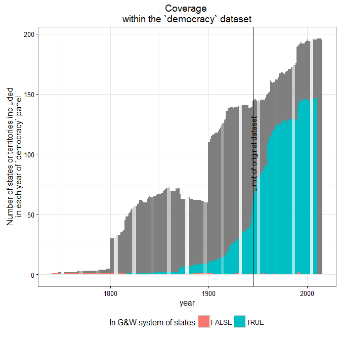

```r
spatial_coverage(data)
```

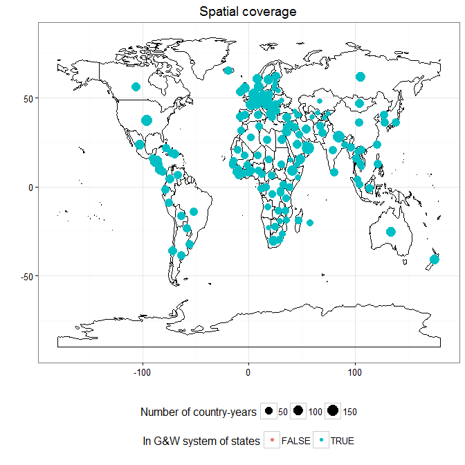

## Distribution


```r
ggplot(data = data) +
  geom_histogram(aes(x=value),bins=20) +
  theme_bw() +
  theme(legend.position = "bottom") +
  labs(y = "Country-years") +
  facet_wrap(~variable, ncol=2)
```

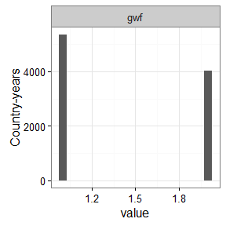


# Hadenius

This is the dataset in Hadenius 1992. Actual values taken from Pemstein, Meserve, and Melton 2013. 

## Coverage


```r
data <- democracy_long %>% filter(variable == "hadenius_pmm")

temporal_coverage(data) 
```

```
## Joining by: c("country_name", "year")
```

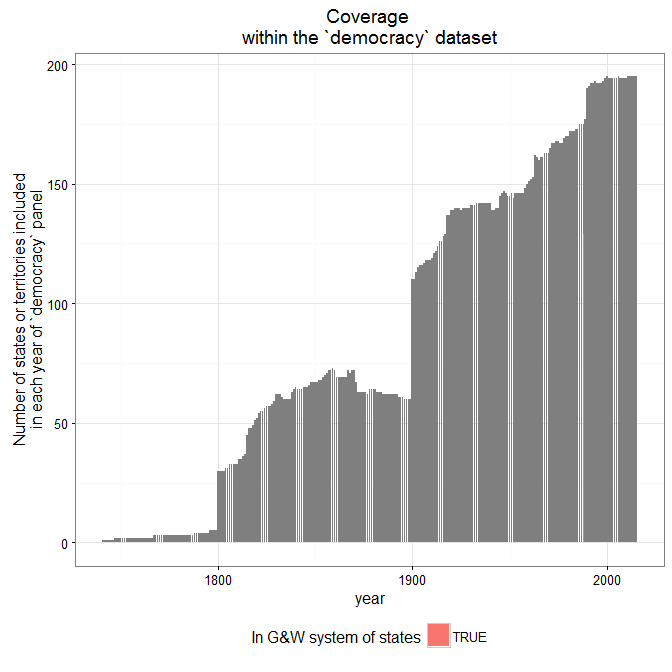

```r
spatial_coverage(data)
```

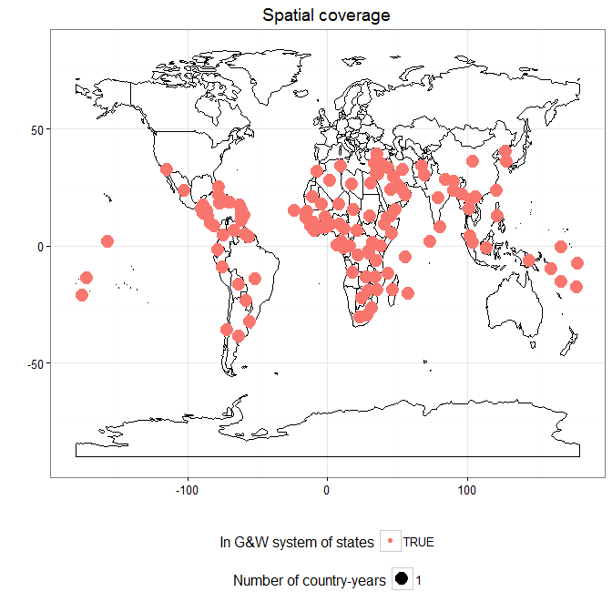

## Distribution


```r
ggplot(data = data) +
  geom_histogram(aes(x=value),bins=20) +
  theme_bw() +
  theme(legend.position = "bottom") +
  labs(y = "Country-years") +
  facet_wrap(~variable, ncol=2)
```

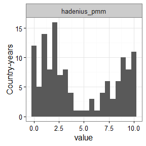

```r
ggplot(data = data) +
  geom_density(aes(x=value)) +
  theme_bw() +
  theme(legend.position = "bottom") +
  labs(y = "Density") +
  facet_wrap(~variable, ncol=2)
```

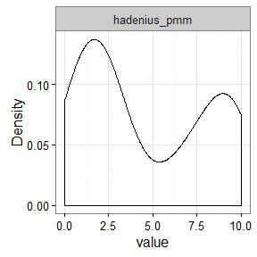

# Kailitz

The dataset described in Kailitz 2013.  

## Coverage


```r
data <- democracy_long %>% filter(variable == "kailitz_binary")

temporal_coverage(data)
```

```
## Joining by: c("country_name", "year")
```

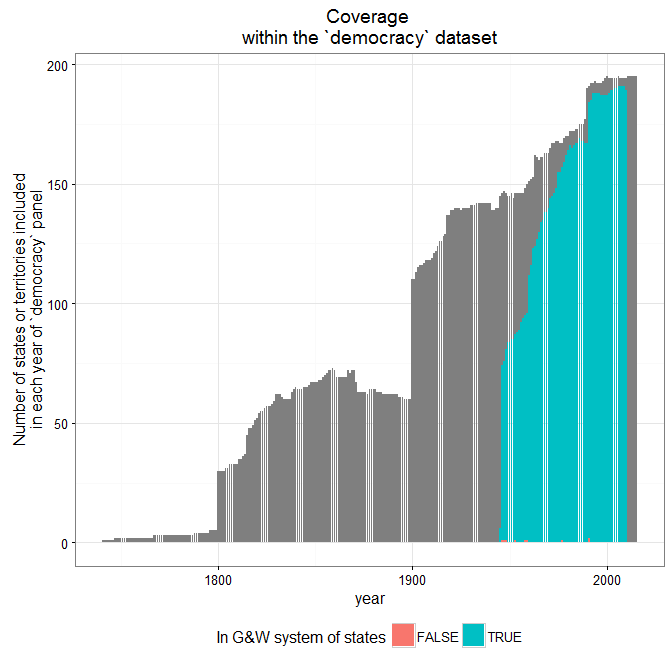

```r
spatial_coverage(data)
```


## Distribution


```r
data <- democracy_long %>% filter(variable %in% c("kailitz_binary","kailitz_tri"))

ggplot(data = data) +
  geom_histogram(aes(x=value)) +
  theme_bw() +
  theme(legend.position = "bottom") +
  labs(y = "Country-years") +
  facet_wrap(~variable, ncol=2)
```

```
## `stat_bin()` using `bins = 30`. Pick better value with `binwidth`.
```

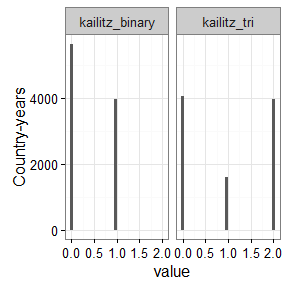

## Index construction and known problems

Note that 316 of the country-years in the Kailitz dataset are classified with more than one regime type. 


```r
kable(kailitz.yearly %>% 
        count(multiple_regimes = grepl("-",combined_regime)))
```


multiple_regimes       n
-----------------  -----
FALSE               9290
TRUE                 316

```r
kable(kailitz.yearly %>% 
        filter(grepl("-",combined_regime)) %>%
        group_by(country_name) %>%
        arrange(country_name,year) %>%
        group_by(combined_regime, add=TRUE) %>%
        summarise(min = min(year), max = max(year), n = n()))
```


country_name                     combined_regime                                                  min    max    n
-------------------------------  -------------------------------------------------------------  -----  -----  ---
Afghanistan                      Electoral Autocracy-Personalist Autocracy                       2010   2010    1
Algeria                          Electoral Autocracy-One party Autocracy                         1989   1991    3
Angola                           Electoral Autocracy-State Failure or Occupation                 2010   2010    1
Benin                            Electoral Autocracy-Personalist Autocracy                       1960   1962    3
Benin                            Military Autocracy-Personalist Autocracy                        1965   1974    8
Benin                            Personalist Autocracy-Transition                                1963   1971    4
Burundi                          Electoral Autocracy-State Failure or Occupation                 1993   1995    3
Burundi                          One party Autocracy-Personalist Autocracy                       1982   1983    2
Cambodia (Kampuchea)             Communist Ideocracy-State Failure or Occupation                 1981   1990   10
Central African Republic         Electoral Autocracy-One party Autocracy                         1991   1992    2
Colombia                         Electoral Autocracy-Liberal Democracy                           1946   1947    2
Colombia                         State Failure or Occupation-Transition                          1948   1952    5
Cuba                             Electoral Autocracy-Liberal Democracy                           1946   1951    6
Ecuador                          Electoral Autocracy-Personalist Autocracy                       1970   1971    2
Ecuador                          Electoral Autocracy-Transition                                  2000   2001    2
Guinea-Bissau                    Military Autocracy-Personalist Autocracy                        1980   1983    4
Guinea-Bissau                    Military Autocracy-Transition                                   2004   2004    1
Haiti                            Electoral Autocracy-Transition                                  1946   1947    2
Honduras                         Electoral Autocracy-Liberal Democracy                           1957   1962    6
Indonesia                        Personalist Autocracy-Transition                                1952   1967   12
Kuwait                           Monarchy-State Failure or Occupation                            1990   1990    1
Lebanon                          State Failure or Occupation-Transition                          2000   2001    2
Lesotho                          Electoral Autocracy-State Failure or Occupation                 1998   1999    2
Lesotho                          Electoral Autocracy-Transition                                  2000   2001    2
Liberia                          Personalist Autocracy-State Failure or Occupation               1990   1990    1
Madagascar (Malagasy)            Military Autocracy-Personalist Autocracy                        1972   1974    3
Madagascar (Malagasy)            Personalist Autocracy-Transition                                1975   1975    1
Mauritania                       Electoral Autocracy-Military Autocracy                          2008   2008    1
Mozambique                       Personalist Autocracy-Transition                                1991   1993    3
Nicaragua                        Communist Ideocracy-Electoral Autocracy                         1984   1989    6
Nicaragua                        Communist Ideocracy-State Failure or Occupation                 1980   1981    2
Nicaragua                        Communist Ideocracy-Transition                                  1982   1983    2
Nicaragua                        Electoral Autocracy-Personalist Autocracy                       1972   1972    1
Nicaragua                        Military Autocracy-Personalist Autocracy                        1973   1973    1
Niger                            Electoral Autocracy-Liberal Democracy                           2000   2010   11
Peru                             Electoral Autocracy-Liberal Democracy                           1963   1967    5
Philippines                      Electoral Autocracy-Liberal Democracy                           1946   1971   26
Philippines                      Liberal Democracy-Personalist Autocracy                         1994   2002    9
Portugal                         Military Autocracy-Transition                                   1974   1975    2
Seychelles                       Electoral Autocracy-Liberal Democracy                           2007   2010    4
Seychelles                       Liberal Democracy-Transition                                    1976   1976    1
Somalia                          Liberal Democracy-Transition                                    1960   1968    9
Somalia                          Military Autocracy-Personalist Autocracy                        1969   1990   22
Somalia                          Military Autocracy-State Failure or Occupation                  1991   1991    1
Spain                            Military Autocracy-One party Autocracy-Personalist Autocracy    1946   1974   29
Sri Lanka (Ceylon)               Electoral Autocracy-Liberal Democracy                           1960   2010   51
Sri Lanka (Ceylon)               Electoral Autocracy-Transition                                  1948   1959   12
Syria                            One party Autocracy-Personalist Autocracy                       2000   2010   11
Tunisia                          One party Autocracy-Personalist Autocracy                       1975   1978    4
Venezuela                        Military Autocracy-Personalist Autocracy                        1948   1957   10
Yemen (Arab Republic of Yemen)   Monarchy-Transition                                             1946   1947    2

The following are especially troublesome, since the multiple categories do not make sense:


```r
kable(kailitz.yearly %>% 
        filter(grepl("-",combined_regime)) %>%
        group_by(country_name) %>%
        arrange(country_name,year) %>%
        group_by(combined_regime, add=TRUE) %>%
        summarise(min = min(year), max = max(year), n = n()) %>%
        filter(grepl("democracy",combined_regime, ignore.case=TRUE)))
```


country_name         combined_regime                             min    max    n
-------------------  ----------------------------------------  -----  -----  ---
Colombia             Electoral Autocracy-Liberal Democracy      1946   1947    2
Cuba                 Electoral Autocracy-Liberal Democracy      1946   1951    6
Honduras             Electoral Autocracy-Liberal Democracy      1957   1962    6
Niger                Electoral Autocracy-Liberal Democracy      2000   2010   11
Peru                 Electoral Autocracy-Liberal Democracy      1963   1967    5
Philippines          Electoral Autocracy-Liberal Democracy      1946   1971   26
Philippines          Liberal Democracy-Personalist Autocracy    1994   2002    9
Seychelles           Electoral Autocracy-Liberal Democracy      2007   2010    4
Seychelles           Liberal Democracy-Transition               1976   1976    1
Somalia              Liberal Democracy-Transition               1960   1968    9
Sri Lanka (Ceylon)   Electoral Autocracy-Liberal Democracy      1960   2010   51

I have constructed the index to classify a country as "democratic" only if it is not also classified as a non-democratic regime as well. Here are the index counts for each regime type:


```r
kable(kailitz.yearly %>%
        count(kailitz_binary,kailitz_tri,combined_regime))
```


 kailitz_binary   kailitz_tri  combined_regime                                                    n
---------------  ------------  -------------------------------------------------------------  -----
              0             0  Communist Ideocracy                                              788
              0             0  Communist Ideocracy-Electoral Autocracy                            6
              0             0  Communist Ideocracy-State Failure or Occupation                   12
              0             0  Communist Ideocracy-Transition                                     2
              0             0  Electoral Autocracy-Military Autocracy                             1
              0             0  Electoral Autocracy-One party Autocracy                            5
              0             0  Electoral Autocracy-Personalist Autocracy                          7
              0             0  Electoral Autocracy-State Failure or Occupation                    6
              0             0  Electoral Autocracy-Transition                                    18
              0             0  Liberal Democracy-Personalist Autocracy                            9
              0             0  Liberal Democracy-Transition                                      10
              0             0  Military Autocracy                                               570
              0             0  Military Autocracy-One party Autocracy-Personalist Autocracy      29
              0             0  Military Autocracy-Personalist Autocracy                          48
              0             0  Military Autocracy-State Failure or Occupation                     1
              0             0  Military Autocracy-Transition                                      3
              0             0  Monarchy                                                         987
              0             0  Monarchy-State Failure or Occupation                               1
              0             0  Monarchy-Transition                                                2
              0             0  One party Autocracy                                              486
              0             0  One party Autocracy-Personalist Autocracy                         17
              0             0  Personalist Autocracy                                            463
              0             0  Personalist Autocracy-State Failure or Occupation                  1
              0             0  Personalist Autocracy-Transition                                  20
              0             0  State Failure or Occupation                                      245
              0             0  State Failure or Occupation-Transition                             7
              0             0  Transition                                                       319
              0             1  Electoral Autocracy                                             1477
              0             1  Electoral Autocracy-Liberal Democracy                            111
              1             2  Liberal Democracy                                               3955

# LIED

This is the Lexical Index of Democracy described in Skaaning,  Gerring, and Bartusevicius 2015 (version 3, updated to 2015). 

## Coverage


```r
data <- democracy_long %>% filter(variable == "lied")

temporal_coverage(data)
```

```
## Joining by: c("country_name", "year")
```

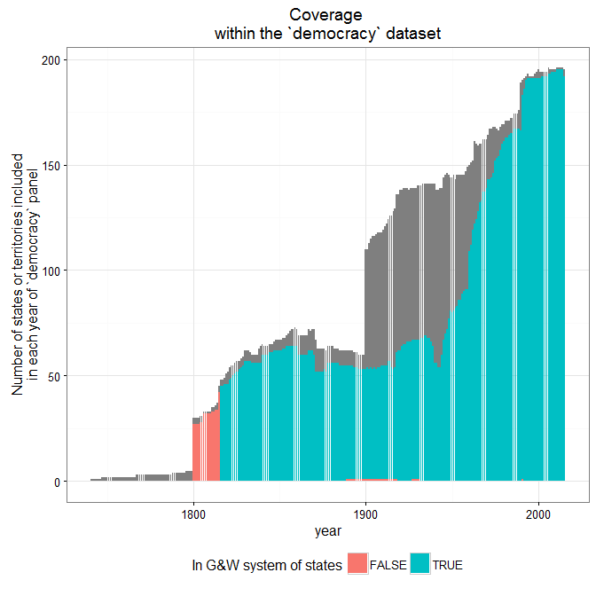

```r
spatial_coverage(data)
```

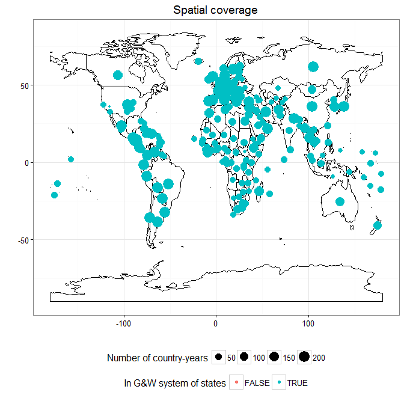

## Distribution


```r
ggplot(data = data) +
  geom_histogram(aes(x=value),binwidth=1) +
  theme_bw() +
  theme(legend.position = "bottom") +
  labs(y = "Country-years") +
  facet_wrap(~variable, ncol=2)
```

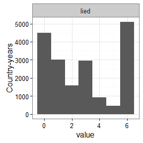

# Magaloni

This is a measure of democracy derived from the authoritarian regimes dataset in Magaloni, Chu, and Min 2013. The original dataset has been extended beyond 1950 using the information encoded in the `duration_nr` variable of the original dataset, which provides information about the start date of each regime. 

## Coverage


```r
data <- democracy_long %>% filter(variable == "magaloni_democ_binary")

temporal_coverage(data) +
  geom_vline(xintercept = 1950) +
  annotate("text", label = "Limit of original dataset", x = 1950,y = 100, angle=90)
```

```
## Joining by: c("country_name", "year")
```

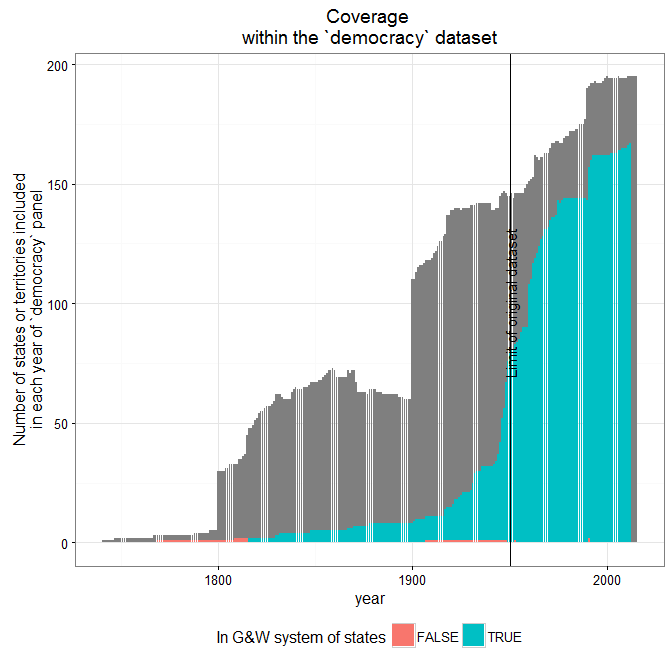

```r
spatial_coverage(data)
```

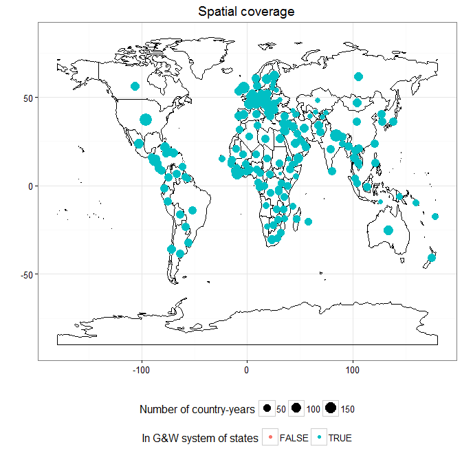

## Distribution

One change has been made (Pakistan 1971/1972 appears to have been misclassified as a democracy).

Note `magaloni_regime_tri` identifies as "hybrid" (middle level) all multiparty autocracies.


```r
data <- democracy_long %>% filter(variable %in% c("magaloni_democ_binary","magaloni_regime_tri"))

ggplot(data = data) +
  geom_histogram(aes(x=value)) +
  theme_bw() +
  theme(legend.position = "bottom") +
  labs(y = "Country-years") +
  facet_wrap(~variable, ncol=2)
```

```
## `stat_bin()` using `bins = 30`. Pick better value with `binwidth`.
```


# Mainwaring

This is the dataset in Mainwaring, Brinks, and Perez Linan 2008.

## Coverage


```r
data <- democracy_long %>% filter(variable == "mainwaring")

temporal_coverage(data) 
```

```
## Joining by: c("country_name", "year")
```

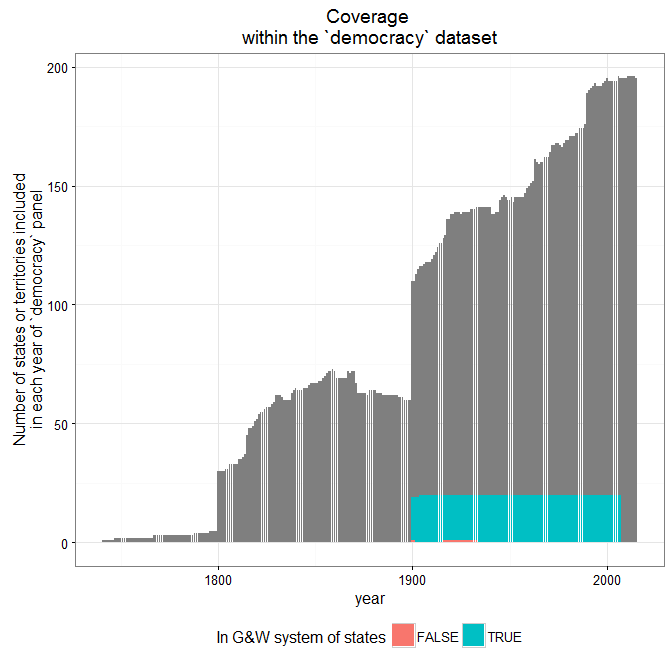

```r
spatial_coverage(data)
```

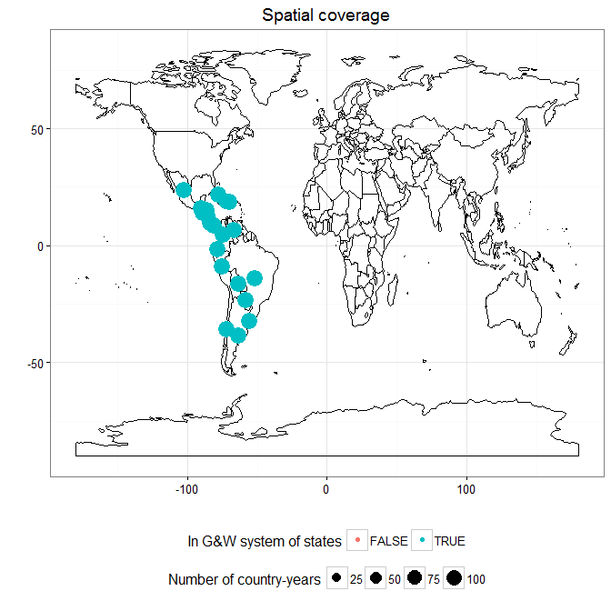

## Distribution


```r
ggplot(data = data) +
  geom_histogram(aes(x=value)) +
  theme_bw() +
  theme(legend.position = "bottom") +
  labs(y = "Country-years") +
  facet_wrap(~variable, ncol=2)
```

```
## `stat_bin()` using `bins = 30`. Pick better value with `binwidth`.
```

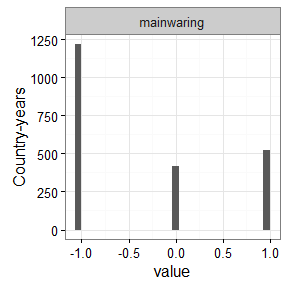

# Munck

This is the dataset in Munck 2009. Taken from Pemstein, Meserve, and Melton 2013.

## Coverage


```r
data <- democracy_long %>% filter(variable == "munck_pmm")

temporal_coverage(data) 
```

```
## Joining by: c("country_name", "year")
```

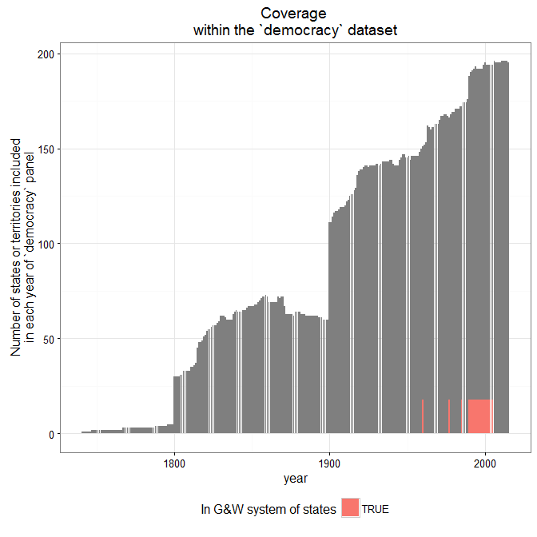

```r
spatial_coverage(data)
```

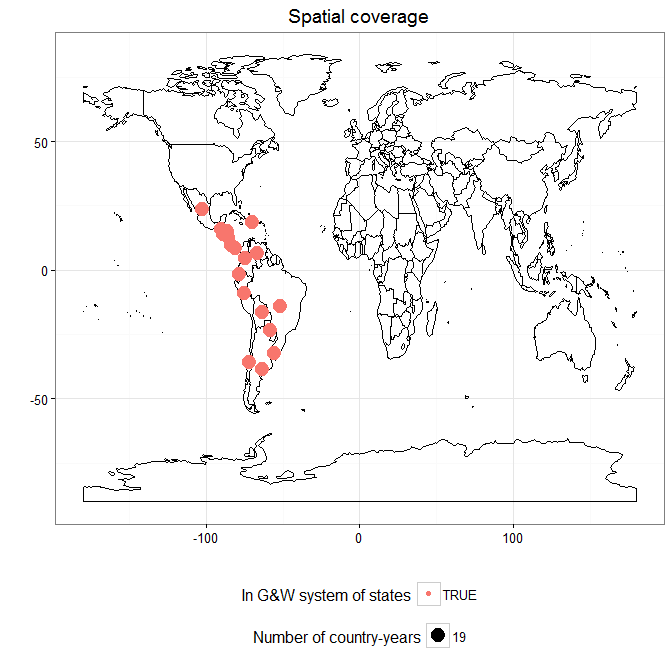

## Distribution


```r
ggplot(data = data) +
  geom_histogram(aes(x=value)) +
  theme_bw() +
  theme(legend.position = "bottom") +
  labs(y = "Country-years") +
  facet_wrap(~variable, ncol=2)
```

```
## `stat_bin()` using `bins = 30`. Pick better value with `binwidth`.
```

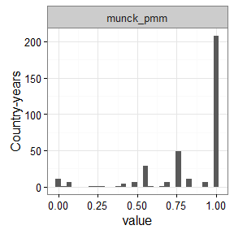

```r
ggplot(data = data) +
  geom_density(aes(x=value)) +
  theme_bw() +
  theme(legend.position = "bottom") +
  labs(y = "Density") +
  facet_wrap(~variable, ncol=2)
```

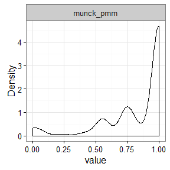

# PACL/ACLP/DD

This is the dataset described in Cheibub, Gandhi, and Vreeland 2010.

## Coverage


```r
data <- democracy_long %>% filter(variable == "pacl")

temporal_coverage(data) 
```

```
## Joining by: c("country_name", "year")
```

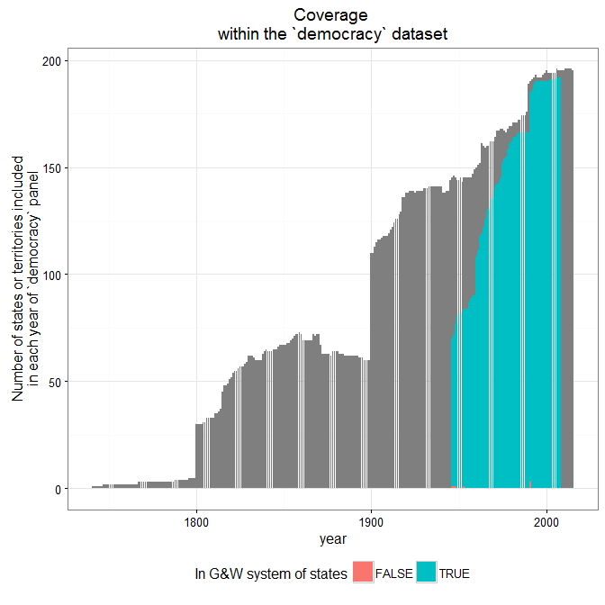

```r
spatial_coverage(data)
```

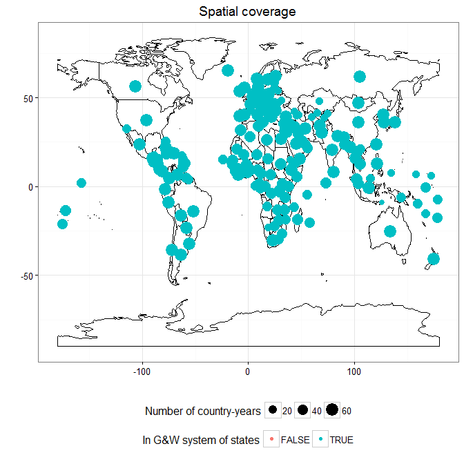

## Distribution


```r
ggplot(data = data) +
  geom_histogram(aes(x=value)) +
  theme_bw() +
  theme(legend.position = "bottom") +
  labs(y = "Country-years", x="") +
  facet_wrap(~variable, ncol=2) 
```

```
## `stat_bin()` using `bins = 30`. Pick better value with `binwidth`.
```

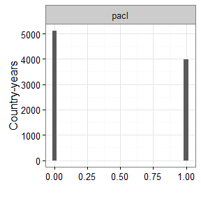

# PEPS

This is the dataset described in Moon et al 2006. 

## Coverage

The `democracy` file contains seven variables from this dataset: `PEPS1i`, `PEPS2i`, `PEPS1q`, `PEPS2q`, `PEPS1v`,`PEPS2v`, and `Polity3`, a cleaned up version of the `polity2` variable in the Polity IV data. The `PEPS*` variables are constructed from `Polity3` and a participation variable derived either from Vanhanen's population and raw participation data (variables ending in `*v`) or from voting turnout data from IDEA (variables ending in `q` or `i`).


```r
data <- democracy_long %>% filter(variable %in% c("PEPS1i","PEPS2i","PEPS1q","PEPS2q","PEPS1v","PEPS2v","Polity3"))

data <- left_join(panel,data) 
```

```
## Joining by: c("country_name", "year")
```

```r
data <- data %>% group_by(variable,year, add=TRUE) %>% count_(vars = c("year","in_system","variable"))

ggplot(data =  data, aes(x=year,fill = in_system, y = n)) + 
    geom_bar(stat = "identity") +
    theme_bw() +
    theme(legend.position = "bottom") +
    labs(fill = "In G&W system of states", y = "Number of states or territories\nin each year of `democracy` panel") +
    ggtitle("Temporal coverage \nwithin the `democracy` dataset") + 
  facet_wrap(~variable) 
```

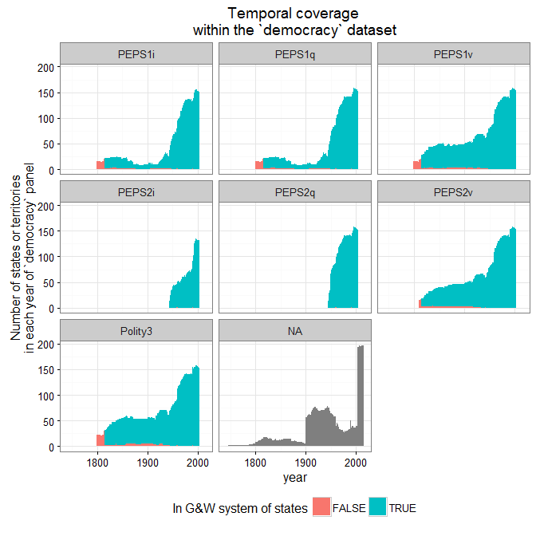

```r
data <- democracy_long %>% filter(variable %in% c("PEPS1i","PEPS2i","PEPS1q","PEPS2q","PEPS1v","PEPS2v"))

spatial_coverage(data)
```

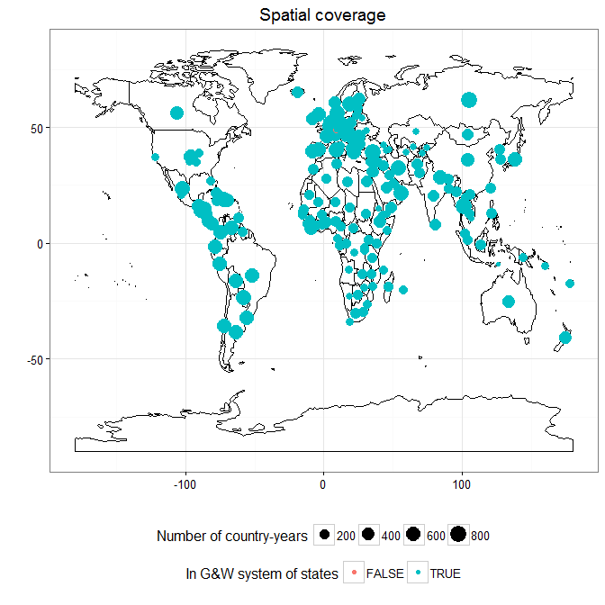

## Distribution


```r
ggplot(data = data) +
  geom_histogram(aes(x=value),binwidth=1) +
  theme_bw() +
  theme(legend.position = "bottom") +
  labs(y = "Country-years", x="") +
  facet_wrap(~variable, ncol=2)
```


```r
library(GGally)
ggcorr(data = democracy %>% select(PEPS1i:PEPS2v), label=TRUE,label_round=3) + scale_fill_gradient2(midpoint = 0.7)
```

```
## Scale for 'fill' is already present. Adding another scale for 'fill',
## which will replace the existing scale.
```

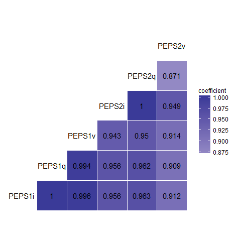

## Known problems

The `Polity3` variable is different from the `polity2` variable in the following cases, mostly due to the different way in which Moon et al recode transitional periods, but in some cases due to revisions in the underlying Polity IV dataset since 2006:


```r
kable(democracy %>%
        filter(Polity3 != polity2) %>%
        group_by(country_name,Polity3,polity2,polity) %>%
        summarise(years = min(year), max = max(year), n = n()))
```


country_name                   Polity3   polity2   polity   years    max    n
----------------------------  --------  --------  -------  ------  -----  ---
Afghanistan                         -7         0      -77    1978   1978    1
Albania                             -9        -5      -88    1945   1945    1
Albania                             -9         0      -77    1939   1944    6
Angola                              -6        -3      -88    1991   1991    1
Angola                              -5        -1      -88    1993   1994    2
Angola                              -4        -2      -88    1995   1996    2
Angola                              -3        -2       -2    2002   2003    2
Argentina                           -4        -3      -88    1956   1956    1
Austria                              0        -1      -88    1933   1933    1
Austria                              8         5      -88    1945   1945    1
Bhutan                              -8       -10      -10    1953   2003   51
Bolivia                             -5        -4      -88    1952   1952    1
Bolivia                             -3        -4      -88    1955   1955    1
Botswana                             7         6        6    1969   1986   18
Botswana                             8         7        7    1987   1996   10
Botswana                             9         8        8    1997   2003    7
Brazil                              -5        -6      -88    1932   1932    1
Bulgaria                            -8        -2      -88    1944   1944    1
Bulgaria                            -7        -4      -88    1945   1945    1
Bulgaria                            -6        -7      -88    1934   1934    1
Burundi                             -7        -3      -88    1992   1992    1
Cambodia (Kampuchea)                -8        -7      -88    1970   1970    1
Cambodia (Kampuchea)                -2         0      -88    1988   1988    1
Cambodia (Kampuchea)                -1         0      -88    1989   1989    1
Cambodia (Kampuchea)                -1         1      -88    1990   1990    1
Cambodia (Kampuchea)                 0         1      -88    1991   1992    2
Chad                                -7        -4      -88    1984   1984    1
Chad                                -7        -3      -88    1978   1978    1
Chad                                -7         0      -77    1979   1983    5
Chile                                1         0      -88    1924   1924    1
China                               -1        -2      -88    1913   1913    1
Comoros                              4         0      -77    1995   1995    1
Croatia                              7         8        8    2000   2003    4
Cuba                                -8        -4      -88    1960   1960    1
Czechoslovakia                      -7         0      -77    1968   1968    1
Denmark                              0         1      -88    1904   1904    1
Denmark                              1         2      -88    1905   1905    1
Denmark                              2         3      -88    1906   1906    1
Denmark                              5         4      -88    1909   1909    1
Denmark                              6         5      -88    1910   1910    1
Denmark                              7         6      -88    1911   1911    1
Dominican Republic                  -3         0      -77    1861   1864    4
Estonia                              6         7        7    1999   1999    1
Estonia                              6         9        9    2000   2003    4
Fiji                                 6         5      -88    2000   2000    1
France                              -7        -8      -88    1860   1860    1
France                               0        -1      -88    1871   1871    1
Guinea-Bissau                        5         0      -77    1998   1998    1
Guinea-Bissau                        5         3      -88    1999   1999    1
Haiti                                3         2      -88    1999   1999    1
Hungary                             -5        -6      -88    1918   1918    1
Hungary                             -5        -4      -88    1946   1946    1
Hungary                             -3        -2      -88    1945   1945    1
Indonesia                            7         6        6    1999   2003    5
Iran (Persia)                       -9         0      -88    1979   1979    1
Iran (Persia)                       -8        -2      -88    1980   1980    1
Iran (Persia)                       -8        -1      -88    1921   1921    1
Iran (Persia)                       -7        -6      -88    1924   1924    1
Iran (Persia)                       -7        -4      -88    1923   1981    2
Iran (Persia)                       -7        -3      -88    1922   1922    1
Italy/Sardinia                      -7        -4       -4    1861   1861    1
Italy/Sardinia                       1         2      -88    1945   1945    1
Italy/Sardinia                       4         5      -88    1946   1946    1
Italy/Sardinia                       7         8      -88    1947   1947    1
Korea, People's Republic of         -9       -10      -10    1994   2003   10
Laos                                -7        -5      -88    1974   1974    1
Laos                                -6        -2      -88    1973   1973    1
Lesotho                              8         0      -77    1998   1998    1
Lesotho                              8         2      -88    1999   1999    1
Lesotho                              8         4      -88    2000   2000    1
Lesotho                              8         6      -88    2001   2001    1
Liberia                             -1         0      -88    1996   1996    1
Luxembourg                           2        -3       -3    1879   1879    1
Luxembourg                          10         7        7    1919   1919    1
Malawi                               5         4        4    2001   2002    2
Malawi                               6         5        5    2003   2003    1
Malawi                               7         6        6    1994   2000    7
Mali                                 6         7        7    2002   2003    2
Mexico                              -8        -9      -88    1879   1879    1
Mexico                              -7        -8      -88    1878   1878    1
Morocco                             -5        -4      -88    1961   1962    2
Morocco                             -2        -3       -3    1963   1964    2
Mozambique                           6         5        5    1994   2003   10
Niger                                4         5        5    1999   2003    5
Papua New Guinea                    10         4        4    1975   2003   29
Peru                                -3        -4      -88    1919   1919    1
Peru                                -1         0      -88    1932   1932    1
Peru                                 2        -6       -6    1948   1949    2
Peru                                 2         3      -88    1979   1979    1
Peru                                 4        -6       -6    1962   1962    1
Peru                                 4        -2       -2    1950   1955    6
Peru                                 4         5        5    1956   1961    6
Poland                              -7        -5      -88    1946   1946    1
Poland                              -7        -2      -88    1945   1945    1
Portugal                            -4        -3      -88    1820   1821    2
Portugal                            -3        -4      -88    1833   1833    1
Rumania                             -6        -7      -88    1940   1940    1
Rumania                             -1        -2      -88    1989   1989    1
Russia (Soviet Union)                4         3        3    1993   1999    7
Russia (Soviet Union)                6         5        5    1992   1992    1
Russia (Soviet Union)                7         6        6    2000   2003    4
Rwanda                              -6        -7       -7    1993   1993    1
Serbia                              -2        -3      -88    1868   1868    1
Sierra Leone                         5         2      -88    2001   2001    1
Sri Lanka (Ceylon)                   6         5        5    2003   2003    1
Sweden                              -8        -9      -88    1811   1811    1
Sweden                              -1        -2      -88    1908   1908    1
Sweden                               7         8      -88    1915   1915    1
Tanzania/Tanganyika                 -7        -6       -6    1961   1991   31
Tanzania/Tanganyika                 -6        -5       -5    1992   1994    3
Tanzania/Tanganyika                  2        -1       -1    2000   2003    4
Thailand                            -5        -4      -88    1934   1934    1
Togo                                -4        -3      -88    1992   1992    1
Uganda                               1         0      -88    1966   1966    1
Ukraine                              6         5        5    1993   1993    1
Ukraine                              6         7        7    1994   1995    2
Ukraine                              7         6        6    2000   2003    4
Yugoslavia                          -5        -4      -88    1944   1944    1
Zambia                               1         5        5    2001   2003    3
Zimbabwe (Rhodesia)                 -7        -4       -4    2002   2003    2
Zimbabwe (Rhodesia)                 -6        -4       -4    2001   2001    1
Zimbabwe (Rhodesia)                 -6        -3       -3    1999   1999    1
Zimbabwe (Rhodesia)                 -5        -3       -3    2000   2000    1
Zimbabwe (Rhodesia)                  5         4      -88    1979   1979    1
Zimbabwe (Rhodesia)                  5         4        4    1980   1982    3

# PITF

These are the scores used in Goldstone et al 2010 and (in binary form) in Taylor and Ulfelder 2015. 

## Coverage


```r
data <- democracy_long %>% filter(variable == "pitf")

temporal_coverage(data) 
```

```
## Joining by: c("country_name", "year")
```

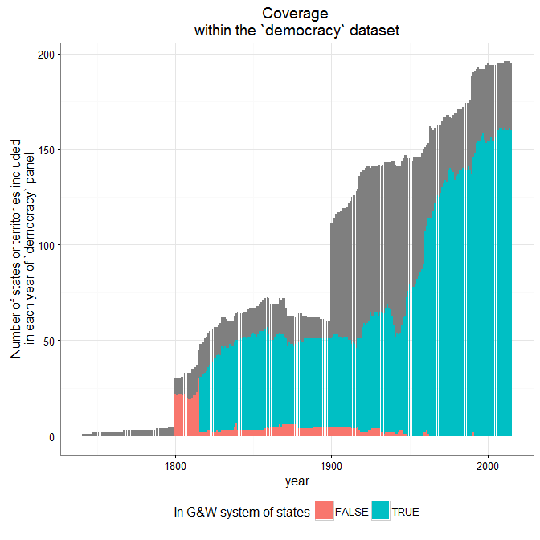

```r
spatial_coverage(data)
```

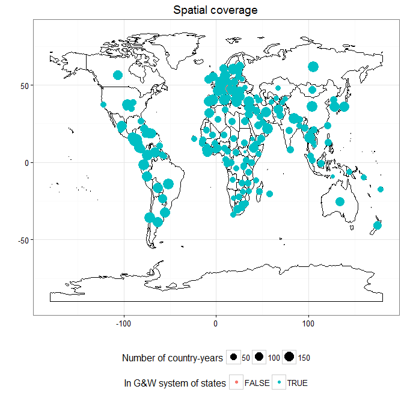

## Distribution


```r
ggplot(data = data) +
  geom_bar(aes(x=value)) +
  theme_bw() +
  theme(legend.position = "bottom") +
  labs(y = "Country-years", x="") +
  facet_wrap(~variable, ncol=2) 
```

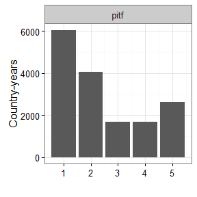

```r
data <- democracy_long %>% filter(variable == "pitf_binary")

ggplot(data = data) +
  geom_bar(aes(x=value)) +
  theme_bw() +
  theme(legend.position = "bottom") +
  labs(y = "Country-years", x="") +
  facet_wrap(~variable, ncol=2) 
```

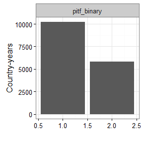

# Polity

These are variables from the Polity IV dataset in country-year format, updated to 2014 (Marshall, Gurr, and Jaggers 2012). 

## Coverage


```r
data <- democracy_long %>% filter(variable == "polity")

temporal_coverage(data) 
```

```
## Joining by: c("country_name", "year")
```


```r
spatial_coverage(data)
```


## Distribution


```r
data <- democracy_long %>% filter(variable == "polity2")

ggplot(data = data) +
  geom_histogram(aes(x=value),binwidth=1) +
  theme_bw() +
  theme(legend.position = "bottom") +
  labs(y = "Country-years") +
  facet_wrap(~variable, ncol=2)
```

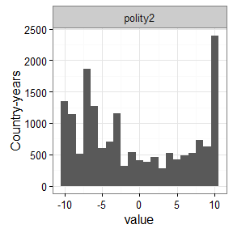

# Polyarchy

The dataset from Coppedge and Reinicke 1991, revised in 2003-2006 with a new "contestation" measure. 

## Coverage


```r
data <- democracy_long %>% filter(variable == "polyarchy_reversed")

temporal_coverage(data) 
```

```
## Joining by: c("country_name", "year")
```

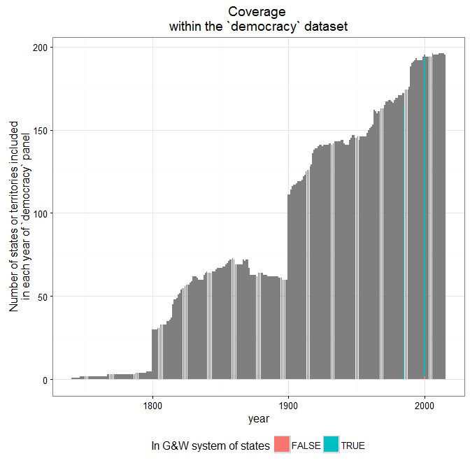

```r
spatial_coverage(data)
```

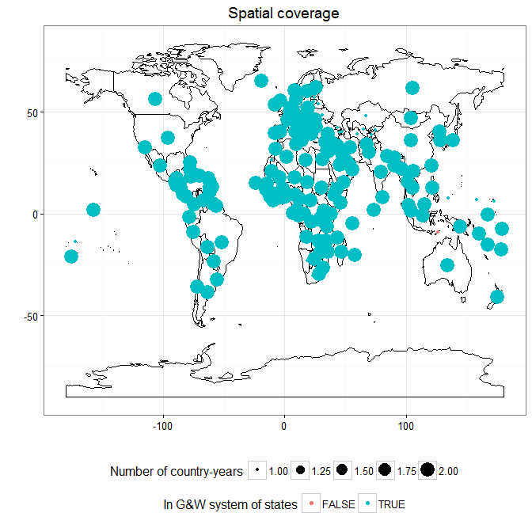

## Distribution


```r
data <- democracy_long %>% filter(variable %in% c("polyarchy_reversed","polyarchy_contestation"))

ggplot(data = data) +
  geom_histogram(aes(x=value)) +
  theme_bw() +
  theme(legend.position = "bottom") +
  labs(y = "Country-years") +
  facet_wrap(~variable, ncol=2)
```

```
## `stat_bin()` using `bins = 30`. Pick better value with `binwidth`.
```

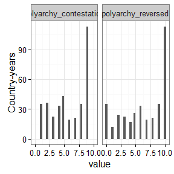

```r
kable(democracy %>% 
        filter(!is.na(polyarchy_reversed)) %>% 
        count(polyarchy_reversed,polyarchy_contestation),
      caption = "Relationship between reversed polyarchy measure and polyarchy contestation measure")
```


Table: Relationship between reversed polyarchy measure and polyarchy contestation measure

 polyarchy_reversed   polyarchy_contestation     n
-------------------  -----------------------  ----
                  0                        1    35
                  1                        2    12
                  2                        2    24
                  3                        3    22
                  4                        4    17
                  5                        4    16
                  5                        5    10
                  6                        5    33
                  7                        6    19
                  8                        7    21
                  9                        8    35
                 10                        9   113

# Political Regime Change (PRC)/Gasiorowski dataset

The dataset first described in Gasiorowski 1996, and updated and revised in Reich 2002. 

## Coverage


```r
data <- democracy_long %>% filter(variable == "prc")

temporal_coverage(data) 
```

```
## Joining by: c("country_name", "year")
```

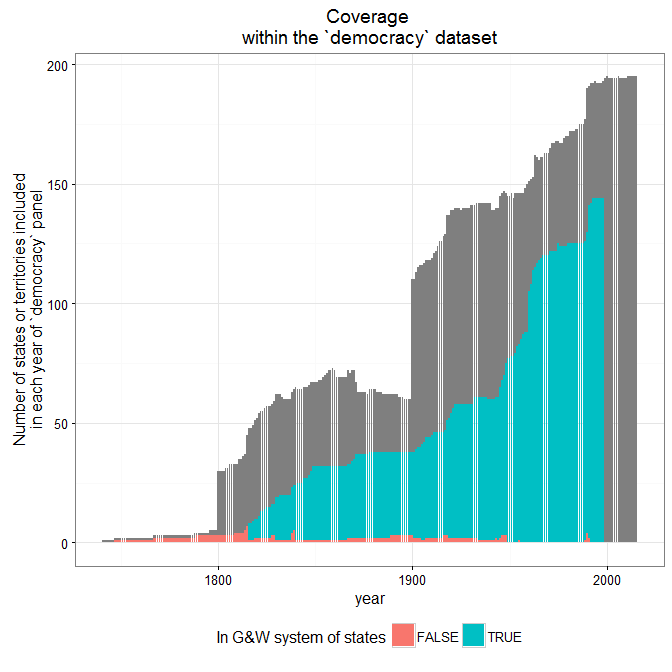

```r
spatial_coverage(data)
```

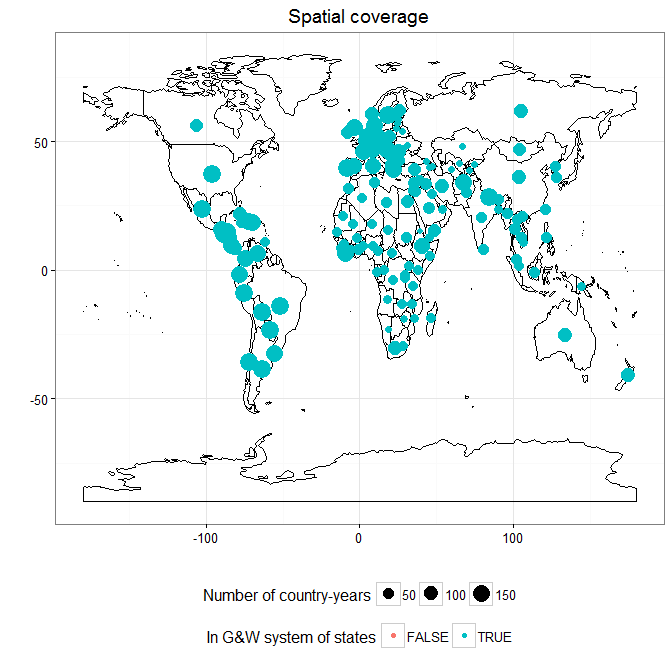

## Distribution


```r
ggplot(data = data) +
  geom_histogram(aes(x=value)) +
  theme_bw() +
  theme(legend.position = "bottom") +
  labs(y = "Country-years") +
  facet_wrap(~variable, ncol=2)
```

```
## `stat_bin()` using `bins = 30`. Pick better value with `binwidth`.
```

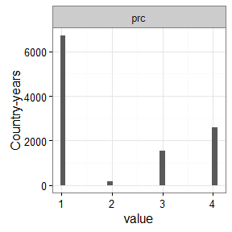

# PIPE

A constructed regime variable from Przeworski 2013 (the Political Institutions and Political Events (PIPE) Data Set).

## Coverage


```r
data <- democracy_long %>% filter(variable == "przeworski")

temporal_coverage(data) 
```

```
## Joining by: c("country_name", "year")
```

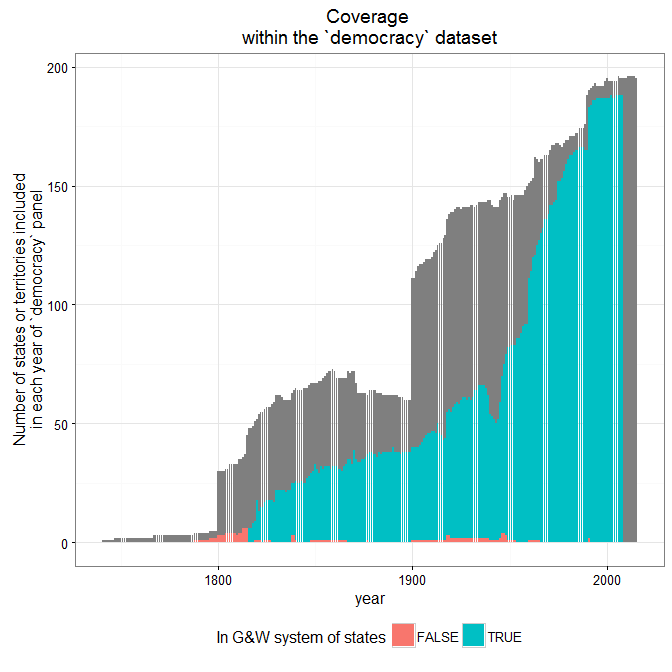

```r
spatial_coverage(data)
```

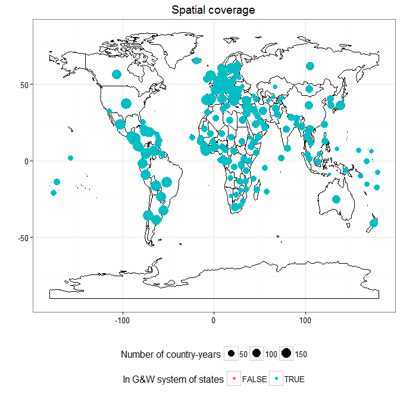

## Distribution

This index is known to have problems, given the confusing documentation in the original dataset regarding its construction. Use with care.


```r
ggplot(data = data) +
  geom_histogram(aes(x=value)) +
  theme_bw() +
  theme(legend.position = "bottom") +
  labs(y = "Country-years") +
  facet_wrap(~variable, ncol=2)
```

```
## `stat_bin()` using `bins = 30`. Pick better value with `binwidth`.
```

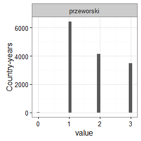

# Svolik

This uses a measure of democracy derived from the authoritarian regime dataset in Svolik 2012. The original data is extended to before 1946 using the information encoded in the `o_startdate` variable of the original dataset, which provides information for the start dates of some authoritarian regimes.

## Coverage


```r
data <- democracy_long %>% filter(variable == "svolik")

temporal_coverage(data) +
  geom_vline(xintercept = 1946) +
  annotate("text", label = "Limit of original dataset", x = 1946,y = 100, angle=90)
```

```
## Joining by: c("country_name", "year")
```


```r
spatial_coverage(data)
```

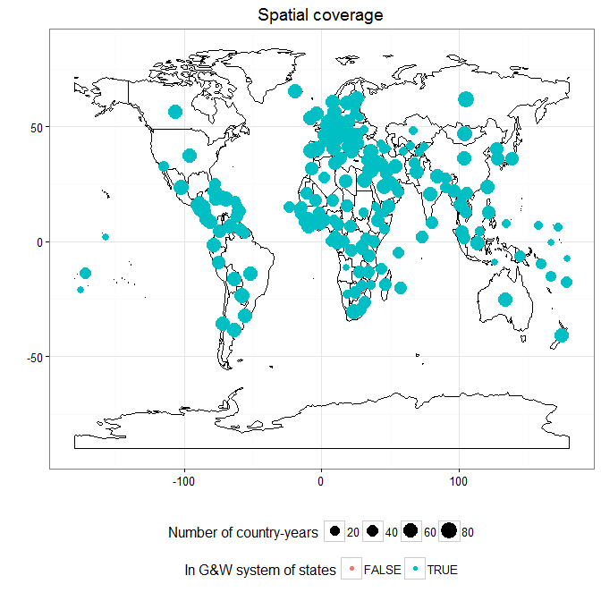

## Distribution


```r
ggplot(data = data) +
  geom_histogram(aes(x=value)) +
  theme_bw() +
  theme(legend.position = "bottom") +
  labs(y = "Country-years") +
  facet_wrap(~variable, ncol=2)
```

```
## `stat_bin()` using `bins = 30`. Pick better value with `binwidth`.
```

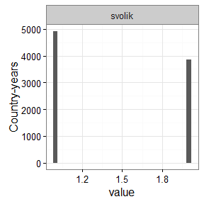

# Ulfelder

The dataset in Ulfelder 2012. 

## Coverage


```r
data <- democracy_long %>% filter(variable == "ulfelder")

temporal_coverage(data) 
```

```
## Joining by: c("country_name", "year")
```

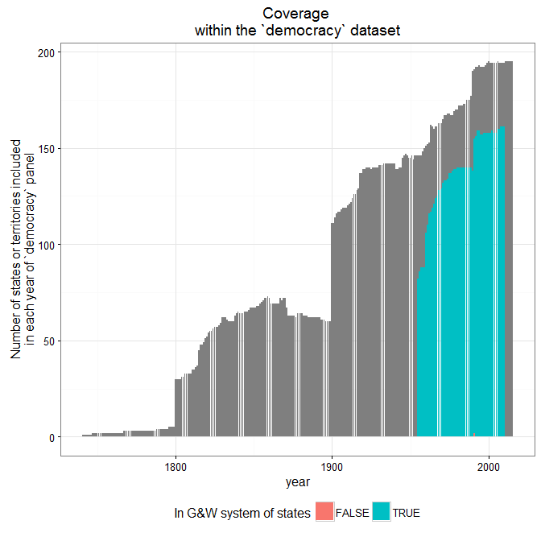

```r
spatial_coverage(data)
```

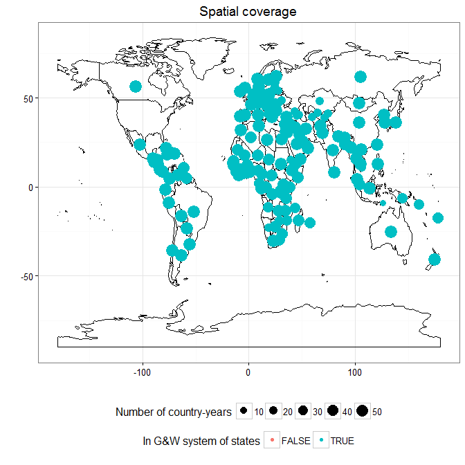

## Distribution


```r
ggplot(data = data) +
  geom_histogram(aes(x=value)) +
  theme_bw() +
  theme(legend.position = "bottom") +
  labs(y = "Country-years") +
  facet_wrap(~variable, ncol=2)
```

```
## `stat_bin()` using `bins = 30`. Pick better value with `binwidth`.
```

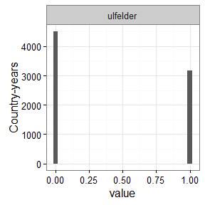

# UTIP

A measure of democracy from the regime type dataset described in Hsu 2008. This dataset identifies three types of democracies: "social democracies", "conservative democracies", and "one party democracies." "One party democracies" are poorly documented, but seem to be equivalent to multiparty autocracies. `utip_dichotomous_strict` identifies as democracies only social or conservative democracies; `utip_dichotomous` also identifies as democracies those "one party democracies"; and `utip_trichotomous` assumes that "one party democracies" are hybrid regimes between democracy and non-democracy.

## Coverage


```r
data <- democracy_long %>% filter(variable == "utip_dichotomous")

temporal_coverage(data) 
```

```
## Joining by: c("country_name", "year")
```

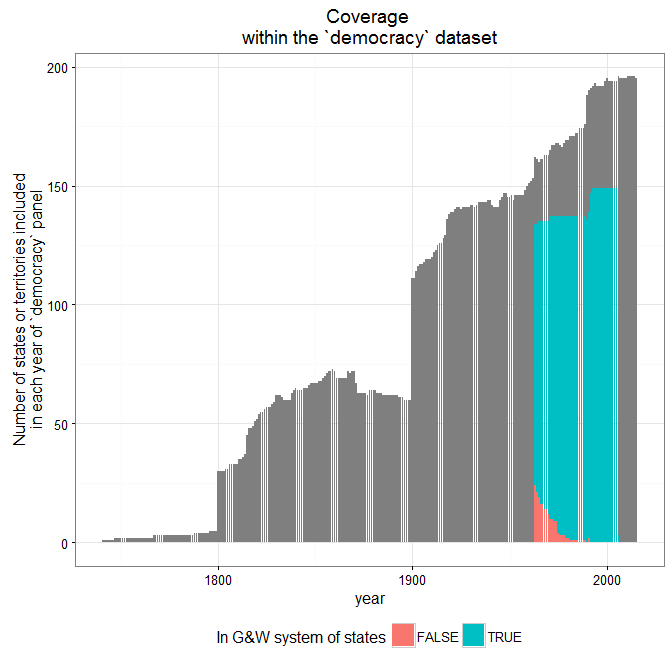

```r
spatial_coverage(data)
```

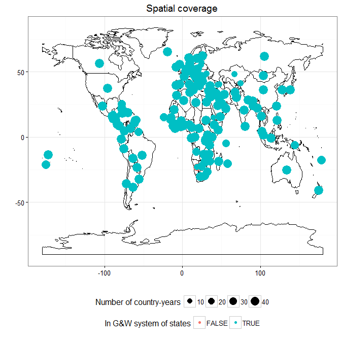

## Distribution


```r
data <- democracy_long %>% filter(variable %in% c("utip_dichotomous_strict","utip_dichotomous","utip_trichotomous"))

ggplot(data = data) +
  geom_histogram(aes(x=value)) +
  theme_bw() +
  theme(legend.position = "bottom") +
  labs(y = "Country-years") +
  facet_wrap(~variable, ncol=2)
```

```
## `stat_bin()` using `bins = 30`. Pick better value with `binwidth`.
```

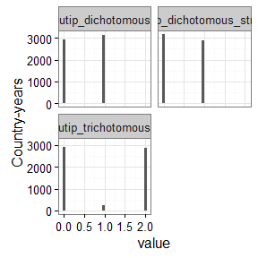

# Vanhanen

This is the dataset in Vanhanen 2012. 

## Coverage


```r
data <- democracy_long %>% filter(variable == "vanhanen_democratization")

temporal_coverage(data) 
```

```
## Joining by: c("country_name", "year")
```

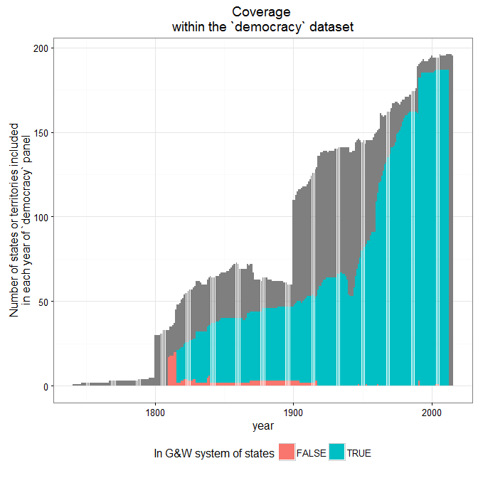

```r
spatial_coverage(data)
```


## Distribution


```r
data <- democracy_long %>% filter(variable %in% c("vanhanen_democratization","vanhanen_participation","vanhanen_competition"))

ggplot(data = data) +
  geom_histogram(aes(x=value)) +
  theme_bw() +
  theme(legend.position = "bottom") +
  labs(y = "Country-years") +
  facet_wrap(~variable, ncol=2)
```

```
## `stat_bin()` using `bins = 30`. Pick better value with `binwidth`.
```

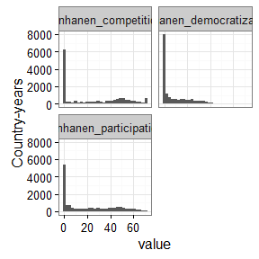

```r
ggplot(data = data) +
  geom_density(aes(x=value)) +
  theme_bw() +
  theme(legend.position = "bottom") +
  labs(y = "Density") +
  facet_wrap(~variable, ncol=2)  
```

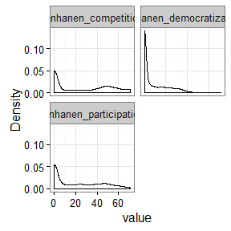

# V-Dem

This is a selection of the major democracy indexes from version 6 of the V-Dem dataset (`v2x*` variables) (Coppedge et al. 2016).

## Coverage

Most of the not in-system country-years in the main dataset are from V-Dem.


```r
data <- democracy_long %>% filter(variable == "v2x_polyarchy")

temporal_coverage(data) 
```

```
## Joining by: c("country_name", "year")
```


```r
spatial_coverage(data)
```

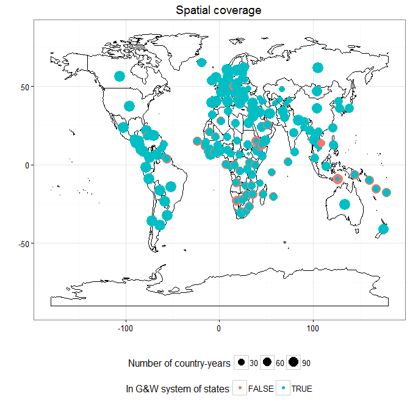

## Distribution


```r
data <- democracy_long %>% filter(grepl("v2x",variable))

ggplot(data = data) +
  geom_histogram(aes(x=value)) +
  theme_bw() +
  theme(legend.position = "bottom") +
  labs(y = "Country-years") +
  facet_wrap(~variable, ncol=2)
```

```
## `stat_bin()` using `bins = 30`. Pick better value with `binwidth`.
```

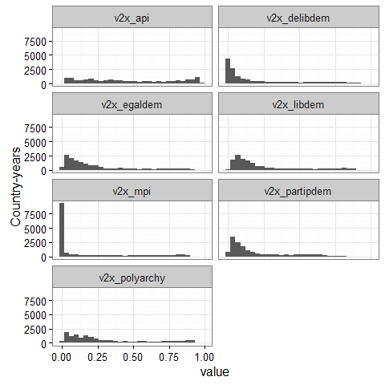

```r
ggplot(data = data) +
  geom_density(aes(x=value)) +
  theme_bw() +
  theme(legend.position = "bottom") +
  labs(y = "Density") +
  facet_wrap(~variable, ncol=2)  
```

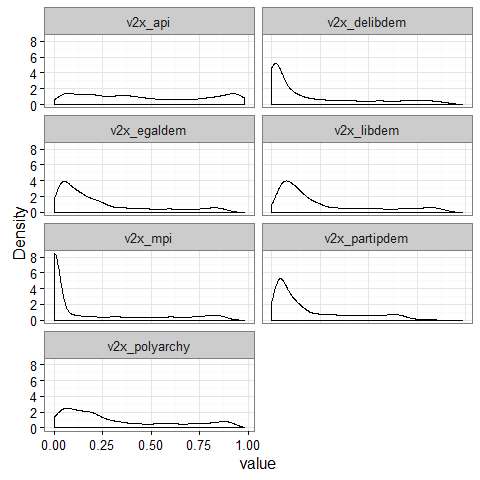

```r
ggcorr(data = democracy %>% select(v2x_api:v2x_polyarchy), label=TRUE,label_round=3, hjust=1) + scale_fill_gradient2(midpoint = 0.7)
```

```
## Scale for 'fill' is already present. Adding another scale for 'fill',
## which will replace the existing scale.
```

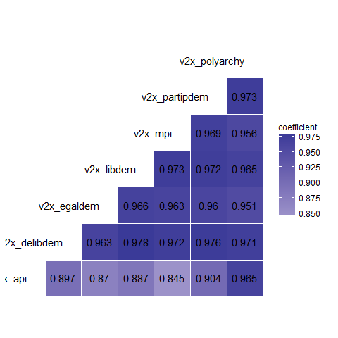

# References

Arat, Zehra F. 1991. Democracy and human rights in developing countries.
Boulder: Lynne Rienner Publishers.

Bernhard, Michael Timothy Nordstrom, and Christopher Reenock, "Economic
Performance, Institutional Intermediation and Democratic Breakdown,"
Journal of Politics 63:3 (2001), pp. 775-803. Data and coding description
available at http://users.clas.ufl.edu/bernhard/content/data/data.htm

Boix, Carles, Michael Miller, and Sebastian Rosato. 2012. A Complete Data
Set of Political Regimes, 1800-2007. Comparative Political Studies 46 (12):
1523-1554. Original data available at
https://sites.google.com/site/mkmtwo/democracy-v2.0.dta?attredirects=0


Bollen, Kenneth A. 2001. "Cross-National Indicators of Liberal Democracy,
1950-1990." 2nd ICPSR version. Chapel Hill, NC: University of North
Carolina, 1998. Ann Arbor, MI: Inter-university Consortium for Political
and Social Research, 2001. Original data available at
http://webapp.icpsr.umich.edu/cocoon/ICPSR-STUDY/02532.xml.

Bowman, Kirk, Fabrice Lehoucq, and James Mahoney. 2005. Measuring Political
Democracy: Case Expertise, Data Adequacy, and Central America. Comparative
Political Studies 38 (8): 939-970.
http://cps.sagepub.com/content/38/8/939. Data available at
http://www.blmdemocracy.gatech.edu/.

Cheibub, Jose Antonio, Jennifer Gandhi, and James Raymond Vreeland. 2010.
"Democracy and Dictatorship Revisited." Public Choice. 143(1):67-101.
Original data available at
https://sites.google.com/site/joseantoniocheibub/datasets/democracy-and-dictatorship-revisited.

Coppedge, Michael, John Gerring, Staffan I. Lindberg, Svend-Erik Skaaning,
and Jan Teorell, with David Altman, Michael Bernhard, M. Steven Fish, Adam
Glynn, Allen Hicken, Carl Henrik Knutsen, Kelly McMann, Pamela Paxton,
Daniel Pemstein, Jeffrey Staton, Brigitte Zimmerman, Frida Andersson,
Valeriya Mechkova, Farhad Miri. 2015. V-Dem Codebook v5. Varieties of
Democracy (V-Dem) Project. Original data available at
https://v-dem.net/en/data/.

Coppedge, Michael and Wolfgang H. Reinicke. 1991. Measuring Polyarchy. In
On Measuring Democracy: Its Consequences and Concomitants, ed. Alex
Inkeles. New Brunswuck, NJ: Transaction pp. 47-68.

Doorenspleet, Renske. 2000. Reassessing the Three Waves of Democratization.
World Politics 52 (03): 384-406. DOI: 10.1017/S0043887100016580.
http://dx.doi.org/10.1017/S0043887100016580.

Economist Intelligence Unit. 2012. Democracy Index 2012: Democracy at a
Standstill.

Freedom House. 2015. "Freedom in the World." Original data available at
http://www.freedomhouse.org.

Gasiorowski, Mark J. 1996. "An Overview of the Political Regime Change
Dataset." Comparative Political Studies 29(4):469-483.

Geddes, Barbara, Joseph Wright, and Erica Frantz. 2014. Autocratic
Breakdown and Regime Transitions: A New Data Set. Perspectives on Politics
12 (1): 313-331. Original data available at
http://dictators.la.psu.edu/.

Gleditsch, Kristian S. & Michael D. Ward. 1999. "Interstate System
Membership: A Revised List of the Independent States since 1816."
International Interactions 25: 393-413. The list can be found at
http://privatewww.essex.ac.uk/~ksg/statelist.html

Goldstone, Jack, Robert Bates, David Epstein, Ted Gurr, Michael Lustik,
Monty Marshall, Jay Ulfelder, and Mark Woodward. 2010. A Global Model for
Forecasting Political Instability. American Journal of Political Science 54
(1): 190-208. DOI:10.1111/j.1540-5907.2009.00426.x

Hadenius, Axel. 1992. Democracy and Development. Cambridge: Cambridge
University Press.

Hadenius, Axel & Jan Teorell. 2007. "Pathways from Authoritarianism", Journal
of Democracy 18(1): 143-156.

Hsu, Sara "The Effect of Political Regimes on Inequality, 1963-2002," UTIP
Working Paper No. 53 (2008),
http://utip.gov.utexas.edu/papers/utip_53.pdf. Data available for
download at http://utip.gov.utexas.edu/data/.

Kailitz, Steffen. 2013. Classifying political regimes revisited: legitimation
and durability. Democratization 20 (1): 39-60. Original data available at
http://dx.doi.org/10.1080/13510347.2013.738861.

Mainwaring, Scott, Daniel Brinks, and Anibal Perez Linan. 2008. "Political
Regimes in Latin America, 1900-2007." Original data available from
http://kellogg.nd.edu/scottmainwaring/Political_Regimes.pdf.

Magaloni, Beatriz, Jonathan Chu, and Eric Min. 2013. Autocracies of the
World, 1950-2012 (Version 1.0). Dataset, Stanford University. Original data
and codebook available at
http://cddrl.fsi.stanford.edu/research/autocracies_of_the_world_dataset/

Marshall, Monty G., Ted Robert Gurr, and Keith Jaggers. 2012. "Polity IV:
Political Regime Characteristics and Transitions, 1800-2012." Updated to
2015. Original data available from
http://www.systemicpeace.org/polity/polity4.htm.

Moon, Bruce E., Jennifer Harvey Birdsall, Sylvia Ceisluk, Lauren M.
Garlett, Joshua J. Hermias, Elizabeth Mendenhall, Patrick D. Schmid, and
Wai Hong Wong (2006) "Voting Counts: Participation in the Measurement of
Democracy" Studies in Comparative International Development 42, 2 (Summer,
2006). The complete dataset is available here:
http://www.lehigh.edu/~bm05/democracy/Obtain_data.htm.

Munck, Gerardo L. 2009. Measuring Democracy: A Bridge Between Scholarship
and Politics. Baltimore: Johns Hopkins University Press.

Pemstein, Daniel, Stephen Meserve, and James Melton. 2010. Democratic
Compromise: A Latent Variable Analysis of Ten Measures of Regime Type.
Political Analysis 18 (4): 426-449.

Pemstein, Daniel, Stephen A. Meserve, and James Melton. 2013. "Replication
data for: Democratic Compromise: A Latent Variable Analysis of Ten Measures
of Regime Type." In: Harvard Dataverse.
http://hdl.handle.net/1902.1/PMM

Przeworski, Adam et al. 2013. Political Institutions and Political Events
(PIPE) Data Set. Department of Politics, New York University.
https://sites.google.com/a/nyu.edu/adam-przeworski/home/data

Reich, G. 2002. Categorizing Political Regimes: New Data for Old Problems.
Democratization 9 (4): 1-24.
http://www.tandfonline.com/doi/pdf/10.1080/714000289.

Skaaning, Svend-Erik, John Gerring, and Henrikas Bartusevicius. 2015. A
Lexical Index of Electoral Democracy. Comparative Political Studies 48
(12): 1491-1525. Original data available from
http://thedata.harvard.edu/dvn/dv/skaaning.

Svolik, Milan. 2012. The Politics of Authoritarian Rule. Cambridge and New
York: Cambridge University Press. Original data available from
http://campuspress.yale.edu/svolik/the-politics-of-authoritarian-rule/.

Taylor, Sean J. and Ulfelder, Jay, A Measurement Error Model of Dichotomous
Democracy Status (May 20, 2015). Available at SSRN:
http://ssrn.com/abstract=2726962 or
http://dx.doi.org/10.2139/ssrn.2726962

Ulfelder, Jay. 2012. "Democracy/Autocracy Data Set." In: Harvard Dataverse.
http://hdl.handle.net/1902.1/18836.

Vanhanen, Tatu. 2012. "FSD1289 Measures of Democracy 1810-2012." Original
data available from
http://www.fsd.uta.fi/english/data/catalogue/FSD1289/meF1289e.html

Wahman, Michael, Jan Teorell, and Axel Hadenius. 2013. Authoritarian regime
types revisited: updated data in comparative perspective. Contemporary
Politics 19 (1): 19-34.
