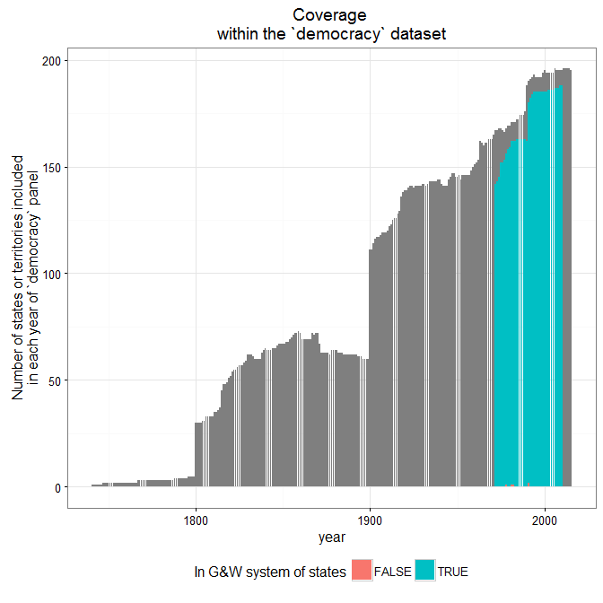
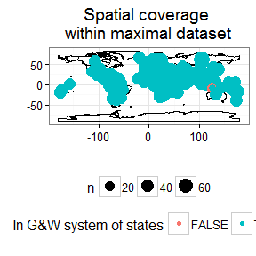
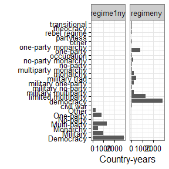

# Characteristics of Different Democracy Measures
Xavier Marquez  
`r Sys.Date()`  


This vignette describes the temporal and spatial coverage of the democracy measures included in this package,  notes their correlations, and documents any changes made to the original data sources.

# General Characteristics


```r
library(knitr)
library(QuickUDS)
library(dplyr)

kable(democracy_long %>% 
        group_by(variable) %>%
        summarise(distinct_countries = n_distinct(country_name),
                  distinct_years = n_distinct(year),
                  min_year = min(year),
                  max_year = max(year),
                  mean_year = mean(year),
                  index_type = unique(index_type),
                  num_values = n_distinct(value),
                  mean = mean(value),
                  median = median(value),
                  min_value = min(value),
                  max_value = max(value),
                  sd = sd(value)),
      digits = 2)
```


|variable                  | distinct_countries| distinct_years| min_year| max_year| mean_year|index_type   | num_values|  mean| median| min_value| max_value|    sd|
|:-------------------------|------------------:|--------------:|--------:|--------:|---------:|:------------|----------:|-----:|------:|---------:|---------:|-----:|
|PEPS1i                    |                175|            204|     1800|     2003|   1949.74|Continuous   |        726| -3.20|  -7.00|    -10.00|     10.00|  6.57|
|PEPS1q                    |                176|            204|     1800|     2003|   1950.37|Continuous   |        727| -3.18|  -6.24|    -10.00|     10.00|  6.49|
|PEPS1v                    |                177|            204|     1800|     2003|   1932.32|Continuous   |       1866| -2.87|  -4.00|    -10.00|     10.00|  5.66|
|PEPS2i                    |                143|             59|     1945|     2003|   1981.28|Continuous   |        843|  3.72|   5.00|     -9.59|     10.00|  4.39|
|PEPS2q                    |                165|             59|     1945|     2003|   1978.99|Continuous   |        856| -1.13|  -1.46|    -10.00|     10.00|  6.91|
|PEPS2v                    |                168|            194|     1810|     2003|   1937.77|Continuous   |       2414| -2.43|  -3.55|    -10.00|     10.00|  5.78|
|Polity3                   |                181|            204|     1800|     2003|   1929.05|Ordinal      |         21| -1.13|  -3.00|    -10.00|     10.00|  7.05|
|arat_pmm                  |                151|             35|     1948|     1982|   1967.70|Continuous   |         77| 73.20|  69.00|     29.00|    109.00| 18.91|
|blm                       |                  5|            101|     1900|     2000|   1950.00|Trichotomous |          3|  0.25|   0.00|      0.00|      1.00|  0.36|
|blm_pmm                   |                  5|             55|     1946|     2000|   1973.00|Trichotomous |          3|  0.36|   0.00|      0.00|      1.00|  0.41|
|bmr_democracy             |                212|            211|     1800|     2010|   1938.71|Dichotomous  |          2|  0.32|   0.00|      0.00|      1.00|  0.47|
|bmr_democracy_omitteddata |                212|            211|     1800|     2010|   1938.89|Dichotomous  |          2|  0.32|   0.00|      0.00|      1.00|  0.47|
|bnr                       |                200|             93|     1913|     2005|   1970.84|Dichotomous  |          2|  0.35|   0.00|      0.00|      1.00|  0.48|
|bollen_pmm                |                161|              5|     1950|     1980|   1965.48|Continuous   |        348| 55.46|  53.59|      0.00|    100.00| 33.70|
|doorenspleet              |                172|            195|     1800|     1994|   1921.29|Dichotomous  |          2|  1.18|   1.00|      1.00|      2.00|  0.38|
|eiu                       |                176|             16|     1996|     2014|   2006.92|Continuous   |        788|  0.47|   0.45|      0.00|      0.97|  0.24|
|exconst                   |                186|            215|     1800|     2014|   1938.14|Ordinal      |         10|  0.07|   3.00|    -88.00|      7.00| 17.29|
|exrec                     |                186|            215|     1800|     2014|   1938.73|Ordinal      |         11|  0.84|   3.00|    -88.00|      8.00| 17.61|
|freedomhouse              |                200|             43|     1972|     2015|   1994.87|Ordinal      |         13|  4.26|   4.50|      1.00|      7.00|  2.06|
|freedomhouse_electoral    |                196|             27|     1989|     2015|   2002.20|Dichotomous  |          2|  0.60|   1.00|      0.00|      1.00|  0.49|
|freedomhouse_pmm          |                198|             37|     1972|     2008|   1990.95|Ordinal      |         13|  4.15|   4.00|      1.00|      7.00|  2.07|
|gwf                       |                154|            270|     1741|     2010|   1969.92|Dichotomous  |          2|  1.43|   1.00|      1.00|      2.00|  0.49|
|hadenius_pmm              |                129|              1|     1988|     1988|   1988.00|Continuous   |         51|  4.51|   3.10|      0.00|     10.00|  3.56|
|kailitz_binary            |                198|             66|     1945|     2010|   1982.69|Dichotomous  |          2|  0.41|   0.00|      0.00|      1.00|  0.49|
|kailitz_tri               |                198|             66|     1945|     2010|   1982.69|Trichotomous |          3|  0.99|   1.00|      0.00|      2.00|  0.91|
|lied                      |                223|            216|     1800|     2015|   1938.91|Ordinal      |          7|  2.78|   3.00|      0.00|      6.00|  2.35|
|lied_accountable          |                223|            216|     1800|     2015|   1938.91|Trichotomous |          3|  0.94|   1.00|      0.00|      2.00|  0.87|
|lied_electoral            |                223|            216|     1800|     2015|   1938.91|Trichotomous |          3|  1.38|   2.00|      0.00|      2.00|  0.85|
|lied_inclusive            |                223|            216|     1800|     2015|   1938.91|Trichotomous |          3|  1.17|   2.00|      0.00|      2.00|  0.94|
|magaloni_democ_binary     |                172|            244|     1769|     2012|   1972.44|Dichotomous  |          2|  0.42|   0.00|      0.00|      1.00|  0.49|
|magaloni_regime_tri       |                172|            244|     1769|     2012|   1972.44|Trichotomous |          3|  2.01|   2.00|      1.00|      3.00|  0.92|
|mainwaring                |                 20|            108|     1900|     2007|   1953.60|Trichotomous |          3| -0.32|  -1.00|     -1.00|      1.00|  0.84|
|mainwaring_pmm            |                 18|             62|     1946|     2007|   1981.10|Trichotomous |          3|  0.12|   0.00|     -1.00|      1.00|  0.85|
|munck_pmm                 |                 18|             19|     1960|     2005|   1993.79|Continuous   |         21|  0.84|   1.00|      0.00|      1.00|  0.26|
|pacl                      |                196|             63|     1946|     2008|   1981.94|Dichotomous  |          2|  0.44|   0.00|      0.00|      1.00|  0.50|
|pacl_pmm                  |                196|             63|     1946|     2008|   1982.01|Dichotomous  |          2|  0.44|   0.00|      0.00|      1.00|  0.50|
|pitf                      |                185|            215|     1800|     2014|   1938.44|Ordinal      |          5|  2.42|   2.00|      1.00|      5.00|  1.48|
|pitf_binary               |                185|            215|     1800|     2014|   1938.44|Dichotomous  |          2|  1.36|   1.00|      1.00|      2.00|  0.48|
|polcomp                   |                186|            215|     1800|     2014|   1938.45|Ordinal      |         13|  1.29|   6.00|    -88.00|     10.00| 17.77|
|polity                    |                186|            215|     1800|     2014|   1938.14|Ordinal      |         24| -4.12|  -3.00|    -88.00|     10.00| 17.67|
|polity2                   |                186|            215|     1800|     2014|   1938.15|Ordinal      |         21| -0.64|  -3.00|    -10.00|     10.00|  7.07|
|polity_pmm                |                167|             63|     1946|     2008|   1980.85|Ordinal      |         21|  0.13|  -1.00|    -10.00|     10.00|  7.50|
|polyarchy_contestation    |                196|              2|     1985|     2000|   1993.11|Ordinal      |          9|  5.82|   6.00|      1.00|      9.00|  2.90|
|polyarchy_pmm             |                194|              2|     1985|     2000|   1993.12|Ordinal      |         11|  6.33|   7.00|      0.00|     10.00|  3.51|
|polyarchy_reversed        |                196|              2|     1985|     2000|   1993.11|Ordinal      |         11|  6.35|   7.00|      0.00|     10.00|  3.52|
|prc                       |                149|            252|     1747|     1998|   1937.00|Ordinal      |          4|  2.00|   1.00|      1.00|      4.00|  1.30|
|prc_notrans               |                149|            252|     1747|     1998|   1936.50|Trichotomous |          3|  2.00|   1.00|      1.00|      4.00|  1.31|
|prc_pmm                   |                148|             53|     1946|     1998|   1974.83|Ordinal      |          4|  2.15|   1.00|      1.00|      4.00|  1.37|
|przeworski                |                197|            221|     1788|     2008|   1950.24|Ordinal      |          4|  1.79|   2.00|      0.00|      3.00|  0.81|
|svolik                    |                198|             88|     1921|     2008|   1980.99|Dichotomous  |          2|  1.44|   1.00|      1.00|      2.00|  0.50|
|ulfelder                  |                167|             56|     1955|     2010|   1984.84|Dichotomous  |          2|  0.41|   0.00|      0.00|      1.00|  0.49|
|utip_dichotomous          |                152|             44|     1963|     2006|   1984.47|Dichotomous  |          2|  0.52|   1.00|      0.00|      1.00|  0.50|
|utip_dichotomous_strict   |                152|             44|     1963|     2006|   1984.47|Dichotomous  |          2|  0.48|   0.00|      0.00|      1.00|  0.50|
|utip_trichotomous         |                152|             44|     1963|     2006|   1984.47|Trichotomous |          3|  0.99|   1.00|      0.00|      2.00|  0.98|
|v2x_api                   |                173|            116|     1900|     2015|   1960.99|Continuous   |       9268|  0.47|   0.42|      0.02|      0.98|  0.31|
|v2x_delibdem              |                172|            116|     1900|     2015|   1961.00|Continuous   |       9827|  0.21|   0.07|      0.00|      0.93|  0.27|
|v2x_egaldem               |                173|            116|     1900|     2015|   1960.99|Continuous   |      10152|  0.25|   0.15|      0.01|      0.92|  0.25|
|v2x_libdem                |                173|            116|     1900|     2015|   1960.99|Continuous   |      10593|  0.26|   0.15|      0.01|      0.93|  0.25|
|v2x_mpi                   |                173|            116|     1900|     2015|   1960.99|Continuous   |       6148|  0.18|   0.00|      0.00|      0.93|  0.28|
|v2x_partipdem             |                173|            116|     1900|     2015|   1960.96|Continuous   |       9910|  0.20|   0.11|      0.00|      0.84|  0.21|
|v2x_polyarchy             |                173|            116|     1900|     2015|   1960.99|Continuous   |       9268|  0.32|   0.21|      0.01|      0.96|  0.28|
|vanhanen_competition      |                193|            203|     1810|     2012|   1947.43|Continuous   |        694| 25.22|  20.00|      0.00|     70.00| 25.17|
|vanhanen_democratization  |                193|            203|     1810|     2012|   1947.43|Continuous   |        445|  8.43|   1.10|      0.00|     49.00| 11.68|
|vanhanen_participation    |                193|            203|     1810|     2012|   1947.43|Continuous   |        760| 21.10|  14.00|      0.00|     71.00| 21.88|
|vanhanen_pmm              |                192|             63|     1946|     2008|   1981.71|Continuous   |        439| 11.31|   5.90|      0.00|     49.00| 12.67|
|wahman_teorell_hadenius   |                193|             39|     1972|     2010|   1991.93|Dichotomous  |          2|  0.42|   0.00|      0.00|      1.00|  0.49|


# Arat

This is the dataset described in Arat 1991; the actual values are taken from Pemstein, Meserve, and Melton 2013 (the replication data for Pemstein, Meserve, and Melton 2010).

## Coverage


```r
library(ggplot2)

panel <- democracy %>% select(country_name,year) %>% distinct()

temporal_coverage <- function(data) {
  data <- left_join(panel,data) 
  
  data <- data %>% 
    group_by(year, add=TRUE) %>% 
    count(year,in_system)

  ggplot(data =  data, aes(x=year,fill = in_system, y = n)) + 
    geom_bar(stat = "identity") +
    theme_bw() +
    theme(legend.position = "bottom") +
    labs(fill = "In G&W system of states", 
         y = "Number of states or territories included\nin each year of `democracy` panel") +
    ggtitle("Coverage \nwithin the `democracy` dataset")
}

library(rworldmap)
```

```
## Loading required package: sp
```

```
## Warning: package 'sp' was built under R version 3.2.5
```

```
## ### Welcome to rworldmap ###
```

```
## For a short introduction type : 	 vignette('rworldmap')
```

```r
world <- getMap()
world <- fortify(world)
```

```
## Regions defined for each Polygons
```

```r
spatial_coverage <- function(data) {
  ggplot() +
    geom_path(data = world, aes(x=long,y=lat,group=group)) +
    theme_bw() +
    theme(legend.position = "bottom") +
    geom_count(data = data, aes(x=lon,y=lat,color = in_system)) +
    labs(color = "In G&W system of states", y = "", x = "", size = "Number of country-years") +
    ggtitle("Spatial coverage")
}

data <- democracy_long %>% filter(variable == "arat_pmm")

temporal_coverage(data)
```

```
## Joining by: c("country_name", "year")
```


```r
spatial_coverage(data)
```


## Distribution


```r
ggplot(data = data) +
  geom_histogram(aes(x=value),bins=20) +
  theme_bw() +
  theme(legend.position = "bottom") +
  labs(y = "Country-years") +
  facet_wrap(~variable, ncol=2)
```


```r
ggplot(data = data) +
  geom_density(aes(x=value)) +
  theme_bw() +
  theme(legend.position = "bottom") +
  labs(y = "Density") +
  facet_wrap(~variable, ncol=2)
```


# BLM

This is the dataset described in Bowman, Lehoucq, and Mahoney 2005.

## Coverage


```r
data <- democracy_long %>% filter(variable == "blm")

temporal_coverage(data)
```

```
## Joining by: c("country_name", "year")
```


```r
spatial_coverage(data)
```


## Distribution


```r
ggplot(data = data) +
  geom_histogram(aes(x=value),bins=20) +
  theme_bw() +
  theme(legend.position = "bottom") +
  labs(y = "Country-years") +
  facet_wrap(~variable, ncol=2)
```


# BMR

This is the dataset described in Boix, Miller, and Rosato 2012.

## Coverage


```r
data <- democracy_long %>% filter(variable == "bmr_democracy")

temporal_coverage(data)
```

```
## Joining by: c("country_name", "year")
```


```r
spatial_coverage(data)
```


## Distribution


```r
data <- democracy_long %>% filter(variable %in% c("bmr_democracy","bmr_democracy_omitteddata"))

ggplot(data = data) +
  geom_histogram(aes(x=value),bins=20) +
  theme_bw() +
  theme(legend.position = "bottom") +
  labs(y = "Country-years") +
  facet_wrap(~variable, ncol=2)
```


# BNR

This is the dataset described in Bernhardt, Nordstrom, and Reenock 2001. The original dataset only counts periods of democracy in the period 1913-2005, since it is designed for event history analysis. To put it in country-year format, this package assumes that country-years in independent states between 1913 and 2005 are to be counted as non-democratic if they are not explicitly said to be democratic by BNR. (Country-years are considered to be independent if the state is not a microstate and appears in Gleditasch and Ward's [1999] panel of indepdent states for the period).

## Coverage


```r
data <- democracy_long %>% filter(variable == "bnr")

temporal_coverage(data)
```

```
## Joining by: c("country_name", "year")
```


```r
spatial_coverage(data)
```


## Distribution


```r
ggplot(data = data) +
  geom_histogram(aes(x=value),bins=20) +
  theme_bw() +
  theme(legend.position = "bottom") +
  labs(y = "Country-years") +
  facet_wrap(~variable, ncol=2)
```


# Bollen

This is the dataset described in Bollen 2001. The actual values are taken from Pemstein, Meserve, and Melton's replication data for their article (Pemstein, Meserve, and Melton 2013).

## Coverage


```r
data <- democracy_long %>% filter(variable == "bollen_pmm")

temporal_coverage(data)
```

```
## Joining by: c("country_name", "year")
```


```r
spatial_coverage(data)
```


## Distribution


```r
ggplot(data = data) +
  geom_histogram(aes(x=value),bins=20) +
  theme_bw() +
  theme(legend.position = "bottom") +
  labs(y = "Country-years") +
  facet_wrap(~variable, ncol=2)
```


```r
ggplot(data = data) +
  geom_density(aes(x=value)) +
  theme_bw() +
  theme(legend.position = "bottom") +
  labs(y = "Density") +
  facet_wrap(~variable, ncol=2)
```


# Doorenspleet

This is the dataset described in Doorenspleet 2000.

## Coverage


```r
data <- democracy_long %>% filter(variable == "doorenspleet")

temporal_coverage(data)
```

```
## Joining by: c("country_name", "year")
```


```r
spatial_coverage(data)
```


## Distribution


```r
ggplot(data = data) +
  geom_histogram(aes(x=value),bins=20) +
  theme_bw() +
  theme(legend.position = "bottom") +
  labs(y = "Country-years") +
  facet_wrap(~variable, ncol=2)
```


# EIU

This contains the Economist Intelligence Unit's index of democracy (EIU 2012). The actual data is taken from the World Bank's Governance Indicators (http://www.govindicators.org)

## Coverage


```r
data <- democracy_long %>% filter(variable == "eiu")

temporal_coverage(data)
```

```
## Joining by: c("country_name", "year")
```


```r
spatial_coverage(data)
```


## Distribution


```r
ggplot(data = data) +
  geom_histogram(aes(x=value),bins=20) +
  theme_bw() +
  theme(legend.position = "bottom") +
  labs(y = "Country-years") +
  facet_wrap(~variable, ncol=2)
```


```r
ggplot(data = data) +
  geom_density(aes(x=value)) +
  theme_bw() +
  theme(legend.position = "bottom") +
  labs(y = "Density") +
  facet_wrap(~variable, ncol=2)
```


# Freedom House (Freedom in the World)

This is the Freedom in the World Index, to 2015 (Freedom House 2016). Some non-independent territories have been excluded from the original data.

## Coverage


```r
data <- democracy_long %>% filter(variable %in% c("freedomhouse"))

temporal_coverage(data)
```

```
## Joining by: c("country_name", "year")
```


```r
spatial_coverage(data)
```


## Distribution


```r
ggplot(data = data) +
  geom_histogram(aes(x=value),bins=20) +
  theme_bw() +
  theme(legend.position = "bottom") +
  labs(y = "Country-years") +
  facet_wrap(~variable, ncol=2)
```


```r
ggplot(data = data) +
  geom_density(aes(x=value)) +
  theme_bw() +
  theme(legend.position = "bottom") +
  labs(y = "Density") +
  facet_wrap(~variable, ncol=2)
```


# Freedom House (Electoral Democracies)

This is Freedom House's list of electoral democracies, to 2015 (Freedom House 2016). Some non-independent territories have been excluded from the original data.

## Coverage


```r
data <- democracy_long %>% filter(variable == "freedomhouse_electoral")

temporal_coverage(data)
```

```
## Joining by: c("country_name", "year")
```


```r
spatial_coverage(data)
```


## Distribution


```r
ggplot(data = data) +
  geom_histogram(aes(x=value),bins=20) +
  theme_bw() +
  theme(legend.position = "bottom") +
  labs(y = "Country-years") +
  facet_wrap(~variable, ncol=2)
```


# GWF (Geddes, Wright, and Frantz)

This is a measure of democracy/non-democracy derived from the dataset described in Geddes, Wright, and Frantz 2014. The original data has been extended beyond 1945 by reconciling the information contained in the original dataset's `gwf_startdate`, `gwf_spell`, and `gwf_casename` variables, which encode the start year of each democratic and non-democratic regime (sometimes going back to the 18th century). 

## Coverage


```r
data <- democracy_long %>% filter(variable == "gwf")

temporal_coverage(data) +
  geom_vline(xintercept = 1945) +
  annotate("text", label = "Limit of original dataset", x = 1945,y = 100, angle=90)
```

```
## Joining by: c("country_name", "year")
```


```r
spatial_coverage(data)
```


## Distribution


```r
ggplot(data = data) +
  geom_histogram(aes(x=value),bins=20) +
  theme_bw() +
  theme(legend.position = "bottom") +
  labs(y = "Country-years") +
  facet_wrap(~variable, ncol=2)
```


# Hadenius

This is the dataset in Hadenius 1992. Actual values taken from Pemstein, Meserve, and Melton 2013. 

## Coverage


```r
data <- democracy_long %>% filter(variable == "hadenius_pmm")

temporal_coverage(data) 
```

```
## Joining by: c("country_name", "year")
```


```r
spatial_coverage(data)
```


## Distribution


```r
ggplot(data = data) +
  geom_histogram(aes(x=value),bins=20) +
  theme_bw() +
  theme(legend.position = "bottom") +
  labs(y = "Country-years") +
  facet_wrap(~variable, ncol=2)
```


```r
ggplot(data = data) +
  geom_density(aes(x=value)) +
  theme_bw() +
  theme(legend.position = "bottom") +
  labs(y = "Density") +
  facet_wrap(~variable, ncol=2)
```


# Kailitz

The dataset described in Kailitz 2013.  

## Coverage


```r
data <- democracy_long %>% filter(variable == "kailitz_binary")

temporal_coverage(data)
```

```
## Joining by: c("country_name", "year")
```


```r
spatial_coverage(data)
```


## Distribution


```r
data <- democracy_long %>% filter(variable %in% c("kailitz_binary","kailitz_tri"))

ggplot(data = data) +
  geom_histogram(aes(x=value)) +
  theme_bw() +
  theme(legend.position = "bottom") +
  labs(y = "Country-years") +
  facet_wrap(~variable, ncol=2)
```

```
## `stat_bin()` using `bins = 30`. Pick better value with `binwidth`.
```


## Index construction and known problems

Note that 316 of the country-years in the Kailitz dataset are classified with more than one regime type. 


```r
kable(kailitz.yearly %>% 
        count(multiple_regimes = grepl("-",combined_regime)))
```


|multiple_regimes |    n|
|:----------------|----:|
|FALSE            | 9290|
|TRUE             |  316|

```r
kable(kailitz.yearly %>% 
        filter(grepl("-",combined_regime)) %>%
        group_by(country_name) %>%
        arrange(country_name,year) %>%
        group_by(combined_regime, add=TRUE) %>%
        summarise(min = min(year), max = max(year), n = n()))
```


|country_name                   |combined_regime                                              |  min|  max|  n|
|:------------------------------|:------------------------------------------------------------|----:|----:|--:|
|Afghanistan                    |Electoral Autocracy-Personalist Autocracy                    | 2010| 2010|  1|
|Algeria                        |Electoral Autocracy-One party Autocracy                      | 1989| 1991|  3|
|Angola                         |Electoral Autocracy-State Failure or Occupation              | 2010| 2010|  1|
|Benin                          |Electoral Autocracy-Personalist Autocracy                    | 1960| 1962|  3|
|Benin                          |Military Autocracy-Personalist Autocracy                     | 1965| 1974|  8|
|Benin                          |Personalist Autocracy-Transition                             | 1963| 1971|  4|
|Burundi                        |Electoral Autocracy-State Failure or Occupation              | 1993| 1995|  3|
|Burundi                        |One party Autocracy-Personalist Autocracy                    | 1982| 1983|  2|
|Cambodia (Kampuchea)           |Communist Ideocracy-State Failure or Occupation              | 1981| 1990| 10|
|Central African Republic       |Electoral Autocracy-One party Autocracy                      | 1991| 1992|  2|
|Colombia                       |Electoral Autocracy-Liberal Democracy                        | 1946| 1947|  2|
|Colombia                       |State Failure or Occupation-Transition                       | 1948| 1952|  5|
|Cuba                           |Electoral Autocracy-Liberal Democracy                        | 1946| 1951|  6|
|Ecuador                        |Electoral Autocracy-Personalist Autocracy                    | 1970| 1971|  2|
|Ecuador                        |Electoral Autocracy-Transition                               | 2000| 2001|  2|
|Guinea-Bissau                  |Military Autocracy-Personalist Autocracy                     | 1980| 1983|  4|
|Guinea-Bissau                  |Military Autocracy-Transition                                | 2004| 2004|  1|
|Haiti                          |Electoral Autocracy-Transition                               | 1946| 1947|  2|
|Honduras                       |Electoral Autocracy-Liberal Democracy                        | 1957| 1962|  6|
|Indonesia                      |Personalist Autocracy-Transition                             | 1952| 1967| 12|
|Kuwait                         |Monarchy-State Failure or Occupation                         | 1990| 1990|  1|
|Lebanon                        |State Failure or Occupation-Transition                       | 2000| 2001|  2|
|Lesotho                        |Electoral Autocracy-State Failure or Occupation              | 1998| 1999|  2|
|Lesotho                        |Electoral Autocracy-Transition                               | 2000| 2001|  2|
|Liberia                        |Personalist Autocracy-State Failure or Occupation            | 1990| 1990|  1|
|Madagascar (Malagasy)          |Military Autocracy-Personalist Autocracy                     | 1972| 1974|  3|
|Madagascar (Malagasy)          |Personalist Autocracy-Transition                             | 1975| 1975|  1|
|Mauritania                     |Electoral Autocracy-Military Autocracy                       | 2008| 2008|  1|
|Mozambique                     |Personalist Autocracy-Transition                             | 1991| 1993|  3|
|Nicaragua                      |Communist Ideocracy-Electoral Autocracy                      | 1984| 1989|  6|
|Nicaragua                      |Communist Ideocracy-State Failure or Occupation              | 1980| 1981|  2|
|Nicaragua                      |Communist Ideocracy-Transition                               | 1982| 1983|  2|
|Nicaragua                      |Electoral Autocracy-Personalist Autocracy                    | 1972| 1972|  1|
|Nicaragua                      |Military Autocracy-Personalist Autocracy                     | 1973| 1973|  1|
|Niger                          |Electoral Autocracy-Liberal Democracy                        | 2000| 2010| 11|
|Peru                           |Electoral Autocracy-Liberal Democracy                        | 1963| 1967|  5|
|Philippines                    |Electoral Autocracy-Liberal Democracy                        | 1946| 1971| 26|
|Philippines                    |Liberal Democracy-Personalist Autocracy                      | 1994| 2002|  9|
|Portugal                       |Military Autocracy-Transition                                | 1974| 1975|  2|
|Seychelles                     |Electoral Autocracy-Liberal Democracy                        | 2007| 2010|  4|
|Seychelles                     |Liberal Democracy-Transition                                 | 1976| 1976|  1|
|Somalia                        |Liberal Democracy-Transition                                 | 1960| 1968|  9|
|Somalia                        |Military Autocracy-Personalist Autocracy                     | 1969| 1990| 22|
|Somalia                        |Military Autocracy-State Failure or Occupation               | 1991| 1991|  1|
|Spain                          |Military Autocracy-One party Autocracy-Personalist Autocracy | 1946| 1974| 29|
|Sri Lanka (Ceylon)             |Electoral Autocracy-Liberal Democracy                        | 1960| 2010| 51|
|Sri Lanka (Ceylon)             |Electoral Autocracy-Transition                               | 1948| 1959| 12|
|Syria                          |One party Autocracy-Personalist Autocracy                    | 2000| 2010| 11|
|Tunisia                        |One party Autocracy-Personalist Autocracy                    | 1975| 1978|  4|
|Venezuela                      |Military Autocracy-Personalist Autocracy                     | 1948| 1957| 10|
|Yemen (Arab Republic of Yemen) |Monarchy-Transition                                          | 1946| 1947|  2|

The following are especially troublesome, since the multiple categories do not make sense:


```r
kable(kailitz.yearly %>% 
        filter(grepl("-",combined_regime)) %>%
        group_by(country_name) %>%
        arrange(country_name,year) %>%
        group_by(combined_regime, add=TRUE) %>%
        summarise(min = min(year), max = max(year), n = n()) %>%
        filter(grepl("democracy",combined_regime, ignore.case=TRUE)))
```


|country_name       |combined_regime                         |  min|  max|  n|
|:------------------|:---------------------------------------|----:|----:|--:|
|Colombia           |Electoral Autocracy-Liberal Democracy   | 1946| 1947|  2|
|Cuba               |Electoral Autocracy-Liberal Democracy   | 1946| 1951|  6|
|Honduras           |Electoral Autocracy-Liberal Democracy   | 1957| 1962|  6|
|Niger              |Electoral Autocracy-Liberal Democracy   | 2000| 2010| 11|
|Peru               |Electoral Autocracy-Liberal Democracy   | 1963| 1967|  5|
|Philippines        |Electoral Autocracy-Liberal Democracy   | 1946| 1971| 26|
|Philippines        |Liberal Democracy-Personalist Autocracy | 1994| 2002|  9|
|Seychelles         |Electoral Autocracy-Liberal Democracy   | 2007| 2010|  4|
|Seychelles         |Liberal Democracy-Transition            | 1976| 1976|  1|
|Somalia            |Liberal Democracy-Transition            | 1960| 1968|  9|
|Sri Lanka (Ceylon) |Electoral Autocracy-Liberal Democracy   | 1960| 2010| 51|

I have constructed the index to classify a country as "democratic" only if it is not also classified as a non-democratic regime as well. Here are the index counts for each regime type:


```r
kable(kailitz.yearly %>%
        count(kailitz_binary,kailitz_tri,combined_regime))
```


| kailitz_binary| kailitz_tri|combined_regime                                              |    n|
|--------------:|-----------:|:------------------------------------------------------------|----:|
|              0|           0|Communist Ideocracy                                          |  788|
|              0|           0|Communist Ideocracy-Electoral Autocracy                      |    6|
|              0|           0|Communist Ideocracy-State Failure or Occupation              |   12|
|              0|           0|Communist Ideocracy-Transition                               |    2|
|              0|           0|Electoral Autocracy-Military Autocracy                       |    1|
|              0|           0|Electoral Autocracy-One party Autocracy                      |    5|
|              0|           0|Electoral Autocracy-Personalist Autocracy                    |    7|
|              0|           0|Electoral Autocracy-State Failure or Occupation              |    6|
|              0|           0|Electoral Autocracy-Transition                               |   18|
|              0|           0|Liberal Democracy-Personalist Autocracy                      |    9|
|              0|           0|Liberal Democracy-Transition                                 |   10|
|              0|           0|Military Autocracy                                           |  570|
|              0|           0|Military Autocracy-One party Autocracy-Personalist Autocracy |   29|
|              0|           0|Military Autocracy-Personalist Autocracy                     |   48|
|              0|           0|Military Autocracy-State Failure or Occupation               |    1|
|              0|           0|Military Autocracy-Transition                                |    3|
|              0|           0|Monarchy                                                     |  987|
|              0|           0|Monarchy-State Failure or Occupation                         |    1|
|              0|           0|Monarchy-Transition                                          |    2|
|              0|           0|One party Autocracy                                          |  486|
|              0|           0|One party Autocracy-Personalist Autocracy                    |   17|
|              0|           0|Personalist Autocracy                                        |  463|
|              0|           0|Personalist Autocracy-State Failure or Occupation            |    1|
|              0|           0|Personalist Autocracy-Transition                             |   20|
|              0|           0|State Failure or Occupation                                  |  245|
|              0|           0|State Failure or Occupation-Transition                       |    7|
|              0|           0|Transition                                                   |  319|
|              0|           1|Electoral Autocracy                                          | 1477|
|              0|           1|Electoral Autocracy-Liberal Democracy                        |  111|
|              1|           2|Liberal Democracy                                            | 3955|

# LIED

This is the Lexical Index of Democracy described in Skaaning,  Gerring, and Bartusevicius 2015 (version 3, updated to 2015). 

## Coverage


```r
data <- democracy_long %>% filter(variable == "lied")

temporal_coverage(data)
```

```
## Joining by: c("country_name", "year")
```


```r
spatial_coverage(data)
```


## Distribution


```r
ggplot(data = data) +
  geom_histogram(aes(x=value),binwidth=1) +
  theme_bw() +
  theme(legend.position = "bottom") +
  labs(y = "Country-years") +
  facet_wrap(~variable, ncol=2)
```


# Magaloni

This is a measure of democracy derived from the authoritarian regimes dataset in Magaloni, Chu, and Min 2013. The original dataset has been extended beyond 1950 using the information encoded in the `duration_nr` variable of the original dataset, which provides information about the start date of each regime. 

## Coverage


```r
data <- democracy_long %>% filter(variable == "magaloni_democ_binary")

temporal_coverage(data) +
  geom_vline(xintercept = 1950) +
  annotate("text", label = "Limit of original dataset", x = 1950,y = 100, angle=90)
```

```
## Joining by: c("country_name", "year")
```


```r
spatial_coverage(data)
```


## Distribution

One change has been made (Pakistan 1971/1972 appears to have been misclassified as a democracy).

Note `magaloni_regime_tri` identifies as "hybrid" (middle level) all multiparty autocracies.


```r
data <- democracy_long %>% filter(variable %in% c("magaloni_democ_binary","magaloni_regime_tri"))

ggplot(data = data) +
  geom_histogram(aes(x=value)) +
  theme_bw() +
  theme(legend.position = "bottom") +
  labs(y = "Country-years") +
  facet_wrap(~variable, ncol=2)
```

```
## `stat_bin()` using `bins = 30`. Pick better value with `binwidth`.
```


# Mainwaring

This is the dataset in Mainwaring, Brinks, and Perez Linan 2008.

## Coverage


```r
data <- democracy_long %>% filter(variable == "mainwaring")

temporal_coverage(data) 
```

```
## Joining by: c("country_name", "year")
```


```r
spatial_coverage(data)
```


## Distribution


```r
ggplot(data = data) +
  geom_histogram(aes(x=value)) +
  theme_bw() +
  theme(legend.position = "bottom") +
  labs(y = "Country-years") +
  facet_wrap(~variable, ncol=2)
```

```
## `stat_bin()` using `bins = 30`. Pick better value with `binwidth`.
```


# Munck

This is the dataset in Munck 2009. Taken from Pemstein, Meserve, and Melton 2013.

## Coverage


```r
data <- democracy_long %>% filter(variable == "munck_pmm")

temporal_coverage(data) 
```

```
## Joining by: c("country_name", "year")
```


```r
spatial_coverage(data)
```


## Distribution


```r
ggplot(data = data) +
  geom_histogram(aes(x=value)) +
  theme_bw() +
  theme(legend.position = "bottom") +
  labs(y = "Country-years") +
  facet_wrap(~variable, ncol=2)
```

```
## `stat_bin()` using `bins = 30`. Pick better value with `binwidth`.
```


```r
ggplot(data = data) +
  geom_density(aes(x=value)) +
  theme_bw() +
  theme(legend.position = "bottom") +
  labs(y = "Density") +
  facet_wrap(~variable, ncol=2)
```


# PACL/ACLP/DD

This is the dataset described in Cheibub, Gandhi, and Vreeland 2010.

## Coverage


```r
data <- democracy_long %>% filter(variable == "pacl")

temporal_coverage(data) 
```

```
## Joining by: c("country_name", "year")
```


```r
spatial_coverage(data)
```


## Distribution


```r
ggplot(data = data) +
  geom_histogram(aes(x=value)) +
  theme_bw() +
  theme(legend.position = "bottom") +
  labs(y = "Country-years", x="") +
  facet_wrap(~variable, ncol=2) 
```

```
## `stat_bin()` using `bins = 30`. Pick better value with `binwidth`.
```


# PEPS

This is the dataset described in Moon et al 2006. 

## Coverage

The `democracy` file contains seven variables from this dataset: `PEPS1i`, `PEPS2i`, `PEPS1q`, `PEPS2q`, `PEPS1v`,`PEPS2v`, and `Polity3`, a cleaned up version of the `polity2` variable in the Polity IV data. The `PEPS*` variables are constructed from `Polity3` and a participation variable derived either from Vanhanen's population and raw participation data (variables ending in `*v`) or from voting turnout data from IDEA (variables ending in `q` or `i`).


```r
data <- democracy_long %>% filter(variable %in% c("PEPS1i","PEPS2i","PEPS1q","PEPS2q","PEPS1v","PEPS2v","Polity3"))

data <- left_join(panel,data) 
```

```
## Joining by: c("country_name", "year")
```

```r
data <- data %>% group_by(variable,year, add=TRUE) %>% count_(vars = c("year","in_system","variable"))

ggplot(data =  data, aes(x=year,fill = in_system, y = n)) + 
    geom_bar(stat = "identity") +
    theme_bw() +
    theme(legend.position = "bottom") +
    labs(fill = "In G&W system of states", y = "Number of states or territories\nin each year of `democracy` panel") +
    ggtitle("Temporal coverage \nwithin the `democracy` dataset") + 
  facet_wrap(~variable) 
```


```r
data <- democracy_long %>% filter(variable %in% c("PEPS1i","PEPS2i","PEPS1q","PEPS2q","PEPS1v","PEPS2v"))

spatial_coverage(data)
```


## Distribution


```r
ggplot(data = data) +
  geom_histogram(aes(x=value),binwidth=1) +
  theme_bw() +
  theme(legend.position = "bottom") +
  labs(y = "Country-years", x="") +
  facet_wrap(~variable, ncol=2)
```


```r
library(GGally)
ggcorr(data = democracy %>% select(PEPS1i:PEPS2v), label=TRUE,label_round=3) + scale_fill_gradient2(midpoint = 0.7)
```

```
## Scale for 'fill' is already present. Adding another scale for 'fill',
## which will replace the existing scale.
```


## Known problems

The `Polity3` variable is different from the `polity2` variable in the following cases, mostly due to the different way in which Moon et al recode transitional periods, but in some cases due to revisions in the underlying Polity IV dataset since 2006:


```r
kable(democracy %>%
        filter(Polity3 != polity2) %>%
        group_by(country_name,Polity3,polity2,polity) %>%
        summarise(years = min(year), max = max(year), n = n()))
```


|country_name                | Polity3| polity2| polity| years|  max|  n|
|:---------------------------|-------:|-------:|------:|-----:|----:|--:|
|Afghanistan                 |      -7|       0|    -77|  1978| 1978|  1|
|Albania                     |      -9|      -5|    -88|  1945| 1945|  1|
|Albania                     |      -9|       0|    -77|  1939| 1944|  6|
|Angola                      |      -6|      -3|    -88|  1991| 1991|  1|
|Angola                      |      -5|      -1|    -88|  1993| 1994|  2|
|Angola                      |      -4|      -2|    -88|  1995| 1996|  2|
|Angola                      |      -3|      -2|     -2|  2002| 2003|  2|
|Argentina                   |      -4|      -3|    -88|  1956| 1956|  1|
|Austria                     |       0|      -1|    -88|  1933| 1933|  1|
|Austria                     |       8|       5|    -88|  1945| 1945|  1|
|Bhutan                      |      -8|     -10|    -10|  1953| 2003| 51|
|Bolivia                     |      -5|      -4|    -88|  1952| 1952|  1|
|Bolivia                     |      -3|      -4|    -88|  1955| 1955|  1|
|Botswana                    |       7|       6|      6|  1969| 1986| 18|
|Botswana                    |       8|       7|      7|  1987| 1996| 10|
|Botswana                    |       9|       8|      8|  1997| 2003|  7|
|Brazil                      |      -5|      -6|    -88|  1932| 1932|  1|
|Bulgaria                    |      -8|      -2|    -88|  1944| 1944|  1|
|Bulgaria                    |      -7|      -4|    -88|  1945| 1945|  1|
|Bulgaria                    |      -6|      -7|    -88|  1934| 1934|  1|
|Burundi                     |      -7|      -3|    -88|  1992| 1992|  1|
|Cambodia (Kampuchea)        |      -8|      -7|    -88|  1970| 1970|  1|
|Cambodia (Kampuchea)        |      -2|       0|    -88|  1988| 1988|  1|
|Cambodia (Kampuchea)        |      -1|       0|    -88|  1989| 1989|  1|
|Cambodia (Kampuchea)        |      -1|       1|    -88|  1990| 1990|  1|
|Cambodia (Kampuchea)        |       0|       1|    -88|  1991| 1992|  2|
|Chad                        |      -7|      -4|    -88|  1984| 1984|  1|
|Chad                        |      -7|      -3|    -88|  1978| 1978|  1|
|Chad                        |      -7|       0|    -77|  1979| 1983|  5|
|Chile                       |       1|       0|    -88|  1924| 1924|  1|
|China                       |      -1|      -2|    -88|  1913| 1913|  1|
|Comoros                     |       4|       0|    -77|  1995| 1995|  1|
|Croatia                     |       7|       8|      8|  2000| 2003|  4|
|Cuba                        |      -8|      -4|    -88|  1960| 1960|  1|
|Czechoslovakia              |      -7|       0|    -77|  1968| 1968|  1|
|Denmark                     |       0|       1|    -88|  1904| 1904|  1|
|Denmark                     |       1|       2|    -88|  1905| 1905|  1|
|Denmark                     |       2|       3|    -88|  1906| 1906|  1|
|Denmark                     |       5|       4|    -88|  1909| 1909|  1|
|Denmark                     |       6|       5|    -88|  1910| 1910|  1|
|Denmark                     |       7|       6|    -88|  1911| 1911|  1|
|Dominican Republic          |      -3|       0|    -77|  1861| 1864|  4|
|Estonia                     |       6|       7|      7|  1999| 1999|  1|
|Estonia                     |       6|       9|      9|  2000| 2003|  4|
|Fiji                        |       6|       5|    -88|  2000| 2000|  1|
|France                      |      -7|      -8|    -88|  1860| 1860|  1|
|France                      |       0|      -1|    -88|  1871| 1871|  1|
|Guinea-Bissau               |       5|       0|    -77|  1998| 1998|  1|
|Guinea-Bissau               |       5|       3|    -88|  1999| 1999|  1|
|Haiti                       |       3|       2|    -88|  1999| 1999|  1|
|Hungary                     |      -5|      -6|    -88|  1918| 1918|  1|
|Hungary                     |      -5|      -4|    -88|  1946| 1946|  1|
|Hungary                     |      -3|      -2|    -88|  1945| 1945|  1|
|Indonesia                   |       7|       6|      6|  1999| 2003|  5|
|Iran (Persia)               |      -9|       0|    -88|  1979| 1979|  1|
|Iran (Persia)               |      -8|      -2|    -88|  1980| 1980|  1|
|Iran (Persia)               |      -8|      -1|    -88|  1921| 1921|  1|
|Iran (Persia)               |      -7|      -6|    -88|  1924| 1924|  1|
|Iran (Persia)               |      -7|      -4|    -88|  1923| 1981|  2|
|Iran (Persia)               |      -7|      -3|    -88|  1922| 1922|  1|
|Italy/Sardinia              |      -7|      -4|     -4|  1861| 1861|  1|
|Italy/Sardinia              |       1|       2|    -88|  1945| 1945|  1|
|Italy/Sardinia              |       4|       5|    -88|  1946| 1946|  1|
|Italy/Sardinia              |       7|       8|    -88|  1947| 1947|  1|
|Korea, People's Republic of |      -9|     -10|    -10|  1994| 2003| 10|
|Laos                        |      -7|      -5|    -88|  1974| 1974|  1|
|Laos                        |      -6|      -2|    -88|  1973| 1973|  1|
|Lesotho                     |       8|       0|    -77|  1998| 1998|  1|
|Lesotho                     |       8|       2|    -88|  1999| 1999|  1|
|Lesotho                     |       8|       4|    -88|  2000| 2000|  1|
|Lesotho                     |       8|       6|    -88|  2001| 2001|  1|
|Liberia                     |      -1|       0|    -88|  1996| 1996|  1|
|Luxembourg                  |       2|      -3|     -3|  1879| 1879|  1|
|Luxembourg                  |      10|       7|      7|  1919| 1919|  1|
|Malawi                      |       5|       4|      4|  2001| 2002|  2|
|Malawi                      |       6|       5|      5|  2003| 2003|  1|
|Malawi                      |       7|       6|      6|  1994| 2000|  7|
|Mali                        |       6|       7|      7|  2002| 2003|  2|
|Mexico                      |      -8|      -9|    -88|  1879| 1879|  1|
|Mexico                      |      -7|      -8|    -88|  1878| 1878|  1|
|Morocco                     |      -5|      -4|    -88|  1961| 1962|  2|
|Morocco                     |      -2|      -3|     -3|  1963| 1964|  2|
|Mozambique                  |       6|       5|      5|  1994| 2003| 10|
|Niger                       |       4|       5|      5|  1999| 2003|  5|
|Papua New Guinea            |      10|       4|      4|  1975| 2003| 29|
|Peru                        |      -3|      -4|    -88|  1919| 1919|  1|
|Peru                        |      -1|       0|    -88|  1932| 1932|  1|
|Peru                        |       2|      -6|     -6|  1948| 1949|  2|
|Peru                        |       2|       3|    -88|  1979| 1979|  1|
|Peru                        |       4|      -6|     -6|  1962| 1962|  1|
|Peru                        |       4|      -2|     -2|  1950| 1955|  6|
|Peru                        |       4|       5|      5|  1956| 1961|  6|
|Poland                      |      -7|      -5|    -88|  1946| 1946|  1|
|Poland                      |      -7|      -2|    -88|  1945| 1945|  1|
|Portugal                    |      -4|      -3|    -88|  1820| 1821|  2|
|Portugal                    |      -3|      -4|    -88|  1833| 1833|  1|
|Rumania                     |      -6|      -7|    -88|  1940| 1940|  1|
|Rumania                     |      -1|      -2|    -88|  1989| 1989|  1|
|Russia (Soviet Union)       |       4|       3|      3|  1993| 1999|  7|
|Russia (Soviet Union)       |       6|       5|      5|  1992| 1992|  1|
|Russia (Soviet Union)       |       7|       6|      6|  2000| 2003|  4|
|Rwanda                      |      -6|      -7|     -7|  1993| 1993|  1|
|Serbia                      |      -2|      -3|    -88|  1868| 1868|  1|
|Sierra Leone                |       5|       2|    -88|  2001| 2001|  1|
|Sri Lanka (Ceylon)          |       6|       5|      5|  2003| 2003|  1|
|Sweden                      |      -8|      -9|    -88|  1811| 1811|  1|
|Sweden                      |      -1|      -2|    -88|  1908| 1908|  1|
|Sweden                      |       7|       8|    -88|  1915| 1915|  1|
|Tanzania/Tanganyika         |      -7|      -6|     -6|  1961| 1991| 31|
|Tanzania/Tanganyika         |      -6|      -5|     -5|  1992| 1994|  3|
|Tanzania/Tanganyika         |       2|      -1|     -1|  2000| 2003|  4|
|Thailand                    |      -5|      -4|    -88|  1934| 1934|  1|
|Togo                        |      -4|      -3|    -88|  1992| 1992|  1|
|Uganda                      |       1|       0|    -88|  1966| 1966|  1|
|Ukraine                     |       6|       5|      5|  1993| 1993|  1|
|Ukraine                     |       6|       7|      7|  1994| 1995|  2|
|Ukraine                     |       7|       6|      6|  2000| 2003|  4|
|Yugoslavia                  |      -5|      -4|    -88|  1944| 1944|  1|
|Zambia                      |       1|       5|      5|  2001| 2003|  3|
|Zimbabwe (Rhodesia)         |      -7|      -4|     -4|  2002| 2003|  2|
|Zimbabwe (Rhodesia)         |      -6|      -4|     -4|  2001| 2001|  1|
|Zimbabwe (Rhodesia)         |      -6|      -3|     -3|  1999| 1999|  1|
|Zimbabwe (Rhodesia)         |      -5|      -3|     -3|  2000| 2000|  1|
|Zimbabwe (Rhodesia)         |       5|       4|    -88|  1979| 1979|  1|
|Zimbabwe (Rhodesia)         |       5|       4|      4|  1980| 1982|  3|

# PITF

These are the scores used in Goldstone et al 2010 and (in binary form) in Taylor and Ulfelder 2015. 

## Coverage


```r
data <- democracy_long %>% filter(variable == "pitf")

temporal_coverage(data) 
```

```
## Joining by: c("country_name", "year")
```


```r
spatial_coverage(data)
```


## Distribution


```r
ggplot(data = data) +
  geom_bar(aes(x=value)) +
  theme_bw() +
  theme(legend.position = "bottom") +
  labs(y = "Country-years", x="") +
  facet_wrap(~variable, ncol=2) 
```


```r
data <- democracy_long %>% filter(variable == "pitf_binary")

ggplot(data = data) +
  geom_bar(aes(x=value)) +
  theme_bw() +
  theme(legend.position = "bottom") +
  labs(y = "Country-years", x="") +
  facet_wrap(~variable, ncol=2) 
```


# Polity

These are variables from the Polity IV dataset in country-year format, updated to 2014 (Marshall, Gurr, and Jaggers 2012). 

## Coverage


```r
data <- democracy_long %>% filter(variable == "polity")

temporal_coverage(data) 
```

```
## Joining by: c("country_name", "year")
```


```r
spatial_coverage(data)
```


## Distribution


```r
data <- democracy_long %>% filter(variable == "polity2")

ggplot(data = data) +
  geom_histogram(aes(x=value),binwidth=1) +
  theme_bw() +
  theme(legend.position = "bottom") +
  labs(y = "Country-years") +
  facet_wrap(~variable, ncol=2)
```


# Polyarchy

The dataset from Coppedge and Reinicke 1991, revised in 2003-2006 with a new "contestation" measure. 

## Coverage


```r
data <- democracy_long %>% filter(variable == "polyarchy_reversed")

temporal_coverage(data) 
```

```
## Joining by: c("country_name", "year")
```


```r
spatial_coverage(data)
```


## Distribution


```r
data <- democracy_long %>% filter(variable %in% c("polyarchy_reversed","polyarchy_contestation"))

ggplot(data = data) +
  geom_histogram(aes(x=value)) +
  theme_bw() +
  theme(legend.position = "bottom") +
  labs(y = "Country-years") +
  facet_wrap(~variable, ncol=2)
```

```
## `stat_bin()` using `bins = 30`. Pick better value with `binwidth`.
```


```r
kable(democracy %>% 
        filter(!is.na(polyarchy_reversed)) %>% 
        count(polyarchy_reversed,polyarchy_contestation),
      caption = "Relationship between reversed polyarchy measure and polyarchy contestation measure")
```


| polyarchy_reversed| polyarchy_contestation|   n|
|------------------:|----------------------:|---:|
|                  0|                      1|  35|
|                  1|                      2|  12|
|                  2|                      2|  24|
|                  3|                      3|  22|
|                  4|                      4|  17|
|                  5|                      4|  16|
|                  5|                      5|  10|
|                  6|                      5|  33|
|                  7|                      6|  19|
|                  8|                      7|  21|
|                  9|                      8|  35|
|                 10|                      9| 113|

# Political Regime Change (PRC)/Gasiorowski dataset

The dataset first described in Gasiorowski 1996, and updated and revised in Reich 2002. 

## Coverage


```r
data <- democracy_long %>% filter(variable == "prc")

temporal_coverage(data) 
```

```
## Joining by: c("country_name", "year")
```


```r
spatial_coverage(data)
```


## Distribution


```r
ggplot(data = data) +
  geom_histogram(aes(x=value)) +
  theme_bw() +
  theme(legend.position = "bottom") +
  labs(y = "Country-years") +
  facet_wrap(~variable, ncol=2)
```

```
## `stat_bin()` using `bins = 30`. Pick better value with `binwidth`.
```


# PIPE

A constructed regime variable from Przeworski 2013 (the Political Institutions and Political Events (PIPE) Data Set).

## Coverage


```r
data <- democracy_long %>% filter(variable == "przeworski")

temporal_coverage(data) 
```

```
## Joining by: c("country_name", "year")
```


```r
spatial_coverage(data)
```


## Distribution

It is not clear that this index is correctly constructed, given the confusing documentation in the original dataset. Use with care.


```r
ggplot(data = data) +
  geom_histogram(aes(x=value)) +
  theme_bw() +
  theme(legend.position = "bottom") +
  labs(y = "Country-years") +
  facet_wrap(~variable, ncol=2)
```

```
## `stat_bin()` using `bins = 30`. Pick better value with `binwidth`.
```


# Svolik

This uses a measure of democracy derived from the authoritarian regime dataset in Svolik 2012. The original data is extended to before 1946 using the information encoded in the `o_startdate` variable of the original dataset, which provides information for the start dates of some authoritarian regimes.

## Coverage


```r
data <- democracy_long %>% filter(variable == "svolik")

temporal_coverage(data) +
  geom_vline(xintercept = 1946) +
  annotate("text", label = "Limit of original dataset", x = 1946,y = 100, angle=90)
```

```
## Joining by: c("country_name", "year")
```


```r
spatial_coverage(data)
```


## Distribution


```r
ggplot(data = data) +
  geom_histogram(aes(x=value)) +
  theme_bw() +
  theme(legend.position = "bottom") +
  labs(y = "Country-years") +
  facet_wrap(~variable, ncol=2)
```

```
## `stat_bin()` using `bins = 30`. Pick better value with `binwidth`.
```


# Ulfelder

The dataset in Ulfelder 2012. 

## Coverage


```r
data <- democracy_long %>% filter(variable == "ulfelder")

temporal_coverage(data) 
```

```
## Joining by: c("country_name", "year")
```


```r
spatial_coverage(data)
```


## Distribution


```r
ggplot(data = data) +
  geom_histogram(aes(x=value)) +
  theme_bw() +
  theme(legend.position = "bottom") +
  labs(y = "Country-years") +
  facet_wrap(~variable, ncol=2)
```

```
## `stat_bin()` using `bins = 30`. Pick better value with `binwidth`.
```


# UTIP

A measure of democracy from the regime type dataset described in Hsu 2008. This dataset identifies three types of democracies: "social democracies", "conservative democracies", and "one party democracies." "One party democracies" are poorly documented, but seem to be equivalent to multiparty autocracies. `utip_dichotomous_strict` identifies as democracies only social or conservative democracies; `utip_dichotomous` also identifies as democracies those "one party democracies"; and `utip_trichotomous` assumes that "one party democracies" are hybrid regimes between democracy and non-democracy.

## Coverage


```r
data <- democracy_long %>% filter(variable == "utip_dichotomous")

temporal_coverage(data) 
```

```
## Joining by: c("country_name", "year")
```


```r
spatial_coverage(data)
```


## Distribution


```r
data <- democracy_long %>% filter(variable %in% c("utip_dichotomous_strict","utip_dichotomous","utip_trichotomous"))

ggplot(data = data) +
  geom_histogram(aes(x=value)) +
  theme_bw() +
  theme(legend.position = "bottom") +
  labs(y = "Country-years") +
  facet_wrap(~variable, ncol=2)
```

```
## `stat_bin()` using `bins = 30`. Pick better value with `binwidth`.
```


# Vanhanen

This is the dataset in Vanhanen 2012. 

## Coverage


```r
data <- democracy_long %>% filter(variable == "vanhanen_democratization")

temporal_coverage(data) 
```

```
## Joining by: c("country_name", "year")
```


```r
spatial_coverage(data)
```


## Distribution


```r
data <- democracy_long %>% filter(variable %in% c("vanhanen_democratization","vanhanen_participation","vanhanen_competition"))

ggplot(data = data) +
  geom_histogram(aes(x=value)) +
  theme_bw() +
  theme(legend.position = "bottom") +
  labs(y = "Country-years") +
  facet_wrap(~variable, ncol=2)
```

```
## `stat_bin()` using `bins = 30`. Pick better value with `binwidth`.
```


```r
ggplot(data = data) +
  geom_density(aes(x=value)) +
  theme_bw() +
  theme(legend.position = "bottom") +
  labs(y = "Density") +
  facet_wrap(~variable, ncol=2)  
```


# V-Dem

This is a selection of the major democracy indexes from version 6 of the V-Dem dataset (`v2x*` variables) (Coppedge et al. 2016).

## Coverage

Most of the not in-system country-years in the main dataset are from V-Dem.


```r
data <- democracy_long %>% filter(variable == "v2x_polyarchy")

temporal_coverage(data) 
```

```
## Joining by: c("country_name", "year")
```


```r
spatial_coverage(data)
```


## Distribution


```r
data <- democracy_long %>% filter(grepl("v2x",variable))

ggplot(data = data) +
  geom_histogram(aes(x=value)) +
  theme_bw() +
  theme(legend.position = "bottom") +
  labs(y = "Country-years") +
  facet_wrap(~variable, ncol=2)
```

```
## `stat_bin()` using `bins = 30`. Pick better value with `binwidth`.
```


```r
ggplot(data = data) +
  geom_density(aes(x=value)) +
  theme_bw() +
  theme(legend.position = "bottom") +
  labs(y = "Density") +
  facet_wrap(~variable, ncol=2)  
```


```r
ggcorr(data = democracy %>% select(v2x_api:v2x_polyarchy), label=TRUE,label_round=3, hjust=1) + scale_fill_gradient2(midpoint = 0.7)
```

```
## Scale for 'fill' is already present. Adding another scale for 'fill',
## which will replace the existing scale.
```


# Wahman Teorell and Hadenius

This is a measure of democracy from the authoritarian Regimes Data Set, version 5.0, by Hadenius, Teorell, & Wahman, described in Hadenius and Teorell 2007 and in Wahman, Teorell, Hadenius 2013. 

## Coverage


```r
data <- democracy_long %>% filter(variable == "wahman_teorell_hadenius")

temporal_coverage(data) 
```

```
## Joining by: c("country_name", "year")
```



```r
spatial_coverage(data)
```



## Distribution


```r
ggplot(data = data) +
  geom_histogram(aes(x=value)) +
  theme_bw() +
  theme(legend.position = "bottom") +
  labs(y = "Country-years") +
  facet_wrap(~variable, ncol=2)
```

```
## `stat_bin()` using `bins = 30`. Pick better value with `binwidth`.
```



# Country name changes (all datasets)


```r
library(stringr)

democracy_long <- democracy_long %>% 
  mutate(original_country_name = str_to_title(original_country_name),
         country_name = str_to_title(country_name))

kable(democracy_long %>%
        group_by(country_name,original_country_name) %>%
        filter(original_country_name != country_name)  %>%
        summarise(min = min(year), max = max(year), num_changes = n(), variables = paste(unique(variable), collapse = ", ")),
      caption = "Country name changes")
```


|country_name                               |original_country_name                                     |  min|  max| num_changes|variables                                                                                                                                                                                                                                                                                                                                                                                                                                                                                                                                                                                                                                                                                                                          |
|:------------------------------------------|:---------------------------------------------------------|----:|----:|-----------:|:----------------------------------------------------------------------------------------------------------------------------------------------------------------------------------------------------------------------------------------------------------------------------------------------------------------------------------------------------------------------------------------------------------------------------------------------------------------------------------------------------------------------------------------------------------------------------------------------------------------------------------------------------------------------------------------------------------------------------------|
|Antigua & Barbuda                          |Antigua                                                   | 1982| 2010|          62|bmr_democracy, bmr_democracy_omitteddata, polyarchy_contestation, polyarchy_reversed                                                                                                                                                                                                                                                                                                                                                                                                                                                                                                                                                                                                                                               |
|Antigua & Barbuda                          |Antigua And Barbuda                                       | 1981| 2015|         286|lied, lied_accountable, lied_electoral, lied_inclusive, przeworski, vanhanen_competition, vanhanen_democratization, vanhanen_participation, wahman_teorell_hadenius                                                                                                                                                                                                                                                                                                                                                                                                                                                                                                                                                                |
|Austria-Hungary                            |Austria-Hungary (Hungary)                                 | 1848| 1917|          70|przeworski                                                                                                                                                                                                                                                                                                                                                                                                                                                                                                                                                                                                                                                                                                                         |
|Bahamas                                    |Bahamas, The                                              | 1973| 2014|          44|eiu, wahman_teorell_hadenius                                                                                                                                                                                                                                                                                                                                                                                                                                                                                                                                                                                                                                                                                                       |
|Belarus (Byelorussia)                      |Belarus                                                   | 1990| 2015|         836|bmr_democracy, bmr_democracy_omitteddata, polyarchy_contestation, polyarchy_reversed, doorenspleet, eiu, freedomhouse, freedomhouse_electoral, pitf, pitf_binary, lied, lied_accountable, lied_electoral, lied_inclusive, magaloni_democ_binary, magaloni_regime_tri, freedomhouse_pmm, pacl_pmm, polity_pmm, polyarchy_pmm, prc_pmm, vanhanen_pmm, pacl, prc, prc_notrans, exconst, exrec, polcomp, polity, polity2, przeworski, svolik, v2x_api, v2x_delibdem, v2x_egaldem, v2x_libdem, v2x_mpi, v2x_partipdem, v2x_polyarchy, vanhanen_competition, vanhanen_democratization, vanhanen_participation, wahman_teorell_hadenius                                                                                                   |
|Benin                                      |Benin (Dahomey)                                           | 1960| 2012|         159|vanhanen_competition, vanhanen_democratization, vanhanen_participation                                                                                                                                                                                                                                                                                                                                                                                                                                                                                                                                                                                                                                                             |
|Bosnia-Herzegovina                         |Bosnia                                                    | 1991| 2014|         235|bmr_democracy, bmr_democracy_omitteddata, magaloni_democ_binary, magaloni_regime_tri, freedomhouse_pmm, pacl_pmm, polity_pmm, polyarchy_pmm, prc_pmm, vanhanen_pmm, exconst, exrec, polcomp, polity, polity2                                                                                                                                                                                                                                                                                                                                                                                                                                                                                                                       |
|Bosnia-Herzegovina                         |Bosnia & Herzego                                          | 2000| 2000|           2|polyarchy_contestation, polyarchy_reversed                                                                                                                                                                                                                                                                                                                                                                                                                                                                                                                                                                                                                                                                                         |
|Bosnia-Herzegovina                         |Bosnia And Herzegovina                                    | 1991| 2015|         450|eiu, lied, lied_accountable, lied_electoral, lied_inclusive, pacl, prc, prc_notrans, przeworski, utip_dichotomous, utip_dichotomous_strict, utip_trichotomous, v2x_api, v2x_delibdem, v2x_egaldem, v2x_libdem, v2x_mpi, v2x_partipdem, v2x_polyarchy, vanhanen_competition, vanhanen_democratization, vanhanen_participation, wahman_teorell_hadenius                                                                                                                                                                                                                                                                                                                                                                              |
|Brunei                                     |Brunei Darussalam                                         | 1984| 2014|         115|eiu, freedomhouse_pmm, pacl_pmm, polyarchy_pmm, vanhanen_pmm, pacl, przeworski                                                                                                                                                                                                                                                                                                                                                                                                                                                                                                                                                                                                                                                     |
|Burkina Faso (Upper Volta)                 |Burkina                                                   | 1985| 2000|           4|polyarchy_contestation, polyarchy_reversed                                                                                                                                                                                                                                                                                                                                                                                                                                                                                                                                                                                                                                                                                         |
|Burkina Faso (Upper Volta)                 |Burkina Faso                                              | 1959| 2015|        1928|bmr_democracy, bmr_democracy_omitteddata, doorenspleet, eiu, freedomhouse, freedomhouse_electoral, pitf, pitf_binary, lied, lied_accountable, lied_electoral, lied_inclusive, magaloni_democ_binary, magaloni_regime_tri, arat_pmm, bollen_pmm, freedomhouse_pmm, hadenius_pmm, pacl_pmm, polity_pmm, polyarchy_pmm, prc_pmm, vanhanen_pmm, pacl, prc, prc_notrans, exconst, exrec, polcomp, polity, polity2, przeworski, svolik, utip_dichotomous, utip_dichotomous_strict, utip_trichotomous, v2x_api, v2x_delibdem, v2x_egaldem, v2x_libdem, v2x_mpi, v2x_partipdem, v2x_polyarchy, wahman_teorell_hadenius                                                                                                                     |
|Burkina Faso (Upper Volta)                 |Burkinafaso                                               | 1960| 2000|          41|przeworski                                                                                                                                                                                                                                                                                                                                                                                                                                                                                                                                                                                                                                                                                                                         |
|Cambodia (Kampuchea)                       |Cambodia                                                  | 1900| 2015|        2369|bmr_democracy, bmr_democracy_omitteddata, polyarchy_contestation, polyarchy_reversed, doorenspleet, eiu, freedomhouse, freedomhouse_electoral, pitf, pitf_binary, lied, lied_accountable, lied_electoral, lied_inclusive, magaloni_democ_binary, magaloni_regime_tri, arat_pmm, bollen_pmm, freedomhouse_pmm, pacl_pmm, polity_pmm, polyarchy_pmm, prc_pmm, vanhanen_pmm, pacl, prc, prc_notrans, exconst, exrec, polcomp, polity, polity2, przeworski, svolik, v2x_api, v2x_delibdem, v2x_egaldem, v2x_libdem, v2x_mpi, v2x_partipdem, v2x_polyarchy, wahman_teorell_hadenius                                                                                                                                                     |
|Cape Verde                                 |Cape Verde Is.                                            | 1975| 2010|          72|bmr_democracy, bmr_democracy_omitteddata                                                                                                                                                                                                                                                                                                                                                                                                                                                                                                                                                                                                                                                                                           |
|Cape Verde                                 |Capeverde                                                 | 1980| 2000|          21|przeworski                                                                                                                                                                                                                                                                                                                                                                                                                                                                                                                                                                                                                                                                                                                         |
|Central African Republic                   |Central Af. Rep.                                          | 1985| 2000|           4|polyarchy_contestation, polyarchy_reversed                                                                                                                                                                                                                                                                                                                                                                                                                                                                                                                                                                                                                                                                                         |
|Central African Republic                   |Central Afr.R.                                            | 1960| 2010|         102|bmr_democracy, bmr_democracy_omitteddata                                                                                                                                                                                                                                                                                                                                                                                                                                                                                                                                                                                                                                                                                           |
|Central African Republic                   |Central Africa Republic                                   | 1960| 1998|          76|prc, prc_notrans                                                                                                                                                                                                                                                                                                                                                                                                                                                                                                                                                                                                                                                                                                                   |
|Congo                                      |Congo (Brazzaville)                                       | 1960| 2015|         117|freedomhouse, freedomhouse_electoral, svolik                                                                                                                                                                                                                                                                                                                                                                                                                                                                                                                                                                                                                                                                                       |
|Congo                                      |Congo (Brazzaville, Republic Of Congo)                    | 1960| 2008|          49|pacl                                                                                                                                                                                                                                                                                                                                                                                                                                                                                                                                                                                                                                                                                                                               |
|Congo                                      |Congo Brazzaville                                         | 1960| 2015|         973|pitf, pitf_binary, lied, lied_accountable, lied_electoral, lied_inclusive, magaloni_democ_binary, magaloni_regime_tri, arat_pmm, bollen_pmm, freedomhouse_pmm, hadenius_pmm, pacl_pmm, polity_pmm, polyarchy_pmm, prc_pmm, vanhanen_pmm, exconst, exrec, polcomp, polity, polity2, przeworski                                                                                                                                                                                                                                                                                                                                                                                                                                      |
|Congo                                      |Congo, Rep.                                               | 1960| 2014|         112|bmr_democracy, bmr_democracy_omitteddata, eiu                                                                                                                                                                                                                                                                                                                                                                                                                                                                                                                                                                                                                                                                                      |
|Congo                                      |Congo, Rep. Of                                            | 1985| 2000|           4|polyarchy_contestation, polyarchy_reversed                                                                                                                                                                                                                                                                                                                                                                                                                                                                                                                                                                                                                                                                                         |
|Congo                                      |Congo, Rep.(Brazzaville)                                  | 1972| 2010|          39|wahman_teorell_hadenius                                                                                                                                                                                                                                                                                                                                                                                                                                                                                                                                                                                                                                                                                                            |
|Congo                                      |Congo, Republic Of (Brazzaville)                          | 1960| 2012|         159|vanhanen_competition, vanhanen_democratization, vanhanen_participation                                                                                                                                                                                                                                                                                                                                                                                                                                                                                                                                                                                                                                                             |
|Congo                                      |Congo_republic Of The                                     | 1903| 2012|         770|v2x_api, v2x_delibdem, v2x_egaldem, v2x_libdem, v2x_mpi, v2x_partipdem, v2x_polyarchy                                                                                                                                                                                                                                                                                                                                                                                                                                                                                                                                                                                                                                              |
|Congo, Democratic Republic Of (Zaire)      |Congo (Kinshasa)                                          | 1972| 2015|          70|freedomhouse, freedomhouse_electoral                                                                                                                                                                                                                                                                                                                                                                                                                                                                                                                                                                                                                                                                                               |
|Congo, Democratic Republic Of (Zaire)      |Congo (Zaire)                                             | 1960| 2008|          42|svolik                                                                                                                                                                                                                                                                                                                                                                                                                                                                                                                                                                                                                                                                                                                             |
|Congo, Democratic Republic Of (Zaire)      |Congo Kinshasa                                            | 1960| 2014|         705|pitf, pitf_binary, magaloni_democ_binary, magaloni_regime_tri, arat_pmm, bollen_pmm, freedomhouse_pmm, hadenius_pmm, pacl_pmm, polity_pmm, polyarchy_pmm, prc_pmm, vanhanen_pmm, exconst, exrec, polcomp, polity, polity2                                                                                                                                                                                                                                                                                                                                                                                                                                                                                                          |
|Congo, Democratic Republic Of (Zaire)      |Congo, Dem Rep (Ex Zaire)                                 | 1960| 2010|         102|bmr_democracy, bmr_democracy_omitteddata                                                                                                                                                                                                                                                                                                                                                                                                                                                                                                                                                                                                                                                                                           |
|Congo, Democratic Republic Of (Zaire)      |Congo, Dem. Rep.                                          | 1985| 2014|          15|polyarchy_contestation, polyarchy_reversed, eiu                                                                                                                                                                                                                                                                                                                                                                                                                                                                                                                                                                                                                                                                                    |
|Congo, Democratic Republic Of (Zaire)      |Congo, Dem. Rep. (Zaire, Kinshasa)                        | 1972| 2010|          39|wahman_teorell_hadenius                                                                                                                                                                                                                                                                                                                                                                                                                                                                                                                                                                                                                                                                                                            |
|Congo, Democratic Republic Of (Zaire)      |Congo, Democratic Republic                                | 1960| 2015|         224|lied, lied_accountable, lied_electoral, lied_inclusive                                                                                                                                                                                                                                                                                                                                                                                                                                                                                                                                                                                                                                                                             |
|Congo, Democratic Republic Of (Zaire)      |Democratic Republic Of Congo                              | 1900| 2012|         791|v2x_api, v2x_delibdem, v2x_egaldem, v2x_libdem, v2x_mpi, v2x_partipdem, v2x_polyarchy                                                                                                                                                                                                                                                                                                                                                                                                                                                                                                                                                                                                                                              |
|Congo, Democratic Republic Of (Zaire)      |Democratic Republic Of The Congo (Zaire, Congo-Kinshasha) | 1960| 2008|          49|pacl                                                                                                                                                                                                                                                                                                                                                                                                                                                                                                                                                                                                                                                                                                                               |
|Congo, Democratic Republic Of (Zaire)      |Zaire                                                     | 1960| 2008|          77|doorenspleet, przeworski                                                                                                                                                                                                                                                                                                                                                                                                                                                                                                                                                                                                                                                                                                           |
|Congo, Democratic Republic Of (Zaire)      |Zaire (Democratic Republic Of Congo)                      | 1960| 1998|          78|prc, prc_notrans                                                                                                                                                                                                                                                                                                                                                                                                                                                                                                                                                                                                                                                                                                                   |
|Cote D’ivoire                              |Cote D'ivoire                                             | 1960| 2015|         877|bmr_democracy, bmr_democracy_omitteddata, polyarchy_contestation, polyarchy_reversed, freedomhouse, freedomhouse_electoral, lied, lied_accountable, lied_electoral, lied_inclusive, arat_pmm, bollen_pmm, freedomhouse_pmm, hadenius_pmm, pacl_pmm, polity_pmm, polyarchy_pmm, prc_pmm, vanhanen_pmm, pacl, przeworski, utip_dichotomous, utip_dichotomous_strict, utip_trichotomous, wahman_teorell_hadenius                                                                                                                                                                                                                                                                                                                      |
|Cote D’ivoire                              |Cote D'ivoire (Ivory Coast)                               | 1960| 2012|         159|vanhanen_competition, vanhanen_democratization, vanhanen_participation                                                                                                                                                                                                                                                                                                                                                                                                                                                                                                                                                                                                                                                             |
|Cote D’ivoire                              |Ivory Coast                                               | 1900| 2014|        1419|doorenspleet, pitf, pitf_binary, magaloni_democ_binary, magaloni_regime_tri, prc, prc_notrans, exconst, exrec, polcomp, polity, polity2, svolik, v2x_api, v2x_delibdem, v2x_egaldem, v2x_libdem, v2x_mpi, v2x_partipdem, v2x_polyarchy                                                                                                                                                                                                                                                                                                                                                                                                                                                                                             |
|Cote D’ivoire                              |Ivorycoast                                                | 1960| 2000|          41|przeworski                                                                                                                                                                                                                                                                                                                                                                                                                                                                                                                                                                                                                                                                                                                         |
|Czech Republic                             |Czech Rep                                                 | 2000| 2000|           2|polyarchy_contestation, polyarchy_reversed                                                                                                                                                                                                                                                                                                                                                                                                                                                                                                                                                                                                                                                                                         |
|Czech Republic                             |Czech Republic (Czechoslovakia)                           | 1993| 2012|          60|vanhanen_competition, vanhanen_democratization, vanhanen_participation                                                                                                                                                                                                                                                                                                                                                                                                                                                                                                                                                                                                                                                             |
|Czechoslovakia                             |Czech Rep                                                 | 1985| 1985|           2|polyarchy_contestation, polyarchy_reversed                                                                                                                                                                                                                                                                                                                                                                                                                                                                                                                                                                                                                                                                                         |
|Czechoslovakia                             |Czech Republic (Czechoslovakia)                           | 1918| 1992|         207|vanhanen_competition, vanhanen_democratization, vanhanen_participation                                                                                                                                                                                                                                                                                                                                                                                                                                                                                                                                                                                                                                                             |
|Czechoslovakia                             |Czech Republik                                            | 1918| 1992|         144|bmr_democracy, bmr_democracy_omitteddata                                                                                                                                                                                                                                                                                                                                                                                                                                                                                                                                                                                                                                                                                           |
|Dominican Republic                         |Dominican Rep                                             | 1946| 2008|         386|arat_pmm, bollen_pmm, freedomhouse_pmm, hadenius_pmm, mainwaring_pmm, munck_pmm, pacl_pmm, polity_pmm, polyarchy_pmm, prc_pmm, vanhanen_pmm                                                                                                                                                                                                                                                                                                                                                                                                                                                                                                                                                                                        |
|Dominican Republic                         |Dominican Rep.                                            | 1844| 2010|         332|bmr_democracy, bmr_democracy_omitteddata                                                                                                                                                                                                                                                                                                                                                                                                                                                                                                                                                                                                                                                                                           |
|Dominican Republic                         |Dominican Repulic                                         | 1900| 2007|         108|mainwaring                                                                                                                                                                                                                                                                                                                                                                                                                                                                                                                                                                                                                                                                                                                         |
|East Timor                                 |East Timor (Timor-Leste)                                  | 2002| 2012|          33|vanhanen_competition, vanhanen_democratization, vanhanen_participation                                                                                                                                                                                                                                                                                                                                                                                                                                                                                                                                                                                                                                                             |
|East Timor                                 |Timor-Leste                                               | 2002| 2014|          18|eiu, wahman_teorell_hadenius                                                                                                                                                                                                                                                                                                                                                                                                                                                                                                                                                                                                                                                                                                       |
|Egypt                                      |Egypt, Arab Rep.                                          | 1972| 2014|          55|eiu, wahman_teorell_hadenius                                                                                                                                                                                                                                                                                                                                                                                                                                                                                                                                                                                                                                                                                                       |
|Equatorial Guinea                          |Equ. Guinea                                               | 1985| 2000|           4|polyarchy_contestation, polyarchy_reversed                                                                                                                                                                                                                                                                                                                                                                                                                                                                                                                                                                                                                                                                                         |
|Equatorial Guinea                          |Equatorial G                                              | 1968| 2010|          86|bmr_democracy, bmr_democracy_omitteddata                                                                                                                                                                                                                                                                                                                                                                                                                                                                                                                                                                                                                                                                                           |
|Equatorial Guinea                          |Equatorialguinea                                          | 1968| 2000|          33|przeworski                                                                                                                                                                                                                                                                                                                                                                                                                                                                                                                                                                                                                                                                                                                         |
|Ethiopia                                   |Ethiopia  (Incl. Erit)                                    | 1952| 1992|          82|bmr_democracy, bmr_democracy_omitteddata                                                                                                                                                                                                                                                                                                                                                                                                                                                                                                                                                                                                                                                                                           |
|Ethiopia                                   |Ethiopia (-1992)                                          | 1963| 1992|          90|utip_dichotomous, utip_dichotomous_strict, utip_trichotomous                                                                                                                                                                                                                                                                                                                                                                                                                                                                                                                                                                                                                                                                       |
|Ethiopia                                   |Ethiopia (1993-)                                          | 1993| 2005|          39|utip_dichotomous, utip_dichotomous_strict, utip_trichotomous                                                                                                                                                                                                                                                                                                                                                                                                                                                                                                                                                                                                                                                                       |
|Ethiopia                                   |Ethiopiaeritrea                                           | 1962| 1990|          29|przeworski                                                                                                                                                                                                                                                                                                                                                                                                                                                                                                                                                                                                                                                                                                                         |
|Federated States Of Micronesia             |Micronesia                                                | 1986| 2015|         281|polyarchy_contestation, polyarchy_reversed, freedomhouse, freedomhouse_electoral, lied, lied_accountable, lied_electoral, lied_inclusive, przeworski, vanhanen_competition, vanhanen_democratization, vanhanen_participation, wahman_teorell_hadenius                                                                                                                                                                                                                                                                                                                                                                                                                                                                              |
|Federated States Of Micronesia             |Micronesia, Fed                                           | 1992| 2010|          38|bmr_democracy, bmr_democracy_omitteddata                                                                                                                                                                                                                                                                                                                                                                                                                                                                                                                                                                                                                                                                                           |
|Federated States Of Micronesia             |Micronesia, Fed Stat                                      | 1991| 2008|          55|freedomhouse_pmm, pacl_pmm, polyarchy_pmm, vanhanen_pmm                                                                                                                                                                                                                                                                                                                                                                                                                                                                                                                                                                                                                                                                            |
|Federated States Of Micronesia             |Micronesia, Federated States Of                           | 1991| 2008|          18|pacl                                                                                                                                                                                                                                                                                                                                                                                                                                                                                                                                                                                                                                                                                                                               |
|Gambia                                     |Gambia, The                                               | 1972| 2015|         118|eiu, freedomhouse, freedomhouse_electoral, wahman_teorell_hadenius                                                                                                                                                                                                                                                                                                                                                                                                                                                                                                                                                                                                                                                                 |
|Gambia                                     |Thegambia                                                 | 1965| 2000|          36|przeworski                                                                                                                                                                                                                                                                                                                                                                                                                                                                                                                                                                                                                                                                                                                         |
|German Democratic Republic                 |East Germany                                              | 1972| 1989|          36|freedomhouse, freedomhouse_electoral, wahman_teorell_hadenius                                                                                                                                                                                                                                                                                                                                                                                                                                                                                                                                                                                                                                                                      |
|German Democratic Republic                 |Gdr                                                       | 1985| 1985|           2|polyarchy_contestation, polyarchy_reversed                                                                                                                                                                                                                                                                                                                                                                                                                                                                                                                                                                                                                                                                                         |
|German Democratic Republic                 |Germany East                                              | 1945| 1990|         602|pitf, pitf_binary, magaloni_democ_binary, magaloni_regime_tri, arat_pmm, bollen_pmm, freedomhouse_pmm, pacl_pmm, polity_pmm, polyarchy_pmm, prc_pmm, vanhanen_pmm, exconst, exrec, polcomp, polity, polity2                                                                                                                                                                                                                                                                                                                                                                                                                                                                                                                        |
|German Democratic Republic                 |Germany, East                                             | 1945| 1990|         378|bmr_democracy, bmr_democracy_omitteddata, lied, lied_accountable, lied_electoral, lied_inclusive, pacl, utip_dichotomous, utip_dichotomous_strict, utip_trichotomous                                                                                                                                                                                                                                                                                                                                                                                                                                                                                                                                                               |
|German Democratic Republic                 |Germanyeast                                               | 1946| 1989|          44|przeworski                                                                                                                                                                                                                                                                                                                                                                                                                                                                                                                                                                                                                                                                                                                         |
|German Federal Republic                    |Germany                                                   | 1946| 2015|        1386|bmr_democracy, bmr_democracy_omitteddata, polyarchy_contestation, polyarchy_reversed, doorenspleet, eiu, freedomhouse, freedomhouse_electoral, pitf, pitf_binary, lied, lied_accountable, lied_electoral, lied_inclusive, magaloni_democ_binary, magaloni_regime_tri, pacl, prc, prc_notrans, exconst, exrec, polcomp, polity, polity2, przeworski, svolik, utip_dichotomous, utip_dichotomous_strict, utip_trichotomous, v2x_api, v2x_delibdem, v2x_egaldem, v2x_libdem, v2x_mpi, v2x_partipdem, v2x_polyarchy, vanhanen_competition, vanhanen_democratization, vanhanen_participation, wahman_teorell_hadenius                                                                                                                   |
|German Federal Republic                    |Germany West                                              | 1945| 2008|         688|pitf, pitf_binary, magaloni_democ_binary, magaloni_regime_tri, arat_pmm, bollen_pmm, freedomhouse_pmm, pacl_pmm, polity_pmm, polyarchy_pmm, prc_pmm, vanhanen_pmm, exconst, exrec, polcomp, polity, polity2                                                                                                                                                                                                                                                                                                                                                                                                                                                                                                                        |
|German Federal Republic                    |Germany, W.                                               | 1972| 1989|          18|freedomhouse, freedomhouse_electoral                                                                                                                                                                                                                                                                                                                                                                                                                                                                                                                                                                                                                                                                                               |
|German Federal Republic                    |Germany, West                                             | 1949| 1989|         368|bmr_democracy, bmr_democracy_omitteddata, lied, lied_accountable, lied_electoral, lied_inclusive, pacl, utip_dichotomous, utip_dichotomous_strict, utip_trichotomous                                                                                                                                                                                                                                                                                                                                                                                                                                                                                                                                                               |
|German Federal Republic                    |Germanywest                                               | 1946| 1989|          44|przeworski                                                                                                                                                                                                                                                                                                                                                                                                                                                                                                                                                                                                                                                                                                                         |
|Germany (Prussia)                          |Germany                                                   | 1800| 1945|        2202|bmr_democracy, bmr_democracy_omitteddata, doorenspleet, pitf, pitf_binary, lied, lied_accountable, lied_electoral, lied_inclusive, prc, prc_notrans, exconst, exrec, polcomp, polity, polity2, przeworski, v2x_api, v2x_delibdem, v2x_egaldem, v2x_libdem, v2x_mpi, v2x_partipdem, v2x_polyarchy, vanhanen_competition, vanhanen_democratization, vanhanen_participation                                                                                                                                                                                                                                                                                                                                                           |
|Germany (Prussia)                          |Prussia                                                   | 1800| 1867|         721|pitf, pitf_binary, lied, lied_accountable, lied_electoral, lied_inclusive, exconst, exrec, polcomp, polity, polity2                                                                                                                                                                                                                                                                                                                                                                                                                                                                                                                                                                                                                |
|Great Colombia                             |Gran Colombia                                             | 1819| 1832|         138|doorenspleet, pitf, pitf_binary, lied, lied_accountable, lied_electoral, lied_inclusive, exconst, exrec, polcomp, polity, polity2, przeworski                                                                                                                                                                                                                                                                                                                                                                                                                                                                                                                                                                                      |
|Guinea-Bissau                              |Guinea-Biss                                               | 1974| 2010|          74|bmr_democracy, bmr_democracy_omitteddata                                                                                                                                                                                                                                                                                                                                                                                                                                                                                                                                                                                                                                                                                           |
|Guinea-Bissau                              |Guineabissau                                              | 1974| 2000|          27|przeworski                                                                                                                                                                                                                                                                                                                                                                                                                                                                                                                                                                                                                                                                                                                         |
|Hesse-Darmstadt (Ducal)                    |Hesse-Darmstadt                                           | 1815| 1870|         224|lied, lied_accountable, lied_electoral, lied_inclusive                                                                                                                                                                                                                                                                                                                                                                                                                                                                                                                                                                                                                                                                             |
|Hesse-Kassel (Electoral)                   |Hesse-Kassel                                              | 1813| 1870|         232|lied, lied_accountable, lied_electoral, lied_inclusive                                                                                                                                                                                                                                                                                                                                                                                                                                                                                                                                                                                                                                                                             |
|Iran (Persia)                              |Iran                                                      | 1800| 2015|        5442|bmr_democracy, bmr_democracy_omitteddata, polyarchy_contestation, polyarchy_reversed, doorenspleet, freedomhouse, freedomhouse_electoral, pitf, pitf_binary, lied, lied_accountable, lied_electoral, lied_inclusive, magaloni_democ_binary, magaloni_regime_tri, arat_pmm, bollen_pmm, freedomhouse_pmm, hadenius_pmm, pacl_pmm, polity_pmm, polyarchy_pmm, prc_pmm, vanhanen_pmm, pacl, prc, prc_notrans, exconst, exrec, polcomp, polity, polity2, przeworski, svolik, utip_dichotomous, utip_dichotomous_strict, utip_trichotomous, v2x_api, v2x_delibdem, v2x_egaldem, v2x_libdem, v2x_mpi, v2x_partipdem, v2x_polyarchy, vanhanen_competition, vanhanen_democratization, vanhanen_participation                               |
|Iran (Persia)                              |Iran, Islamic Rep.                                        | 1972| 2014|          55|eiu, wahman_teorell_hadenius                                                                                                                                                                                                                                                                                                                                                                                                                                                                                                                                                                                                                                                                                                       |
|Italy/Sardinia                             |Italy                                                     | 1861| 2015|        4585|bmr_democracy, bmr_democracy_omitteddata, polyarchy_contestation, polyarchy_reversed, doorenspleet, eiu, freedomhouse, freedomhouse_electoral, pitf, pitf_binary, lied, lied_accountable, lied_electoral, lied_inclusive, magaloni_democ_binary, magaloni_regime_tri, arat_pmm, bollen_pmm, freedomhouse_pmm, pacl_pmm, polity_pmm, polyarchy_pmm, prc_pmm, vanhanen_pmm, pacl, prc, prc_notrans, exconst, exrec, polcomp, polity, polity2, przeworski, svolik, utip_dichotomous, utip_dichotomous_strict, utip_trichotomous, v2x_api, v2x_delibdem, v2x_egaldem, v2x_libdem, v2x_mpi, v2x_partipdem, v2x_polyarchy, vanhanen_competition, vanhanen_democratization, vanhanen_participation, wahman_teorell_hadenius               |
|Italy/Sardinia                             |Sardinia                                                  | 1815| 1860|         644|bmr_democracy, bmr_democracy_omitteddata, doorenspleet, pitf, pitf_binary, lied, lied_accountable, lied_electoral, lied_inclusive, exconst, exrec, polcomp, polity, polity2                                                                                                                                                                                                                                                                                                                                                                                                                                                                                                                                                        |
|Korea                                      |Korea_south                                               | 1900| 1910|          77|v2x_api, v2x_delibdem, v2x_egaldem, v2x_libdem, v2x_mpi, v2x_partipdem, v2x_polyarchy                                                                                                                                                                                                                                                                                                                                                                                                                                                                                                                                                                                                                                              |
|Korea, People's Republic Of                |Korea North                                               | 1948| 2014|         901|pitf, pitf_binary, magaloni_democ_binary, magaloni_regime_tri, arat_pmm, bollen_pmm, freedomhouse_pmm, hadenius_pmm, pacl_pmm, polity_pmm, polyarchy_pmm, prc_pmm, vanhanen_pmm, exconst, exrec, polcomp, polity, polity2                                                                                                                                                                                                                                                                                                                                                                                                                                                                                                          |
|Korea, People's Republic Of                |Korea, Dem. Rep.                                          | 2004| 2014|          11|eiu                                                                                                                                                                                                                                                                                                                                                                                                                                                                                                                                                                                                                                                                                                                                |
|Korea, People's Republic Of                |Korea, Dem. Rep. (N)                                      | 1972| 2010|          39|wahman_teorell_hadenius                                                                                                                                                                                                                                                                                                                                                                                                                                                                                                                                                                                                                                                                                                            |
|Korea, People's Republic Of                |Korea, Democratic People's Republic                       | 1948| 2012|         195|vanhanen_competition, vanhanen_democratization, vanhanen_participation                                                                                                                                                                                                                                                                                                                                                                                                                                                                                                                                                                                                                                                             |
|Korea, People's Republic Of                |Korea, North                                              | 1948| 2015|         516|bmr_democracy, bmr_democracy_omitteddata, lied, lied_accountable, lied_electoral, lied_inclusive, przeworski, svolik                                                                                                                                                                                                                                                                                                                                                                                                                                                                                                                                                                                                               |
|Korea, People's Republic Of                |Korea_north                                               | 1945| 2012|         476|v2x_api, v2x_delibdem, v2x_egaldem, v2x_libdem, v2x_mpi, v2x_partipdem, v2x_polyarchy                                                                                                                                                                                                                                                                                                                                                                                                                                                                                                                                                                                                                                              |
|Korea, People's Republic Of                |North Korea                                               | 1948| 2015|         237|polyarchy_contestation, polyarchy_reversed, freedomhouse, freedomhouse_electoral, pacl, prc, prc_notrans                                                                                                                                                                                                                                                                                                                                                                                                                                                                                                                                                                                                                           |
|Korea, Republic Of                         |Korea South                                               | 1948| 2014|         900|pitf, pitf_binary, magaloni_democ_binary, magaloni_regime_tri, arat_pmm, bollen_pmm, freedomhouse_pmm, hadenius_pmm, pacl_pmm, polity_pmm, polyarchy_pmm, prc_pmm, vanhanen_pmm, exconst, exrec, polcomp, polity, polity2                                                                                                                                                                                                                                                                                                                                                                                                                                                                                                          |
|Korea, Republic Of                         |Korea, Rep.                                               | 1996| 2014|          16|eiu                                                                                                                                                                                                                                                                                                                                                                                                                                                                                                                                                                                                                                                                                                                                |
|Korea, Republic Of                         |Korea, Rep. (S)                                           | 1972| 2010|          39|wahman_teorell_hadenius                                                                                                                                                                                                                                                                                                                                                                                                                                                                                                                                                                                                                                                                                                            |
|Korea, Republic Of                         |Korea, S                                                  | 1985| 2000|           4|polyarchy_contestation, polyarchy_reversed                                                                                                                                                                                                                                                                                                                                                                                                                                                                                                                                                                                                                                                                                         |
|Korea, Republic Of                         |Korea, South                                              | 1945| 2015|         648|bmr_democracy, bmr_democracy_omitteddata, lied, lied_accountable, lied_electoral, lied_inclusive, przeworski, svolik, utip_dichotomous, utip_dichotomous_strict, utip_trichotomous                                                                                                                                                                                                                                                                                                                                                                                                                                                                                                                                                 |
|Korea, Republic Of                         |Korea_south                                               | 1911| 2014|         728|v2x_api, v2x_delibdem, v2x_egaldem, v2x_libdem, v2x_mpi, v2x_partipdem, v2x_polyarchy                                                                                                                                                                                                                                                                                                                                                                                                                                                                                                                                                                                                                                              |
|Korea, Republic Of                         |Republic Of Korea                                         | 1948| 1994|          47|doorenspleet                                                                                                                                                                                                                                                                                                                                                                                                                                                                                                                                                                                                                                                                                                                       |
|Korea, Republic Of                         |South Korea                                               | 1948| 2015|         232|freedomhouse, freedomhouse_electoral, pacl, prc, prc_notrans                                                                                                                                                                                                                                                                                                                                                                                                                                                                                                                                                                                                                                                                       |
|Kyrgyz Republic                            |Kyrgyz Rep.                                               | 2000| 2000|           2|polyarchy_contestation, polyarchy_reversed                                                                                                                                                                                                                                                                                                                                                                                                                                                                                                                                                                                                                                                                                         |
|Kyrgyz Republic                            |Kyrgyzstan                                                | 1990| 2015|         803|doorenspleet, freedomhouse, freedomhouse_electoral, pitf, pitf_binary, lied, lied_accountable, lied_electoral, lied_inclusive, magaloni_democ_binary, magaloni_regime_tri, freedomhouse_pmm, pacl_pmm, polity_pmm, polyarchy_pmm, prc_pmm, vanhanen_pmm, pacl, prc, prc_notrans, exconst, exrec, polcomp, polity, polity2, przeworski, svolik, utip_dichotomous, utip_dichotomous_strict, utip_trichotomous, v2x_api, v2x_delibdem, v2x_egaldem, v2x_libdem, v2x_mpi, v2x_partipdem, v2x_polyarchy, vanhanen_competition, vanhanen_democratization, vanhanen_participation                                                                                                                                                         |
|Kyrgyz Republic                            |Kyrgyztan                                                 | 1991| 2010|          40|bmr_democracy, bmr_democracy_omitteddata                                                                                                                                                                                                                                                                                                                                                                                                                                                                                                                                                                                                                                                                                           |
|Laos                                       |Lao Pdr                                                   | 2006| 2014|           9|eiu                                                                                                                                                                                                                                                                                                                                                                                                                                                                                                                                                                                                                                                                                                                                |
|Laos                                       |Lao, Pdr                                                  | 1972| 2010|          39|wahman_teorell_hadenius                                                                                                                                                                                                                                                                                                                                                                                                                                                                                                                                                                                                                                                                                                            |
|Libya                                      |Libyan Arab Jamahiriya                                    | 1951| 2008|          66|pacl, przeworski                                                                                                                                                                                                                                                                                                                                                                                                                                                                                                                                                                                                                                                                                                                   |
|Liechtenstein                              |Liechstenstein                                            | 1991| 2010|          40|bmr_democracy, bmr_democracy_omitteddata                                                                                                                                                                                                                                                                                                                                                                                                                                                                                                                                                                                                                                                                                           |
|Macedonia (Former Yugoslav Republic Of)    |Macedonia                                                 | 1991| 2015|         840|bmr_democracy, bmr_democracy_omitteddata, polyarchy_contestation, polyarchy_reversed, doorenspleet, freedomhouse, freedomhouse_electoral, pitf, pitf_binary, lied, lied_accountable, lied_electoral, lied_inclusive, magaloni_democ_binary, magaloni_regime_tri, freedomhouse_pmm, pacl_pmm, polity_pmm, polyarchy_pmm, prc_pmm, vanhanen_pmm, pacl, prc, prc_notrans, exconst, exrec, polcomp, polity, polity2, przeworski, svolik, utip_dichotomous, utip_dichotomous_strict, utip_trichotomous, v2x_api, v2x_delibdem, v2x_egaldem, v2x_libdem, v2x_mpi, v2x_partipdem, v2x_polyarchy, vanhanen_competition, vanhanen_democratization, vanhanen_participation                                                                   |
|Macedonia (Former Yugoslav Republic Of)    |Macedonia, Fyr                                            | 1992| 2014|          35|eiu, wahman_teorell_hadenius                                                                                                                                                                                                                                                                                                                                                                                                                                                                                                                                                                                                                                                                                                       |
|Madagascar (Malagasy)                      |Madagascar                                                | 1800| 2015|        2867|bmr_democracy, bmr_democracy_omitteddata, polyarchy_contestation, polyarchy_reversed, doorenspleet, eiu, freedomhouse, freedomhouse_electoral, pitf, pitf_binary, lied, lied_accountable, lied_electoral, lied_inclusive, magaloni_democ_binary, magaloni_regime_tri, arat_pmm, bollen_pmm, freedomhouse_pmm, hadenius_pmm, pacl_pmm, polity_pmm, polyarchy_pmm, prc_pmm, vanhanen_pmm, pacl, prc, prc_notrans, exconst, exrec, polcomp, polity, polity2, przeworski, svolik, utip_dichotomous, utip_dichotomous_strict, utip_trichotomous, v2x_api, v2x_delibdem, v2x_egaldem, v2x_libdem, v2x_mpi, v2x_partipdem, v2x_polyarchy, vanhanen_competition, vanhanen_democratization, vanhanen_participation, wahman_teorell_hadenius |
|Madagascar (Malagasy)                      |Madagascarmalagasy                                        | 1960| 2000|          41|przeworski                                                                                                                                                                                                                                                                                                                                                                                                                                                                                                                                                                                                                                                                                                                         |
|Malawi                                     |Malawirepublic                                            | 1964| 2000|          37|przeworski                                                                                                                                                                                                                                                                                                                                                                                                                                                                                                                                                                                                                                                                                                                         |
|Marshall Islands                           |Marshall                                                  | 2000| 2000|           2|polyarchy_contestation, polyarchy_reversed                                                                                                                                                                                                                                                                                                                                                                                                                                                                                                                                                                                                                                                                                         |
|Marshall Islands                           |Marshall Isl                                              | 1992| 2010|          38|bmr_democracy, bmr_democracy_omitteddata                                                                                                                                                                                                                                                                                                                                                                                                                                                                                                                                                                                                                                                                                           |
|Myanmar (Burma)                            |Burma                                                     | 1985| 2015|          31|polyarchy_contestation, polyarchy_reversed, freedomhouse_electoral                                                                                                                                                                                                                                                                                                                                                                                                                                                                                                                                                                                                                                                                 |
|Myanmar (Burma)                            |Burma (Myanmar)                                           | 1947| 2012|         198|vanhanen_competition, vanhanen_democratization, vanhanen_participation                                                                                                                                                                                                                                                                                                                                                                                                                                                                                                                                                                                                                                                             |
|Myanmar (Burma)                            |Burma_myanmar                                             | 1900| 2015|         812|v2x_api, v2x_delibdem, v2x_egaldem, v2x_libdem, v2x_mpi, v2x_partipdem, v2x_polyarchy                                                                                                                                                                                                                                                                                                                                                                                                                                                                                                                                                                                                                                              |
|Myanmar (Burma)                            |Myanmar                                                   | 1800| 2015|        1243|bmr_democracy, bmr_democracy_omitteddata, eiu, freedomhouse, lied, lied_accountable, lied_electoral, lied_inclusive, pacl, prc, prc_notrans, przeworski, svolik, utip_dichotomous, utip_dichotomous_strict, utip_trichotomous, wahman_teorell_hadenius                                                                                                                                                                                                                                                                                                                                                                                                                                                                             |
|New Zealand                                |Newzealand                                                | 1907| 2000|          94|przeworski                                                                                                                                                                                                                                                                                                                                                                                                                                                                                                                                                                                                                                                                                                                         |
|Pakistan                                   |Pakistan  (Incl. Banglad.)                                | 1947| 1971|          50|bmr_democracy, bmr_democracy_omitteddata                                                                                                                                                                                                                                                                                                                                                                                                                                                                                                                                                                                                                                                                                           |
|Pakistan                                   |Pakistan (-1971)                                          | 1963| 1971|          27|utip_dichotomous, utip_dichotomous_strict, utip_trichotomous                                                                                                                                                                                                                                                                                                                                                                                                                                                                                                                                                                                                                                                                       |
|Pakistan                                   |Pakistan (1972-)                                          | 1972| 2005|         102|utip_dichotomous, utip_dichotomous_strict, utip_trichotomous                                                                                                                                                                                                                                                                                                                                                                                                                                                                                                                                                                                                                                                                       |
|Pakistan                                   |Pakistanincludingbangladesh                               | 1947| 1970|          24|przeworski                                                                                                                                                                                                                                                                                                                                                                                                                                                                                                                                                                                                                                                                                                                         |
|Palestinian Authority (West Bank And Gaza) |West Bank And Gaza                                        | 2006| 2014|           9|eiu                                                                                                                                                                                                                                                                                                                                                                                                                                                                                                                                                                                                                                                                                                                                |
|Papal States                               |Papal States, The                                         | 1815| 1869|         220|lied, lied_accountable, lied_electoral, lied_inclusive                                                                                                                                                                                                                                                                                                                                                                                                                                                                                                                                                                                                                                                                             |
|Papal States                               |Papal States/ Vat                                         | 1815| 1870|         111|bmr_democracy, bmr_democracy_omitteddata                                                                                                                                                                                                                                                                                                                                                                                                                                                                                                                                                                                                                                                                                           |
|Papua New Guinea                           |Papua N.Guinea                                            | 1975| 2010|          72|bmr_democracy, bmr_democracy_omitteddata                                                                                                                                                                                                                                                                                                                                                                                                                                                                                                                                                                                                                                                                                           |
|Rumania                                    |Romania                                                   | 1859| 2015|        4475|bmr_democracy, bmr_democracy_omitteddata, polyarchy_contestation, polyarchy_reversed, doorenspleet, eiu, freedomhouse, freedomhouse_electoral, pitf, pitf_binary, lied, lied_accountable, lied_electoral, lied_inclusive, magaloni_democ_binary, magaloni_regime_tri, arat_pmm, bollen_pmm, freedomhouse_pmm, pacl_pmm, polity_pmm, polyarchy_pmm, prc_pmm, vanhanen_pmm, pacl, prc, prc_notrans, exconst, exrec, polcomp, polity, polity2, przeworski, svolik, utip_dichotomous, utip_dichotomous_strict, utip_trichotomous, v2x_api, v2x_delibdem, v2x_egaldem, v2x_libdem, v2x_mpi, v2x_partipdem, v2x_polyarchy, vanhanen_competition, vanhanen_democratization, vanhanen_participation, wahman_teorell_hadenius               |
|Russia (Soviet Union)                      |Russia                                                    | 1800| 2015|        3092|bmr_democracy, bmr_democracy_omitteddata, doorenspleet, freedomhouse, freedomhouse_electoral, pitf, pitf_binary, lied, lied_accountable, lied_electoral, lied_inclusive, magaloni_democ_binary, magaloni_regime_tri, exconst, exrec, polcomp, polity, polity2, przeworski, svolik, v2x_api, v2x_delibdem, v2x_egaldem, v2x_libdem, v2x_mpi, v2x_partipdem, v2x_polyarchy                                                                                                                                                                                                                                                                                                                                                           |
|Russia (Soviet Union)                      |Russia (Ussr)                                             | 1946| 2008|         316|arat_pmm, freedomhouse_pmm, pacl_pmm, polity_pmm, polyarchy_pmm, prc_pmm, vanhanen_pmm                                                                                                                                                                                                                                                                                                                                                                                                                                                                                                                                                                                                                                             |
|Russia (Soviet Union)                      |Russia/Ussr                                               | 1985| 2000|           4|polyarchy_contestation, polyarchy_reversed                                                                                                                                                                                                                                                                                                                                                                                                                                                                                                                                                                                                                                                                                         |
|Russia (Soviet Union)                      |Russian Federation                                        | 1991| 2014|         104|eiu, pacl, przeworski, utip_dichotomous, utip_dichotomous_strict, utip_trichotomous, wahman_teorell_hadenius                                                                                                                                                                                                                                                                                                                                                                                                                                                                                                                                                                                                                       |
|Russia (Soviet Union)                      |U.S.S.R.                                                  | 1946| 1990|          45|pacl                                                                                                                                                                                                                                                                                                                                                                                                                                                                                                                                                                                                                                                                                                                               |
|Russia (Soviet Union)                      |Ussr                                                      | 1922| 1991|        1239|bmr_democracy, bmr_democracy_omitteddata, freedomhouse, freedomhouse_electoral, pitf, pitf_binary, lied, lied_accountable, lied_electoral, lied_inclusive, magaloni_democ_binary, magaloni_regime_tri, exconst, exrec, polcomp, polity, polity2, przeworski, utip_dichotomous, utip_dichotomous_strict, utip_trichotomous, wahman_teorell_hadenius                                                                                                                                                                                                                                                                                                                                                                                 |
|Saint Kitts And Nevis                      |Saint Kitts & N                                           | 1985| 2000|           4|polyarchy_contestation, polyarchy_reversed                                                                                                                                                                                                                                                                                                                                                                                                                                                                                                                                                                                                                                                                                         |
|Saint Kitts And Nevis                      |St. Kitts & Nevis                                         | 1983| 2015|         108|freedomhouse_electoral, freedomhouse_pmm, hadenius_pmm, pacl_pmm, polyarchy_pmm, vanhanen_pmm                                                                                                                                                                                                                                                                                                                                                                                                                                                                                                                                                                                                                                      |
|Saint Kitts And Nevis                      |St. Kitts And Nevis                                       | 1981| 2015|         240|lied, lied_accountable, lied_electoral, lied_inclusive, pacl, przeworski, svolik, wahman_teorell_hadenius                                                                                                                                                                                                                                                                                                                                                                                                                                                                                                                                                                                                                          |
|Saint Kitts And Nevis                      |St.Kitts&Nevis                                            | 1984| 2010|          54|bmr_democracy, bmr_democracy_omitteddata                                                                                                                                                                                                                                                                                                                                                                                                                                                                                                                                                                                                                                                                                           |
|Saint Lucia                                |St. Lucia                                                 | 1979| 2015|         391|freedomhouse_electoral, lied, lied_accountable, lied_electoral, lied_inclusive, bollen_pmm, freedomhouse_pmm, hadenius_pmm, pacl_pmm, polyarchy_pmm, vanhanen_pmm, pacl, przeworski, svolik, wahman_teorell_hadenius                                                                                                                                                                                                                                                                                                                                                                                                                                                                                                               |
|Saint Lucia                                |St.Lucia                                                  | 1979| 2010|          64|bmr_democracy, bmr_democracy_omitteddata                                                                                                                                                                                                                                                                                                                                                                                                                                                                                                                                                                                                                                                                                           |
|Saint Vincent And The Grenadines           |Saint Vincent & Grenadines                                | 1979| 2015|          36|freedomhouse                                                                                                                                                                                                                                                                                                                                                                                                                                                                                                                                                                                                                                                                                                                       |
|Saint Vincent And The Grenadines           |Saint Vincent G                                           | 1985| 2000|           4|polyarchy_contestation, polyarchy_reversed                                                                                                                                                                                                                                                                                                                                                                                                                                                                                                                                                                                                                                                                                         |
|Saint Vincent And The Grenadines           |St Vincent And The Grenadines                             | 1963| 2005|         129|utip_dichotomous, utip_dichotomous_strict, utip_trichotomous                                                                                                                                                                                                                                                                                                                                                                                                                                                                                                                                                                                                                                                                       |
|Saint Vincent And The Grenadines           |St. Vincent & Grenadine                                   | 1979| 2008|          94|bollen_pmm, freedomhouse_pmm, hadenius_pmm, pacl_pmm, polyarchy_pmm, vanhanen_pmm                                                                                                                                                                                                                                                                                                                                                                                                                                                                                                                                                                                                                                                  |
|Saint Vincent And The Grenadines           |St. Vincent & Grenadines                                  | 1989| 2015|          27|freedomhouse_electoral                                                                                                                                                                                                                                                                                                                                                                                                                                                                                                                                                                                                                                                                                                             |
|Saint Vincent And The Grenadines           |St. Vincent And The Grenadines                            | 1979| 2015|         270|lied, lied_accountable, lied_electoral, lied_inclusive, pacl, przeworski, svolik, wahman_teorell_hadenius                                                                                                                                                                                                                                                                                                                                                                                                                                                                                                                                                                                                                          |
|Saint Vincent And The Grenadines           |St.Vincent&Gre                                            | 1979| 2010|          64|bmr_democracy, bmr_democracy_omitteddata                                                                                                                                                                                                                                                                                                                                                                                                                                                                                                                                                                                                                                                                                           |
|Samoa/Western Samoa                        |Samoa                                                     | 1962| 2015|         583|polyarchy_contestation, polyarchy_reversed, freedomhouse, freedomhouse_electoral, lied, lied_accountable, lied_electoral, lied_inclusive, pacl, przeworski, svolik, utip_dichotomous, utip_dichotomous_strict, utip_trichotomous, wahman_teorell_hadenius                                                                                                                                                                                                                                                                                                                                                                                                                                                                          |
|Samoa/Western Samoa                        |Samoa (Western Samoa)                                     | 1962| 2012|         153|vanhanen_competition, vanhanen_democratization, vanhanen_participation                                                                                                                                                                                                                                                                                                                                                                                                                                                                                                                                                                                                                                                             |
|Samoa/Western Samoa                        |Samoa, W                                                  | 1962| 2010|          98|bmr_democracy, bmr_democracy_omitteddata                                                                                                                                                                                                                                                                                                                                                                                                                                                                                                                                                                                                                                                                                           |
|Samoa/Western Samoa                        |Western Samoa                                             | 1962| 2008|         150|arat_pmm, bollen_pmm, freedomhouse_pmm, hadenius_pmm, pacl_pmm, polyarchy_pmm, vanhanen_pmm                                                                                                                                                                                                                                                                                                                                                                                                                                                                                                                                                                                                                                        |
|Serbia                                     |Serbia (Yugoslavia)                                       | 2006| 2012|          21|vanhanen_competition, vanhanen_democratization, vanhanen_participation                                                                                                                                                                                                                                                                                                                                                                                                                                                                                                                                                                                                                                                             |
|Serbia                                     |Yugoslavia (Serbia And Montenegro)                        | 1878| 1917|         120|vanhanen_competition, vanhanen_democratization, vanhanen_participation                                                                                                                                                                                                                                                                                                                                                                                                                                                                                                                                                                                                                                                             |
|Serbia                                     |Yugoslavia (Serbia)                                       | 2006| 2008|          10|freedomhouse_pmm, pacl_pmm, polity_pmm, vanhanen_pmm                                                                                                                                                                                                                                                                                                                                                                                                                                                                                                                                                                                                                                                                               |
|Serbia                                     |Yugoslavia, Fr (Serbia/Montenegro)                        | 2006| 2010|           5|wahman_teorell_hadenius                                                                                                                                                                                                                                                                                                                                                                                                                                                                                                                                                                                                                                                                                                            |
|Sicily (Two Sicilies)                      |Sicily                                                    | 1800| 1860|         334|bmr_democracy, bmr_democracy_omitteddata, lied, lied_accountable, lied_electoral, lied_inclusive                                                                                                                                                                                                                                                                                                                                                                                                                                                                                                                                                                                                                                   |
|Sicily (Two Sicilies)                      |Two Sicilies                                              | 1816| 1860|         360|doorenspleet, pitf, pitf_binary, exconst, exrec, polcomp, polity, polity2                                                                                                                                                                                                                                                                                                                                                                                                                                                                                                                                                                                                                                                          |
|Sierra Leone                               |Sierraleone                                               | 1961| 2000|          40|przeworski                                                                                                                                                                                                                                                                                                                                                                                                                                                                                                                                                                                                                                                                                                                         |
|Slovakia                                   |Slovak Rep                                                | 2000| 2000|           2|polyarchy_contestation, polyarchy_reversed                                                                                                                                                                                                                                                                                                                                                                                                                                                                                                                                                                                                                                                                                         |
|Slovakia                                   |Slovak Republic                                           | 1993| 2014|         240|eiu, pitf, pitf_binary, magaloni_democ_binary, magaloni_regime_tri, prc, prc_notrans, exconst, exrec, polcomp, polity, polity2, wahman_teorell_hadenius                                                                                                                                                                                                                                                                                                                                                                                                                                                                                                                                                                            |
|Slovakia                                   |Slovak Republik                                           | 1993| 2010|          36|bmr_democracy, bmr_democracy_omitteddata                                                                                                                                                                                                                                                                                                                                                                                                                                                                                                                                                                                                                                                                                           |
|Solomon Islands                            |Solomon Is.                                               | 1978| 2010|          66|bmr_democracy, bmr_democracy_omitteddata                                                                                                                                                                                                                                                                                                                                                                                                                                                                                                                                                                                                                                                                                           |
|South Africa                               |Southafrica                                               | 1910| 2000|          91|przeworski                                                                                                                                                                                                                                                                                                                                                                                                                                                                                                                                                                                                                                                                                                                         |
|Sri Lanka (Ceylon)                         |Sri Lanka                                                 | 1900| 2015|        2872|bmr_democracy, bmr_democracy_omitteddata, polyarchy_contestation, polyarchy_reversed, doorenspleet, eiu, freedomhouse, freedomhouse_electoral, pitf, pitf_binary, lied, lied_accountable, lied_electoral, lied_inclusive, magaloni_democ_binary, magaloni_regime_tri, arat_pmm, bollen_pmm, freedomhouse_pmm, hadenius_pmm, pacl_pmm, polity_pmm, polyarchy_pmm, prc_pmm, vanhanen_pmm, pacl, prc, prc_notrans, exconst, exrec, polcomp, polity, polity2, przeworski, svolik, utip_dichotomous, utip_dichotomous_strict, utip_trichotomous, v2x_api, v2x_delibdem, v2x_egaldem, v2x_libdem, v2x_mpi, v2x_partipdem, v2x_polyarchy, vanhanen_competition, vanhanen_democratization, vanhanen_participation, wahman_teorell_hadenius |
|Sudan                                      |Sudan-North                                               | 2011| 2014|          28|pitf, pitf_binary, exconst, exrec, polcomp, polity, polity2                                                                                                                                                                                                                                                                                                                                                                                                                                                                                                                                                                                                                                                                        |
|Surinam                                    |Suriname                                                  | 1900| 2015|        1979|bmr_democracy, bmr_democracy_omitteddata, polyarchy_contestation, polyarchy_reversed, eiu, freedomhouse, freedomhouse_electoral, pitf, pitf_binary, lied, lied_accountable, lied_electoral, lied_inclusive, magaloni_democ_binary, magaloni_regime_tri, arat_pmm, bollen_pmm, freedomhouse_pmm, hadenius_pmm, pacl_pmm, polyarchy_pmm, vanhanen_pmm, pacl, exconst, exrec, polcomp, polity, polity2, przeworski, svolik, utip_dichotomous, utip_dichotomous_strict, utip_trichotomous, v2x_api, v2x_delibdem, v2x_egaldem, v2x_libdem, v2x_mpi, v2x_partipdem, v2x_polyarchy, vanhanen_competition, vanhanen_democratization, vanhanen_participation, wahman_teorell_hadenius                                                      |
|Syria                                      |Syrian Arab Republic                                      | 1972| 2014|          55|eiu, wahman_teorell_hadenius                                                                                                                                                                                                                                                                                                                                                                                                                                                                                                                                                                                                                                                                                                       |
|São Tomé And Principe                      |Sao Tome                                                  | 1975| 2010|         184|bmr_democracy, bmr_democracy_omitteddata, arat_pmm, bollen_pmm, freedomhouse_pmm, hadenius_pmm, pacl_pmm, polyarchy_pmm, vanhanen_pmm                                                                                                                                                                                                                                                                                                                                                                                                                                                                                                                                                                                              |
|São Tomé And Principe                      |Sao Tome & P                                              | 1985| 2000|           4|polyarchy_contestation, polyarchy_reversed                                                                                                                                                                                                                                                                                                                                                                                                                                                                                                                                                                                                                                                                                         |
|São Tomé And Principe                      |Sao Tome & Principe                                       | 1975| 2015|          67|freedomhouse, freedomhouse_electoral                                                                                                                                                                                                                                                                                                                                                                                                                                                                                                                                                                                                                                                                                               |
|São Tomé And Principe                      |Sao Tome And Principe                                     | 1900| 2015|        1181|lied, lied_accountable, lied_electoral, lied_inclusive, pacl, przeworski, svolik, v2x_api, v2x_delibdem, v2x_egaldem, v2x_libdem, v2x_mpi, v2x_partipdem, v2x_polyarchy, vanhanen_competition, vanhanen_democratization, vanhanen_participation, wahman_teorell_hadenius                                                                                                                                                                                                                                                                                                                                                                                                                                                           |
|São Tomé And Principe                      |Saotomeandprincipe                                        | 1975| 2000|          26|przeworski                                                                                                                                                                                                                                                                                                                                                                                                                                                                                                                                                                                                                                                                                                                         |
|Taiwan                                     |Taiwan, China                                             | 1972| 2014|          55|eiu, wahman_teorell_hadenius                                                                                                                                                                                                                                                                                                                                                                                                                                                                                                                                                                                                                                                                                                       |
|Taiwan                                     |Taiwan, Republic Of China On                              | 1949| 2012|         192|vanhanen_competition, vanhanen_democratization, vanhanen_participation                                                                                                                                                                                                                                                                                                                                                                                                                                                                                                                                                                                                                                                             |
|Tanzania/Tanganyika                        |Tanzania                                                  | 1914| 2015|        2419|bmr_democracy, bmr_democracy_omitteddata, polyarchy_contestation, polyarchy_reversed, doorenspleet, eiu, freedomhouse, freedomhouse_electoral, pitf, pitf_binary, lied, lied_accountable, lied_electoral, lied_inclusive, magaloni_democ_binary, magaloni_regime_tri, arat_pmm, bollen_pmm, freedomhouse_pmm, hadenius_pmm, pacl_pmm, polity_pmm, polyarchy_pmm, prc_pmm, vanhanen_pmm, pacl, prc, prc_notrans, exconst, exrec, polcomp, polity, polity2, przeworski, svolik, utip_dichotomous, utip_dichotomous_strict, utip_trichotomous, v2x_api, v2x_delibdem, v2x_egaldem, v2x_libdem, v2x_mpi, v2x_partipdem, v2x_polyarchy, vanhanen_competition, vanhanen_democratization, vanhanen_participation, wahman_teorell_hadenius |
|Trinidad And Tobago                        |Trinidad                                                  | 1962| 2008|         273|polyarchy_contestation, polyarchy_reversed, doorenspleet, arat_pmm, bollen_pmm, freedomhouse_pmm, hadenius_pmm, pacl_pmm, polity_pmm, polyarchy_pmm, prc_pmm, vanhanen_pmm                                                                                                                                                                                                                                                                                                                                                                                                                                                                                                                                                         |
|Trinidad And Tobago                        |Trinidad & Tobago                                         | 1972| 2015|          70|freedomhouse, freedomhouse_electoral                                                                                                                                                                                                                                                                                                                                                                                                                                                                                                                                                                                                                                                                                               |
|Trinidad And Tobago                        |Trinidad&Tobago                                           | 1962| 2010|          98|bmr_democracy, bmr_democracy_omitteddata                                                                                                                                                                                                                                                                                                                                                                                                                                                                                                                                                                                                                                                                                           |
|Turkey (Ottoman Empire)                    |Ottoman Empire                                            | 1800| 1921|         530|lied, lied_accountable, lied_electoral, lied_inclusive, przeworski                                                                                                                                                                                                                                                                                                                                                                                                                                                                                                                                                                                                                                                                 |
|Turkey (Ottoman Empire)                    |Turkey                                                    | 1800| 2015|        4983|bmr_democracy, bmr_democracy_omitteddata, polyarchy_contestation, polyarchy_reversed, doorenspleet, eiu, freedomhouse, freedomhouse_electoral, pitf, pitf_binary, lied, lied_accountable, lied_electoral, lied_inclusive, magaloni_democ_binary, magaloni_regime_tri, arat_pmm, bollen_pmm, freedomhouse_pmm, hadenius_pmm, pacl_pmm, polity_pmm, polyarchy_pmm, prc_pmm, vanhanen_pmm, pacl, prc, prc_notrans, exconst, exrec, polcomp, polity, polity2, przeworski, svolik, utip_dichotomous, utip_dichotomous_strict, utip_trichotomous, v2x_api, v2x_delibdem, v2x_egaldem, v2x_libdem, v2x_mpi, v2x_partipdem, v2x_polyarchy, vanhanen_competition, vanhanen_democratization, vanhanen_participation, wahman_teorell_hadenius |
|United Arab Emirates                       |Uae                                                       | 1971| 2014|         502|pitf, pitf_binary, arat_pmm, bollen_pmm, freedomhouse_pmm, hadenius_pmm, pacl_pmm, polity_pmm, polyarchy_pmm, prc_pmm, vanhanen_pmm, exconst, exrec, polcomp, polity, polity2                                                                                                                                                                                                                                                                                                                                                                                                                                                                                                                                                      |
|United Arab Emirates                       |United Arab E.                                            | 1971| 2010|          80|bmr_democracy, bmr_democracy_omitteddata                                                                                                                                                                                                                                                                                                                                                                                                                                                                                                                                                                                                                                                                                           |
|United Arab Emirates                       |United Arab Emir                                          | 1985| 2000|           4|polyarchy_contestation, polyarchy_reversed                                                                                                                                                                                                                                                                                                                                                                                                                                                                                                                                                                                                                                                                                         |
|United Arab Emirates                       |United Arabic Emirates                                    | 1971| 1994|          24|doorenspleet                                                                                                                                                                                                                                                                                                                                                                                                                                                                                                                                                                                                                                                                                                                       |
|United Provinces Of Central America        |Central American Union                                    | 1824| 1838|          30|bmr_democracy, bmr_democracy_omitteddata                                                                                                                                                                                                                                                                                                                                                                                                                                                                                                                                                                                                                                                                                           |
|United Provinces Of Central America        |United Province Ca                                        | 1824| 1838|         105|pitf, pitf_binary, exconst, exrec, polcomp, polity, polity2                                                                                                                                                                                                                                                                                                                                                                                                                                                                                                                                                                                                                                                                        |
|United Provinces Of Central America        |Up Of Central America                                     | 1823| 1840|          18|przeworski                                                                                                                                                                                                                                                                                                                                                                                                                                                                                                                                                                                                                                                                                                                         |
|United Provinces Of Central America        |Upca                                                      | 1821| 1822|           2|przeworski                                                                                                                                                                                                                                                                                                                                                                                                                                                                                                                                                                                                                                                                                                                         |
|United States Of America                   |United States                                             | 1788| 2015|        5410|polyarchy_contestation, polyarchy_reversed, eiu, freedomhouse, freedomhouse_electoral, pitf, pitf_binary, lied, lied_accountable, lied_electoral, lied_inclusive, magaloni_democ_binary, magaloni_regime_tri, arat_pmm, bollen_pmm, freedomhouse_pmm, pacl_pmm, polity_pmm, polyarchy_pmm, prc_pmm, vanhanen_pmm, prc, prc_notrans, exconst, exrec, polcomp, polity, polity2, przeworski, utip_dichotomous, utip_dichotomous_strict, utip_trichotomous, v2x_api, v2x_delibdem, v2x_egaldem, v2x_libdem, v2x_mpi, v2x_partipdem, v2x_polyarchy, vanhanen_competition, vanhanen_democratization, vanhanen_participation, wahman_teorell_hadenius                                                                                     |
|Venezuela                                  |Venezuela, Rb                                             | 1972| 2014|          55|eiu, wahman_teorell_hadenius                                                                                                                                                                                                                                                                                                                                                                                                                                                                                                                                                                                                                                                                                                       |
|Vietnam (Annam/Cochin China/Tonkin)        |Vietnam                                                   | 1800| 1948|         701|lied, lied_accountable, lied_electoral, lied_inclusive, v2x_api, v2x_delibdem, v2x_egaldem, v2x_libdem, v2x_mpi, v2x_partipdem, v2x_polyarchy                                                                                                                                                                                                                                                                                                                                                                                                                                                                                                                                                                                      |
|Vietnam, Democratic Republic Of            |Democratic Republic Of Vietnam                            | 1954| 1994|          41|doorenspleet                                                                                                                                                                                                                                                                                                                                                                                                                                                                                                                                                                                                                                                                                                                       |
|Vietnam, Democratic Republic Of            |Viet Nam                                                  | 1976| 2008|          41|pacl, przeworski                                                                                                                                                                                                                                                                                                                                                                                                                                                                                                                                                                                                                                                                                                                   |
|Vietnam, Democratic Republic Of            |Vietnam                                                   | 1972| 2015|         731|bmr_democracy, bmr_democracy_omitteddata, polyarchy_contestation, polyarchy_reversed, eiu, freedomhouse, freedomhouse_electoral, pitf, pitf_binary, lied, lied_accountable, lied_electoral, lied_inclusive, magaloni_democ_binary, magaloni_regime_tri, exconst, exrec, polcomp, polity, polity2, przeworski, wahman_teorell_hadenius                                                                                                                                                                                                                                                                                                                                                                                              |
|Vietnam, Democratic Republic Of            |Vietnam North                                             | 1954| 2008|         541|pitf, pitf_binary, magaloni_democ_binary, magaloni_regime_tri, arat_pmm, bollen_pmm, freedomhouse_pmm, hadenius_pmm, pacl_pmm, polity_pmm, polyarchy_pmm, prc_pmm, vanhanen_pmm, prc, prc_notrans, exconst, exrec, polcomp, polity, polity2                                                                                                                                                                                                                                                                                                                                                                                                                                                                                        |
|Vietnam, Democratic Republic Of            |Vietnam, N.                                               | 1972| 1975|           4|freedomhouse                                                                                                                                                                                                                                                                                                                                                                                                                                                                                                                                                                                                                                                                                                                       |
|Vietnam, Democratic Republic Of            |Vietnam, North                                            | 1954| 2008|         194|bmr_democracy, bmr_democracy_omitteddata, lied, lied_accountable, lied_electoral, lied_inclusive, przeworski, svolik                                                                                                                                                                                                                                                                                                                                                                                                                                                                                                                                                                                                               |
|Vietnam, Democratic Republic Of            |Vietnam, Socialist Republic Of                            | 1954| 2012|         177|vanhanen_competition, vanhanen_democratization, vanhanen_participation                                                                                                                                                                                                                                                                                                                                                                                                                                                                                                                                                                                                                                                             |
|Vietnam, Democratic Republic Of            |Vietnam_democratic Republic Of                            | 1945| 2012|         476|v2x_api, v2x_delibdem, v2x_egaldem, v2x_libdem, v2x_mpi, v2x_partipdem, v2x_polyarchy                                                                                                                                                                                                                                                                                                                                                                                                                                                                                                                                                                                                                                              |
|Vietnam, Republic Of                       |Republic Of Vietnam                                       | 1955| 1975|          21|doorenspleet                                                                                                                                                                                                                                                                                                                                                                                                                                                                                                                                                                                                                                                                                                                       |
|Vietnam, Republic Of                       |South Vietnam                                             | 1972| 1975|           8|freedomhouse, wahman_teorell_hadenius                                                                                                                                                                                                                                                                                                                                                                                                                                                                                                                                                                                                                                                                                              |
|Vietnam, Republic Of                       |Vietnam South                                             | 1954| 1975|         277|pitf, pitf_binary, magaloni_democ_binary, magaloni_regime_tri, arat_pmm, bollen_pmm, freedomhouse_pmm, polity_pmm, prc_pmm, vanhanen_pmm, prc, prc_notrans, exconst, exrec, polcomp, polity, polity2                                                                                                                                                                                                                                                                                                                                                                                                                                                                                                                               |
|Vietnam, Republic Of                       |Vietnam, Republic Of (South Vietnam)                      | 1954| 1974|          63|vanhanen_competition, vanhanen_democratization, vanhanen_participation                                                                                                                                                                                                                                                                                                                                                                                                                                                                                                                                                                                                                                                             |
|Vietnam, Republic Of                       |Vietnam, South                                            | 1954| 1975|         149|bmr_democracy, bmr_democracy_omitteddata, lied, lied_accountable, lied_electoral, lied_inclusive, przeworski, svolik                                                                                                                                                                                                                                                                                                                                                                                                                                                                                                                                                                                                               |
|Vietnam, Republic Of                       |Vietnam_republic Of                                       | 1949| 1975|         189|v2x_api, v2x_delibdem, v2x_egaldem, v2x_libdem, v2x_mpi, v2x_partipdem, v2x_polyarchy                                                                                                                                                                                                                                                                                                                                                                                                                                                                                                                                                                                                                                              |
|Württemberg                                |Wuerttemburg                                              | 1800| 1871|         764|pitf, pitf_binary, lied, lied_accountable, lied_electoral, lied_inclusive, exconst, exrec, polcomp, polity, polity2                                                                                                                                                                                                                                                                                                                                                                                                                                                                                                                                                                                                                |
|Württemberg                                |Wurttemburg                                               | 1800| 1871|          72|doorenspleet                                                                                                                                                                                                                                                                                                                                                                                                                                                                                                                                                                                                                                                                                                                       |
|Württemberg                                |Wuttemberg                                                | 1800| 1871|         144|bmr_democracy, bmr_democracy_omitteddata                                                                                                                                                                                                                                                                                                                                                                                                                                                                                                                                                                                                                                                                                           |
|Yemen (Arab Republic Of Yemen)             |North Yemen                                               | 1972| 1989|          18|wahman_teorell_hadenius                                                                                                                                                                                                                                                                                                                                                                                                                                                                                                                                                                                                                                                                                                            |
|Yemen (Arab Republic Of Yemen)             |Yemen                                                     | 1918| 2015|        1479|bmr_democracy, bmr_democracy_omitteddata, doorenspleet, freedomhouse, freedomhouse_electoral, pitf, pitf_binary, lied, lied_accountable, lied_electoral, lied_inclusive, magaloni_democ_binary, magaloni_regime_tri, pacl, exconst, exrec, polcomp, polity, polity2, przeworski, svolik, utip_dichotomous, utip_dichotomous_strict, utip_trichotomous, v2x_api, v2x_delibdem, v2x_egaldem, v2x_libdem, v2x_mpi, v2x_partipdem, v2x_polyarchy, vanhanen_competition, vanhanen_democratization, vanhanen_participation                                                                                                                                                                                                               |
|Yemen (Arab Republic Of Yemen)             |Yemen Arab Republic                                       | 1918| 1998|         456|bmr_democracy, bmr_democracy_omitteddata, doorenspleet, pacl, prc, prc_notrans, svolik                                                                                                                                                                                                                                                                                                                                                                                                                                                                                                                                                                                                                                             |
|Yemen (Arab Republic Of Yemen)             |Yemen North                                               | 1918| 2008|         964|pitf, pitf_binary, magaloni_democ_binary, magaloni_regime_tri, arat_pmm, bollen_pmm, freedomhouse_pmm, hadenius_pmm, pacl_pmm, polity_pmm, polyarchy_pmm, prc_pmm, vanhanen_pmm, exconst, exrec, polcomp, polity, polity2                                                                                                                                                                                                                                                                                                                                                                                                                                                                                                          |
|Yemen (Arab Republic Of Yemen)             |Yemen, N                                                  | 1985| 2000|           4|polyarchy_contestation, polyarchy_reversed                                                                                                                                                                                                                                                                                                                                                                                                                                                                                                                                                                                                                                                                                         |
|Yemen (Arab Republic Of Yemen)             |Yemen, N.                                                 | 1972| 1989|          18|freedomhouse, freedomhouse_electoral                                                                                                                                                                                                                                                                                                                                                                                                                                                                                                                                                                                                                                                                                               |
|Yemen (Arab Republic Of Yemen)             |Yemen, North                                              | 1918| 1989|         369|lied, lied_accountable, lied_electoral, lied_inclusive, utip_dichotomous, utip_dichotomous_strict, utip_trichotomous                                                                                                                                                                                                                                                                                                                                                                                                                                                                                                                                                                                                               |
|Yemen (Arab Republic Of Yemen)             |Yemen, Rep.                                               | 1990| 2014|          37|eiu, wahman_teorell_hadenius                                                                                                                                                                                                                                                                                                                                                                                                                                                                                                                                                                                                                                                                                                       |
|Yemen (Arab Republic Of Yemen)             |Yemennorth                                                | 1946| 1989|          44|przeworski                                                                                                                                                                                                                                                                                                                                                                                                                                                                                                                                                                                                                                                                                                                         |
|Yemen, People's Republic Of                |People's Republic Of Yemen                                | 1985| 1985|           2|polyarchy_contestation, polyarchy_reversed                                                                                                                                                                                                                                                                                                                                                                                                                                                                                                                                                                                                                                                                                         |
|Yemen, People's Republic Of                |South Yemen                                               | 1900| 1990|         673|freedomhouse, freedomhouse_electoral, v2x_api, v2x_delibdem, v2x_egaldem, v2x_libdem, v2x_mpi, v2x_partipdem, v2x_polyarchy, wahman_teorell_hadenius                                                                                                                                                                                                                                                                                                                                                                                                                                                                                                                                                                               |
|Yemen, People's Republic Of                |Yemen Pdr (South)                                         | 1967| 1989|          23|pacl                                                                                                                                                                                                                                                                                                                                                                                                                                                                                                                                                                                                                                                                                                                               |
|Yemen, People's Republic Of                |Yemen People Republic                                     | 1967| 1989|          46|bmr_democracy, bmr_democracy_omitteddata                                                                                                                                                                                                                                                                                                                                                                                                                                                                                                                                                                                                                                                                                           |
|Yemen, People's Republic Of                |Yemen People's Democratic Republic Of                     | 1967| 1990|          48|prc, prc_notrans                                                                                                                                                                                                                                                                                                                                                                                                                                                                                                                                                                                                                                                                                                                   |
|Yemen, People's Republic Of                |Yemen People's Republic                                   | 1967| 1989|          23|svolik                                                                                                                                                                                                                                                                                                                                                                                                                                                                                                                                                                                                                                                                                                                             |
|Yemen, People's Republic Of                |Yemen South                                               | 1967| 1990|         345|pitf, pitf_binary, magaloni_democ_binary, magaloni_regime_tri, arat_pmm, bollen_pmm, freedomhouse_pmm, hadenius_pmm, pacl_pmm, polity_pmm, polyarchy_pmm, prc_pmm, vanhanen_pmm, exconst, exrec, polcomp, polity, polity2                                                                                                                                                                                                                                                                                                                                                                                                                                                                                                          |
|Yemen, People's Republic Of                |Yemen, People's Democratic Republic Of (South)            | 1967| 1989|          69|vanhanen_competition, vanhanen_democratization, vanhanen_participation                                                                                                                                                                                                                                                                                                                                                                                                                                                                                                                                                                                                                                                             |
|Yemen, People's Republic Of                |Yemen, South                                              | 1967| 1989|          92|lied, lied_accountable, lied_electoral, lied_inclusive                                                                                                                                                                                                                                                                                                                                                                                                                                                                                                                                                                                                                                                                             |
|Yemen, People's Republic Of                |Yemensouth                                                | 1967| 1989|          23|przeworski                                                                                                                                                                                                                                                                                                                                                                                                                                                                                                                                                                                                                                                                                                                         |
|Yugoslavia                                 |Serbia                                                    | 1942| 2005|         469|eiu, svolik, v2x_api, v2x_delibdem, v2x_egaldem, v2x_libdem, v2x_mpi, v2x_partipdem, v2x_polyarchy                                                                                                                                                                                                                                                                                                                                                                                                                                                                                                                                                                                                                                 |
|Yugoslavia                                 |Serbia & Montenegro                                       | 2003| 2005|           3|freedomhouse_electoral                                                                                                                                                                                                                                                                                                                                                                                                                                                                                                                                                                                                                                                                                                             |
|Yugoslavia                                 |Serbia (Yugoslavia)                                       | 2003| 2005|           9|vanhanen_competition, vanhanen_democratization, vanhanen_participation                                                                                                                                                                                                                                                                                                                                                                                                                                                                                                                                                                                                                                                             |
|Yugoslavia                                 |Serbia And Montenegro                                     | 1991| 2006|          85|pitf, pitf_binary, magaloni_democ_binary, magaloni_regime_tri, pacl, exconst, exrec, polcomp, polity, polity2, przeworski                                                                                                                                                                                                                                                                                                                                                                                                                                                                                                                                                                                                          |
|Yugoslavia                                 |Serbia-Montenegro                                         | 1992| 2005|          56|lied, lied_accountable, lied_electoral, lied_inclusive                                                                                                                                                                                                                                                                                                                                                                                                                                                                                                                                                                                                                                                                             |
|Yugoslavia                                 |Yugoslavia (Serbia & Montenegro)                          | 1992| 2005|          14|freedomhouse                                                                                                                                                                                                                                                                                                                                                                                                                                                                                                                                                                                                                                                                                                                       |
|Yugoslavia                                 |Yugoslavia (Serbia And Montenegro)                        | 1918| 2002|         243|vanhanen_competition, vanhanen_democratization, vanhanen_participation                                                                                                                                                                                                                                                                                                                                                                                                                                                                                                                                                                                                                                                             |
|Yugoslavia                                 |Yugoslavia (Serbia)                                       | 1946| 2005|         300|arat_pmm, bollen_pmm, freedomhouse_pmm, pacl_pmm, polity_pmm, polyarchy_pmm, prc_pmm, vanhanen_pmm                                                                                                                                                                                                                                                                                                                                                                                                                                                                                                                                                                                                                                 |
|Yugoslavia                                 |Yugoslavia, Fpr                                           | 1972| 1991|          20|wahman_teorell_hadenius                                                                                                                                                                                                                                                                                                                                                                                                                                                                                                                                                                                                                                                                                                            |
|Yugoslavia                                 |Yugoslavia, Fr (Serbia/Montenegro)                        | 1992| 2005|          14|wahman_teorell_hadenius                                                                                                                                                                                                                                                                                                                                                                                                                                                                                                                                                                                                                                                                                                            |
|Zimbabwe (Rhodesia)                        |Zimbabwe                                                  | 1902| 2015|        2256|bmr_democracy, bmr_democracy_omitteddata, polyarchy_contestation, polyarchy_reversed, doorenspleet, eiu, freedomhouse, freedomhouse_electoral, pitf, pitf_binary, lied, lied_accountable, lied_electoral, lied_inclusive, magaloni_democ_binary, magaloni_regime_tri, arat_pmm, bollen_pmm, freedomhouse_pmm, hadenius_pmm, pacl_pmm, polity_pmm, polyarchy_pmm, prc_pmm, vanhanen_pmm, pacl, prc, prc_notrans, exconst, exrec, polcomp, polity, polity2, przeworski, svolik, utip_dichotomous, utip_dichotomous_strict, utip_trichotomous, v2x_api, v2x_delibdem, v2x_egaldem, v2x_libdem, v2x_mpi, v2x_partipdem, v2x_polyarchy, vanhanen_competition, vanhanen_democratization, vanhanen_participation, wahman_teorell_hadenius |

# Differences between Gleditsch and Ward codes, Polity codes and COW codes


```r
count_sequence_breaks <- function(seq, seq_step = 1) {
  first_diff <- c(seq_step, diff(seq)) - seq_step
  periods <- cumsum(abs(first_diff))
  periods
}

kable(democracy %>%
        filter(GWn != cown | GWn != polity_ccode | cown != polity_ccode) %>%
        distinct(country_name,GWn,cown,polity_ccode,year) %>%
        arrange(country_name,GWn,cown,polity_ccode,year) %>% 
        group_by(country_name,GWn,cown,polity_ccode) %>%
        mutate(period = count_sequence_breaks(year)) %>%
        group_by(period, add = TRUE) %>%
        summarise(min = min(year), max = max(year), n = n()),
      caption = "Differences between Gleditsch and Ward codes, COW codes, and Polity codes")
```


|country_name                        | GWn| cown| polity_ccode| period|  min|  max|  n|
|:-----------------------------------|---:|----:|------------:|------:|----:|----:|--:|
|Ethiopia                            | 530|  530|          529|      0| 1994| 2015| 22|
|German Federal Republic             | 260|  255|          255|      0| 1991| 2015| 25|
|Italy/Sardinia                      | 325|  325|          324|      0| 1815| 1860| 46|
|Kiribati                            | 970|  946|          946|      0| 1978| 2015| 38|
|Kosovo                              | 347|  347|          341|      0| 1999| 2015| 17|
|Montenegro                          | 341|  341|          348|      0| 1878| 1918| 41|
|Montenegro                          | 341|  341|          348|     79| 1998| 2015| 18|
|Nauru                               | 971|  970|          970|      0| 1968| 2015| 48|
|Pakistan                            | 770|  770|          769|      0| 1947| 1971| 25|
|Russia (Soviet Union)               | 365|  365|          364|      0| 1923| 1991| 69|
|Serbia                              | 340|  345|          342|      0| 1830| 1920| 91|
|Serbia                              | 340|  345|          342|     85| 2006| 2015| 10|
|South Sudan                         | 626|  626|          525|      0| 2011| 2015|  5|
|Sudan                               | 625|  625|          626|      0| 1900| 1947| 48|
|Sudan                               | 625|  625|          626|      5| 1953| 1955|  3|
|Sudan                               | 625|  625|          626|     60| 2011| 2015|  5|
|Tonga                               | 972|  955|          955|      0| 1963| 2015| 53|
|Tuvalu                              | 973|  947|          947|      0| 1977| 2015| 39|
|Vietnam (Annam/Cochin China/Tonkin) | 815|  816|          816|      0| 1800| 1892| 93|
|Vietnam (Annam/Cochin China/Tonkin) | 815|  816|          816|      9| 1902| 1948| 47|
|Vietnam, Democratic Republic of     | 816|  816|          818|      0| 1945| 1953|  9|
|Vietnam, Democratic Republic of     | 816|  816|          818|     22| 1976| 2015| 40|
|Yemen (Arab Republic of Yemen)      | 678|  679|          679|      0| 1990| 2015| 26|
|Yugoslavia                          | 345|  345|          347|      0| 1913| 1920|  8|
|Yugoslavia                          | 345|  345|          347|     70| 1991| 2006| 16|

# Differences with the CoW system of states

There are a few country-years that are in the CoW state system but are not included in this dataset:


```r
COW_system <- read.csv("http://www.correlatesofwar.org/data-sets/state-system-membership/system2011/at_download/file")

COW_system <- COW_system %>% rename(cown = ccode)

kable(anti_join(COW_system,democracy))
```

```
## Joining by: c("cown", "year")
```


|stateabb | cown| year| version|
|:--------|----:|----:|-------:|
|GMY      |  255| 1990|    2011|
|ZAN      |  511| 1964|    2011|
|SIC      |  329| 1861|    2011|
|YAR      |  678| 1990|    2011|
|AUH      |  300| 1918|    2011|
|TUN      |  616| 1881|    2011|
|EGY      |  651| 1882|    2011|

Germany in 1990 appears with the `GWn` code 260 for 1990, since Gleditsch and Ward treats it as a continuation of the Federal Republic; similarly, the Yemen Arab Republic appears with the `GWn` code 678 for 1990, since Gleditsch and Ward treat is a continuation of the previous state, while CoW considers it a new state (code 679). The rest - Zanzibar 1964, Sicily (Kingdom of the Two Sicilies) 1861, Austria-Hungary 1918, Tunisia 1881, and Egypt 1882 have no data for the democracy measures. These cases also represent years where these countries lost their independence or disappeared.

It is also worth noting that, though there are no duplicate country-years wehn grouping by `country_name` or `GWn` or `polity_ccode`, when grouping by `cown`, there are a few duplicate observations:


```r
kable(democracy %>% 
        group_by(country_name,year) %>% 
        filter(n() > 1) %>% 
        group_by(country_name) %>% 
        summarise(countries = paste(unique(country_name),collapse = ", "), min(year), max(year)))
```


|country_name |countries | min(year)| max(year)|
|:------------|:---------|---------:|---------:|

```r
kable(democracy %>% 
        group_by(GWn,year) %>% 
        filter(n() > 1) %>% 
        group_by(GWn) %>% 
        summarise(countries = paste(unique(country_name),collapse = ", "), min(year), max(year)))
```


| GWn|countries | min(year)| max(year)|
|---:|:---------|---------:|---------:|

```r
kable(democracy %>% 
        group_by(polity_ccode,year) %>% 
        filter(n() > 1) %>% 
        group_by(polity_ccode) %>% 
        summarise(countries = paste(unique(country_name),collapse = ", "), min(year), max(year)))
```


| polity_ccode|countries | min(year)| max(year)|
|------------:|:---------|---------:|---------:|

```r
kable(democracy %>% 
        group_by(cown,year) %>% 
        filter(n() > 1) %>% 
        group_by(cown) %>% 
        summarise(countries = paste(unique(country_name),collapse = ", "), min(year), max(year)))
```


| cown|countries                                                            | min(year)| max(year)|
|----:|:--------------------------------------------------------------------|---------:|---------:|
|  345|Serbia, Yugoslavia                                                   |      1913|      2006|
|  816|Vietnam (Annam/Cochin China/Tonkin), Vietnam, Democratic Republic of |      1945|      1948|

# References

Arat, Zehra F. 1991. Democracy and human rights in developing countries.
Boulder: Lynne Rienner Publishers.

Bernhard, Michael Timothy Nordstrom, and Christopher Reenock, "Economic
Performance, Institutional Intermediation and Democratic Breakdown,"
Journal of Politics 63:3 (2001), pp. 775-803. Data and coding description
available at http://users.clas.ufl.edu/bernhard/content/data/data.htm

Boix, Carles, Michael Miller, and Sebastian Rosato. 2012. A Complete Data
Set of Political Regimes, 1800-2007. Comparative Political Studies 46 (12):
1523-1554. Original data available at
https://sites.google.com/site/mkmtwo/democracy-v2.0.dta?attredirects=0


Bollen, Kenneth A. 2001. "Cross-National Indicators of Liberal Democracy,
1950-1990." 2nd ICPSR version. Chapel Hill, NC: University of North
Carolina, 1998. Ann Arbor, MI: Inter-university Consortium for Political
and Social Research, 2001. Original data available at
http://webapp.icpsr.umich.edu/cocoon/ICPSR-STUDY/02532.xml.

Bowman, Kirk, Fabrice Lehoucq, and James Mahoney. 2005. Measuring Political
Democracy: Case Expertise, Data Adequacy, and Central America. Comparative
Political Studies 38 (8): 939-970.
http://cps.sagepub.com/content/38/8/939. Data available at
http://www.blmdemocracy.gatech.edu/.

Cheibub, Jose Antonio, Jennifer Gandhi, and James Raymond Vreeland. 2010.
"Democracy and Dictatorship Revisited." Public Choice. 143(1):67-101.
Original data available at
https://sites.google.com/site/joseantoniocheibub/datasets/democracy-and-dictatorship-revisited.

Coppedge, Michael, John Gerring, Staffan I. Lindberg, Svend-Erik Skaaning,
and Jan Teorell, with David Altman, Michael Bernhard, M. Steven Fish, Adam
Glynn, Allen Hicken, Carl Henrik Knutsen, Kelly McMann, Pamela Paxton,
Daniel Pemstein, Jeffrey Staton, Brigitte Zimmerman, Frida Andersson,
Valeriya Mechkova, Farhad Miri. 2015. V-Dem Codebook v5. Varieties of
Democracy (V-Dem) Project. Original data available at
https://v-dem.net/en/data/.

Coppedge, Michael and Wolfgang H. Reinicke. 1991. Measuring Polyarchy. In
On Measuring Democracy: Its Consequences and Concomitants, ed. Alex
Inkeles. New Brunswuck, NJ: Transaction pp. 47-68.

Doorenspleet, Renske. 2000. Reassessing the Three Waves of Democratization.
World Politics 52 (03): 384-406. DOI: 10.1017/S0043887100016580.
http://dx.doi.org/10.1017/S0043887100016580.

Economist Intelligence Unit. 2012. Democracy Index 2012: Democracy at a
Standstill.

Freedom House. 2015. "Freedom in the World." Original data available at
http://www.freedomhouse.org.

Gasiorowski, Mark J. 1996. "An Overview of the Political Regime Change
Dataset." Comparative Political Studies 29(4):469-483.

Geddes, Barbara, Joseph Wright, and Erica Frantz. 2014. Autocratic
Breakdown and Regime Transitions: A New Data Set. Perspectives on Politics
12 (1): 313-331. Original data available at
http://dictators.la.psu.edu/.

Gleditsch, Kristian S. & Michael D. Ward. 1999. "Interstate System
Membership: A Revised List of the Independent States since 1816."
International Interactions 25: 393-413. The list can be found at
http://privatewww.essex.ac.uk/~ksg/statelist.html

Goldstone, Jack, Robert Bates, David Epstein, Ted Gurr, Michael Lustik,
Monty Marshall, Jay Ulfelder, and Mark Woodward. 2010. A Global Model for
Forecasting Political Instability. American Journal of Political Science 54
(1): 190-208. DOI:10.1111/j.1540-5907.2009.00426.x

Hadenius, Axel. 1992. Democracy and Development. Cambridge: Cambridge
University Press.

Hadenius, Axel & Jan Teorell. 2007. "Pathways from Authoritarianism", Journal
of Democracy 18(1): 143-156.

Hsu, Sara "The Effect of Political Regimes on Inequality, 1963-2002," UTIP
Working Paper No. 53 (2008),
http://utip.gov.utexas.edu/papers/utip_53.pdf. Data available for
download at http://utip.gov.utexas.edu/data/.

Kailitz, Steffen. 2013. Classifying political regimes revisited: legitimation
and durability. Democratization 20 (1): 39-60. Original data available at
http://dx.doi.org/10.1080/13510347.2013.738861.

Mainwaring, Scott, Daniel Brinks, and Anibal Perez Linan. 2008. "Political
Regimes in Latin America, 1900-2007." Original data available from
http://kellogg.nd.edu/scottmainwaring/Political_Regimes.pdf.

Magaloni, Beatriz, Jonathan Chu, and Eric Min. 2013. Autocracies of the
World, 1950-2012 (Version 1.0). Dataset, Stanford University. Original data
and codebook available at
http://cddrl.fsi.stanford.edu/research/autocracies_of_the_world_dataset/

Marshall, Monty G., Ted Robert Gurr, and Keith Jaggers. 2012. "Polity IV:
Political Regime Characteristics and Transitions, 1800-2012." Updated to
2015. Original data available from
http://www.systemicpeace.org/polity/polity4.htm.

Moon, Bruce E., Jennifer Harvey Birdsall, Sylvia Ceisluk, Lauren M.
Garlett, Joshua J. Hermias, Elizabeth Mendenhall, Patrick D. Schmid, and
Wai Hong Wong (2006) "Voting Counts: Participation in the Measurement of
Democracy" Studies in Comparative International Development 42, 2 (Summer,
2006). The complete dataset is available here:
http://www.lehigh.edu/~bm05/democracy/Obtain_data.htm.

Munck, Gerardo L. 2009. Measuring Democracy: A Bridge Between Scholarship
and Politics. Baltimore: Johns Hopkins University Press.

Pemstein, Daniel, Stephen Meserve, and James Melton. 2010. Democratic
Compromise: A Latent Variable Analysis of Ten Measures of Regime Type.
Political Analysis 18 (4): 426-449.

Pemstein, Daniel, Stephen A. Meserve, and James Melton. 2013. "Replication
data for: Democratic Compromise: A Latent Variable Analysis of Ten Measures
of Regime Type." In: Harvard Dataverse.
http://hdl.handle.net/1902.1/PMM

Przeworski, Adam et al. 2013. Political Institutions and Political Events
(PIPE) Data Set. Department of Politics, New York University.
https://sites.google.com/a/nyu.edu/adam-przeworski/home/data

Reich, G. 2002. Categorizing Political Regimes: New Data for Old Problems.
Democratization 9 (4): 1-24.
http://www.tandfonline.com/doi/pdf/10.1080/714000289.

Skaaning, Svend-Erik, John Gerring, and Henrikas Bartusevicius. 2015. A
Lexical Index of Electoral Democracy. Comparative Political Studies 48
(12): 1491-1525. Original data available from
http://thedata.harvard.edu/dvn/dv/skaaning.

Svolik, Milan. 2012. The Politics of Authoritarian Rule. Cambridge and New
York: Cambridge University Press. Original data available from
http://campuspress.yale.edu/svolik/the-politics-of-authoritarian-rule/.

Taylor, Sean J. and Ulfelder, Jay, A Measurement Error Model of Dichotomous
Democracy Status (May 20, 2015). Available at SSRN:
http://ssrn.com/abstract=2726962 or
http://dx.doi.org/10.2139/ssrn.2726962

Ulfelder, Jay. 2012. "Democracy/Autocracy Data Set." In: Harvard Dataverse.
http://hdl.handle.net/1902.1/18836.

Vanhanen, Tatu. 2012. "FSD1289 Measures of Democracy 1810-2012." Original
data available from
http://www.fsd.uta.fi/english/data/catalogue/FSD1289/meF1289e.html

Wahman, Michael, Jan Teorell, and Axel Hadenius. 2013. Authoritarian regime
types revisited: updated data in comparative perspective. Contemporary
Politics 19 (1): 19-34.
